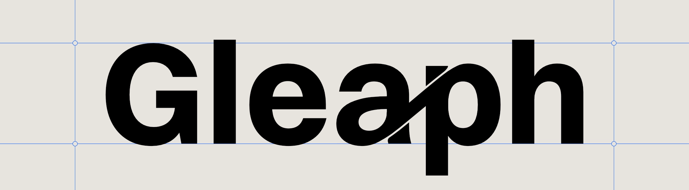

# Gleaph

<p align="center">
  
</p>

**Gleaph** is a graph database designed to run on the
[Internet Computer](https://internetcomputer.org/).

Gleaph combines:

- **GQL** (Graph Query Language, ISO/IEC 39075) for standard graph querying
- **LARA**, a CSR-derived stable graph storage layout optimized for Internet Computer canisters
- **Prepared Queries** for safe frontend-to-canister execution
- **Federated graph shards** for scaling graph data across canisters
- A path toward **vector-aware graph search** and **GraphRAG**

Gleaph is not only a place to store connected data. Its long-term direction is to make
relationships, properties, embeddings, and access-control-aware query execution available
through one graph-native execution model.

## Why Gleaph?

Modern applications increasingly need to combine structured relationships with semantic
similarity.

A knowledge graph may tell you:

- which documents cite each other
- which users can access which records
- which entities belong to the same project
- which events happened before or after another event

A vector index may tell you:

- which passages are semantically close
- which entities are similar
- which memories or documents are relevant to a prompt

Gleaph aims to bring these together: graph traversal, filtering, authorization, and
vector-aware ranking should be expressible as one query plan instead of being stitched
together across unrelated systems.

## GQL

Gleaph uses [GQL](https://www.gqlstandards.org/) (Graph Query Language,
[ISO/IEC 39075](https://www.iso.org/standard/76120.html)) as its query language.

The `gleaph-gql` and `gleaph-gql-planner` crates are intended to remain general-purpose
GQL crates. Internet Computer-specific behavior is implemented outside those portable
layers.

## Storage: LARA

Gleaph’s storage model is based on **LARA** (Localized Adjacency Relocation Array), a
graph representation derived from Compressed Sparse Row (CSR).

LARA is designed for stable memory and canister constraints: compact adjacency storage,
predictable traversal, and local relocation without assuming a conventional server
runtime.

## Prepared Queries

Prepared Queries allow administrators to pre-register GQL programs that can be executed
by less-privileged callers.

This is especially important on the Internet Computer: frontends can safely call Gleaph
directly without requiring a custom backend canister for every application query.

## Vector-Aware Graph Search

Gleaph is being shaped to support vector payloads and vector predicates alongside graph
structure.

The near-term model is:

- store vectors as graph-associated payloads
- filter candidates through graph patterns, labels, properties, or access rules
- apply vector predicates such as distance thresholds
- return graph-shaped results rather than isolated vector hits

This is different from positioning Gleaph as a standalone vector database. The important
idea is graph-first retrieval: vectors become part of the graph execution model.

Future work may include:

- vector indexes for approximate nearest-neighbor search
- vector-aware GQL extensions or procedures
- hybrid ranking over graph distance, edge weights, properties, and embedding distance
- shard-aware vector retrieval for federated deployments

## GraphRAG Direction

Gleaph is a natural fit for GraphRAG-style systems because it can represent both the
retrieval substrate and the authorization model.

A GraphRAG application could use Gleaph to model:

- documents, chunks, entities, claims, and citations
- relationships between extracted entities
- provenance from generated answers back to source material
- tenant, user, and role-based access control
- semantic similarity between chunks or entities

Instead of retrieving text chunks first and reconstructing context later, Gleaph can make
retrieval graph-aware from the beginning:

1. find semantically relevant chunks
2. traverse to related entities, documents, or citations
3. filter by caller identity and prepared-query permissions
4. return a bounded, explainable context subgraph for generation

## Internet Computer Integration

Gleaph extends GQL for Internet Computer use cases with:

- `IC.PRINCIPAL`
- `IC.MSG_CALLER()`

These allow prepared queries to express caller-aware access patterns directly.

## Access Control

The router canister enforces a role hierarchy:

- Executor
- Read
- Write
- Manager
- Admin

Graph shards do not expose arbitrary user GQL. They execute planned work from the router
or trusted peer shards.

## Command-line interface

The top-level `gleaph` command exposes code generation through the same options as
`gleaph-codegen` and local schema-migration artifact commands:

```sh
cargo run -p gleaph-cli -- codegen \
  --manifest path/to/manifest.json \
  --target typescript \
  --output src/generated.ts
```

Migration packages live under `./migrations` by default. `new` creates the next
six-digit package containing `migration.toml` and `up.gql`; `plan` validates and
prints the local parent chain. `status` and `apply` are Router-backed commands;
both require `--canister` and accept the network/identity options shown below:

```sh
cargo run -p gleaph-cli -- migration new init_graph --description "Initial graph"
cargo run -p gleaph-cli -- migration plan
cargo run -p gleaph-cli -- migration status --canister <router-principal> -n local
cargo run -p gleaph-cli -- migration apply --canister <router-principal> -n local --identity path/to/admin.pem
```

Migration v1 accepts exactly one additive `CREATE GRAPH TYPE` or `CREATE GRAPH …
TYPED` statement per package. The Router records the immutable checksum and parent
link in its canonical ledger; see [ADR 0058](design/adr/0058-versioned-additive-schema-migrations.md).

## Design Documentation

Architecture, GQL layers, federation, execution, storage, and security notes live in
[`design/`](./design/).

## License

This project is licensed under either of [Apache License, Version 2.0](./LICENSE-APACHE) or [MIT License](./LICENSE-MIT) at your option.
