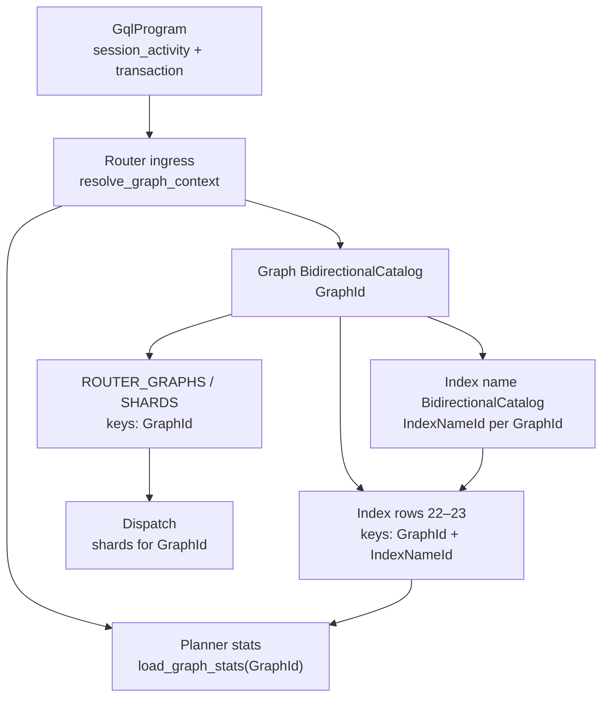

# 0011. GQL graph resolution and catalog scoping

Date: 2026-06-13  
Status: accepted  
Last revised: 2026-06-13  
Anchor timestamp: 2026-06-13 06:46:07 UTC +0000

## Revision history

| Date | Change |
|------|--------|
| 2026-06-13 | Proposed: GQL graph resolution at router ingress; deprecate Candid `logical_graph_name`. |
| 2026-06-13 | Clarified catalog scope: **`BidirectionalCatalog` for graph and index names**; migrate all stable/router keys and stored values from `String` names to **`GraphId` / `IndexNameId`**. |
| 2026-06-13 | Accepted. |

## Context

ISO/IEC 39075 (GQL) scopes data access through **session graph** and **focused graph**
references, not through transport-level parameters:

| GQL construct | Role |
|---------------|------|
| `SESSION SET [PROPERTY] GRAPH <name>` | Sets **current graph** for the session (within one program) |
| `SESSION RESET [PROPERTY] GRAPH` | Clears current graph |
| `USE <graph> …` / `USE GRAPH <name> { … }` | **Focused** scope for a linear part or inline procedure body |
| `CURRENT_GRAPH` / `HOME_GRAPH` | Special graph references resolved at runtime |
| Plain `MATCH …` (no `USE`) | Operates on **current graph** |

`gleaph-gql` parses and validates these constructs. `gleaph-gql-planner` emits
`PlanOp::UseGraph { graph_name, sub_plan }` for explicit `USE` scopes.

### Current Gleaph behavior (problem)

Router query ingress (`gql_query`, `gql_execute`, prepared execute, index DDL via
`gql_execute*`) takes a separate Candid argument **`logical_graph_name: text`** and uses it
for:

- shard registry lookup (`list_shards_for_graph`)
- index catalog / planner stats (`ROUTER_NAMED_INDEXES`, `ROUTER_INDEXED_PROPERTY_SET`)
- prepared-plan keys and idempotency keys

The parsed **`GqlProgram.session_activity` is not applied** to routing. A client can call:

```text
gql_query("tenant_b", "SESSION SET GRAPH tenant_a MATCH (n) RETURN n")
```

and the router dispatches to **tenant_b** shards while GQL semantics name **tenant_a**.

This duplicates graph context (API arg vs program text), violates GQL layering
([layers.md](../gql/layers.md)), and blocks a single source of truth for catalog
partitions keyed by graph.

### Catalog problem (today)

Per [ADR 0006](0006-pre-federation-foundation.md), **property and label names** already use
`BidirectionalCatalog` on the router (`PropertyId`, label ids). **Graph names and index names
do not** — they appear as raw `String` in stable keys and in stored records:

| Store | Region | String usage (today) |
|-------|--------|----------------------|
| Graph registry map key | `ROUTER_GRAPHS` | `BTreeMap<String, GraphRegistryEntry>` |
| Shard record field | `ROUTER_SHARDS` value | `ShardRegistryEntry.logical_graph_name` |
| Shard listing | `list_shards_for_graph` | full scan + string compare (no graph-id index) |
| Canister uniqueness map | `ROUTER_SHARD_BY_GRAPH` | `Principal → ShardId` (**not** logical graph name) |
| Named index row key | `ROUTER_NAMED_INDEXES` | `NamedIndexKey { graph, index_name }` |
| Index membership key | `ROUTER_INDEXED_PROPERTY_SET` | `IndexedPropertyKey { graph, … }` |
| Prepared plan key | `ROUTER_PREPARED_PLANS` (ephemeral) | `"{graph}\0{name}"` |
| Idempotency key | `ROUTER_MUTATION_BY_CLIENT_KEY` | `ClientMutationKey.logical_graph_name` |
| Label telemetry | mutation records | `logical_graph_name: String` |

**Label / property ids** remain **global** (not graph-scoped) — unchanged from ADR 0006.

**This ADR’s catalog decision:** implement the same **`BidirectionalCatalog` pattern** for
**logical graph names → `GraphId`** and **index names → `IndexNameId` (scoped per `GraphId`)**,
then **replace every row above** so stable keys and stored federation/catalog fields use ids,
not embedded name strings. GQL and Candid may still accept **names at the API boundary**; router
interns once and uses ids internally (same as property names → `PropertyId` today).

Index catalog rows and shard dispatch **must** use the same **`GraphId`** as GQL-resolved
graph context (§1). Today that identity is the Candid argument string, not the program.

### Stateless IC calls

Each canister update call is stateless: there is no SQL-style session persisted across calls.
For Gleaph, **one GQL program** (`session_activity` + `transaction_activity`) is the session
boundary for graph context on that invocation. Cross-call “current graph” is out of scope unless
a future session store is added (non-goal here).

---

## Problem

| Issue | Impact |
|-------|--------|
| **Dual graph source of truth** | Candid `logical_graph_name` vs `SESSION SET GRAPH` / `USE` can disagree |
| **Validator gap** | Transaction validation starts with empty `graph_scope`; session commands do not seed it |
| **Planner / executor gap** | Plain `MATCH` has no `UseGraph`; router must infer default graph from program, not API |
| **String keys in stable maps** | Graph / index names duplicated in keys and values; no rename-safe ids |
| **Catalog coupling** | Index DDL and stats keyed by API string, not by GQL-resolved `GraphId` |
| **HOME_GRAPH undefined** | Parser accepts `HOME_GRAPH`; router has no resolution rule |

---

## Existing architecture assessment

| Component | Can it absorb graph resolution? |
|-----------|----------------------------------|
| `gleaph-gql` | Owns AST and validation; should **not** know shard ids or `ROUTER_*` stable keys |
| `gleaph-gql-planner` | Already carries `UseGraph` graph names in plans; should stay federation-agnostic |
| `gleaph-router` | Already owns registry, dispatch, index catalog, RBAC — **correct owner for resolution** |
| `gleaph-graph` | Executes against one shard’s store per invocation; receives graph context via dispatch, not parse |

Keeping `logical_graph_name` on query APIs is a pre-federation shortcut
([operations.md](../federation/operations.md)). It is not fit for GQL-native ingress once
multi-graph and index DDL are product-facing.

---

## Decision

### 1. Router ingress resolves **effective graph(s)** from the GQL program

Introduce **`resolve_graph_context(program, params, caller) -> GraphContext`** in
`gleaph-router` (exact module TBD; lives above parse, below dispatch).

#### 1.1 Session current graph (`effective_graph`)

Apply `program.session_activity` in order **before** the transaction body:

| Command | Effect on current graph |
|---------|-------------------------|
| `SESSION SET [PROPERTY] GRAPH <name>` | Set current to resolved `<name>` |
| `SESSION SET … GRAPH $p = <expr>` | Set current from parameter / expression |
| `SESSION RESET [PROPERTY] GRAPH` | Clear current |
| `SESSION RESET` (all) | Clear current (among other resets) |

Resolve `<name>` and expression results:

| Reference | Resolution |
|-----------|------------|
| Catalog `ObjectName` (e.g. `tenant.main`, `/db/g`) | Lookup in `ROUTER_GRAPHS` (+ RBAC via `resolve_graph`) |
| `CURRENT_GRAPH` | Current graph at that point in session_activity (error if unset) |
| `HOME_GRAPH` | Caller’s **home graph** (see §1.3) |
| Graph binding variable | From procedure prefix / inline scope (validator graph_scope rules) |

If, after session_activity, **current graph is unset**:

| Condition | Default |
|-----------|---------|
| Exactly **one** active graph in `ROUTER_GRAPHS` visible to caller | Use that graph (**standalone degenerate case**) |
| `HOME_GRAPH` configured for caller (see §1.3) | Use home graph |
| Otherwise | **`RouterError::InvalidArgument`** — `"no graph context"` |

**Plain queries** (`MATCH … RETURN …` without `USE`) use **`effective_graph`** for shard
list, planner stats, and index catalog for that execution.

#### 1.2 Focused graph (`PlanOp::UseGraph`)

For each `PlanOp::UseGraph { graph_name, sub_plan }` in the physical plan:

- Resolve `graph_name` with the same rules as §1.1 (including `CURRENT_GRAPH` = session
  current at plan-build time).
- **Dispatch** that sub-plan against **that graph’s** shard list and stats — not necessarily
  `effective_graph`.
- v1 may reject plans where multiple distinct focused graphs appear and multi-graph federated
  merge is not implemented; v2 fans out per graph and merges at router (product milestone).

This unifies GQL **`USE`** with federation routing. It is distinct from “shards of one logical
graph” in [layers.md](../gql/layers.md) only in **naming**: both use the same graph registry
entry and shard list for a given graph name.

#### 1.3 HOME graph (router config)

Add **home graph** resolution on the router (not in `gleaph-gql`):

| Option (pick at implementation; default row first) | Semantics |
|----------------------------------------------------|-----------|
| **A. Sole visible graph** | If caller sees exactly one `GraphRegistryEntry`, that is HOME |
| **B. Explicit flag** | `GraphRegistryEntry.is_home` or per-caller map in router auth state |
| **C. Controller default** | Tenant controller record names default graph for principals it manages |

Until B/C exists, **A** suffices for standalone and single-tenant PocketIC.

#### 1.4 Query API shape (target)

**Target** public query entrypoints:

```candid
gql_query : (text, blob) -> (Result<GqlQueryResult, RouterError>;
gql_execute : (text, blob) -> (Result<nat64, RouterError>;
// … prepared execute similarly without logical_graph_name
```

`logical_graph_name` is **removed** from query / prepared **execute** paths after a deprecation
window.

**Retention:** Admin and registry APIs (`admin_register_shard`, `admin_register_graph`,
`list_shards_for_graph`, backfill status, **optional** explicit graph on idempotency metadata)
may keep an explicit graph name where the operation is **not** parsed from GQL.

**Transition:** During deprecation, if `logical_graph_name` is still present, router **must**
verify it equals `effective_graph` or return `GraphContextMismatch`.

---

### 2. Wire session graph into validation (GQL crate)

`validate_transaction_activity` currently seeds `graph_scope` empty and ignores
`session_activity` for query validation.

**Decision:** Add optional **`SessionGraphSeed`** (or equivalent) passed from router after
evaluating session_activity, so `validate_graph_reference` and composite validation see the
same current graph the router will use. Alternatively, evaluate session graph only in router
and run an ingress-specific validation pass — **prefer extending validator** to keep one
semantic implementation.

`gleaph-gql` still must **not** import router stable types.

---

### 3. Graph name catalog — `BidirectionalCatalog<GraphId>`

Same abstraction and ownership as `ROUTER_PROPERTY_CATALOG` ([ADR 0006 §2](0006-pre-federation-foundation.md)).

| Item | Policy |
|------|--------|
| Type | `GraphId(u32): CatalogId` in `graph-kernel`; **`GraphId::from_raw(0)` reserved**, never assigned |
| Policy | `DenseMaxPlusOnePolicy` (or `SparseFromOnePolicy` if manual holes needed) |
| Stable regions | `ROUTER_GRAPH_BY_NAME` + `ROUTER_GRAPH_BY_ID` — `BidirectionalCatalog::init(...)` |
| Allocation | `get_or_insert(graph_name)` on `admin_register_graph`; lookup on GQL resolution and `resolve_graph` |
| `ROUTER_GRAPHS` | **`BTreeMap<GraphId, GraphRegistryEntry>`** (replaces `String` key) |
| `GraphRegistryEntry` | Keeps `graph_name: String` for Candid / display; **not** repeated in other stable keys |
| Rename | Update name side of graph catalog only; **`GraphId` stable** for shards, indexes, idempotency |

**GQL / API boundary:** `resolve_graph_context` and admin APIs accept catalog
`ObjectName` / text; router resolves to **`GraphId`** before any stable lookup or dispatch.

---

### 4. Index name catalog — `BidirectionalCatalog<IndexNameId>` per graph

Index names are unique **within a logical graph** (`CREATE INDEX idx …` scope). Implement a
**graph-scoped** bidirectional catalog using the same `BidirectionalCatalog` type with a
composite name key:

| Item | Policy |
|------|--------|
| Type | `IndexNameId(u16): CatalogId`; **`0` reserved** |
| Scope | Names interned per **`GraphId`** — composite stable name key `(GraphId, index_name: String)` on the name→id map, or equivalent qualified encoding in `BidirectionalCatalog` name map |
| Stable regions | `ROUTER_INDEX_NAME_BY_NAME` + `ROUTER_INDEX_NAME_BY_ID` (new pair; repack per ADR 0007) |
| DDL | `CREATE INDEX person_age …` → `get_or_insert(graph_id, "person_age")` → `IndexNameId` |

**Index metadata rows** ([ADR 0009](../adr/0009-edge-property-index-and-index-ddl.md), regions 22–23)
— **replace string keys entirely**:

| Region | Current key | Target key |
|--------|-------------|------------|
| `ROUTER_NAMED_INDEXES` | `NamedIndexKey { graph: String, index_name: String }` | `NamedIndexKey { graph_id: GraphId, index_name_id: IndexNameId }` (fixed-width Storable) |
| `ROUTER_INDEXED_PROPERTY_SET` | `IndexedPropertyKey { graph: String, kind_tag, property_id }` | `IndexedPropertyKey { graph_id: GraphId, kind_tag, property_id }` |

**Values** (`IndexDefRecord`) already use `PropertyId` + `label_id` — no index **name** in value.

**Planner stats:** `load_graph_stats(graph_id: GraphId)` scans membership by `graph_id` prefix;
property **names** in GQL still resolve via global `PropertyId` catalog at plan build.

**Index DDL:** Applies to **`GraphId`** from `effective_graph` (§1.1); index identifier in DDL
interns through §4 catalog.

**Out of scope:** graph-index **posting keys** stay `(property_id, value, shard_id, …)` — no
`GraphId` or index name in postings ([ADR 0010](0010-index-sharding-extensibility.md)).

---

### 5. Migrate existing string key / value sites to ids

All router stable and ephemeral keys that embed graph or index **names** move to **`GraphId` /
`IndexNameId`**. Public Candid may keep human-readable names where operators expect them; router
interns at entry.

| Location | Change |
|----------|--------|
| `ROUTER_GRAPHS` map key | `String` → **`GraphId`** |
| `ShardRegistryEntry` | `logical_graph_name: String` → **`graph_id: GraphId`** |
| `list_shards_for_graph(name)` | Resolve name → `GraphId`; add **`ROUTER_SHARDS_BY_GRAPH_ID: GraphId → Vec<ShardId>`** (or equivalent index) — **distinct from** `ROUTER_SHARD_BY_GRAPH` (`Principal → ShardId`, unchanged) |
| `ROUTER_NAMED_INDEXES` / `ROUTER_INDEXED_PROPERTY_SET` keys | §4 |
| `ROUTER_PREPARED_PLANS` key | `(GraphId, prepared_name)` fixed struct — not `String` with `\0` |
| `ClientMutationKey` / label telemetry mutation records | `logical_graph_name: String` → **`graph_id: GraphId`** |
| `graph_stats_for`, `create_index`, `drop_index`, index fan-out | Parameters **`GraphId`** (+ `IndexNameId` for named index ops) |
| `graph-kernel::ShardRegistryEntry` wire/Candid | **`graph_id: GraphId`**; expose name via router lookup when needed |
| PocketIC / tests | Register graphs via catalog; assert by `GraphId` or resolve name once |

**Not migrated (names at boundary only):**

- GQL AST / planner `PlanOp::UseGraph { graph_name: … }` — textual until router resolves at ingress
- `GraphRegistryEntry.graph_name` — canonical display name for admin/Candid
- Property / label **global** catalogs — unchanged

**Admin APIs:** `admin_set_indexed_*` → thin wrappers over index DDL; both paths intern graph +
index names to ids before stable write (ADR 0009 follow-up).

---

### 6. Ownership summary



| Concern | Owner |
|---------|--------|
| Parse / AST | `gleaph-gql` |
| Session + focused graph **semantics** | `gleaph-gql` validate + router `resolve_graph_context` |
| Graph name → **`GraphId`** | Router `BidirectionalCatalog<GraphId>` |
| Index name → **`IndexNameId`** | Router index-name catalog (scoped by `GraphId`) |
| Graph / shard registry stable keys | **`GraphId`**, not string |
| Index DDL metadata stable keys | **`GraphId` + `IndexNameId`**, not string |
| Shard list per graph | `ROUTER_SHARDS_BY_GRAPH_ID` (new); not `ROUTER_SHARD_BY_GRAPH` (canister map) |
| **`UseGraph` sub-plan routing** | Router dispatch (multi-graph milestone) |
| Plan execution | Graph shard(s) |

---

## Consequences

### Positive

- Single source of truth for graph context aligned with GQL
- Graph and index names interned like property names — compact stable keys, rename-safe ids
- Index catalog and shard dispatch always consistent with planner stats for the same `GraphId`
- Removes redundant client parameter; prepared queries self-contained
- Clear boundary: GQL crates stay portable; router owns all name→id catalogs

### Trade-offs

- Router ingress complexity (session evaluation, HOME rules, mismatch checks)
- Breaking Candid change for SDKs and PocketIC tests
- Multi-graph plans with several `UseGraph` targets require dispatch work not done today
- Validator + router must stay in sync for session graph seeding

---

## Alternatives considered

| Alternative | Verdict |
|-------------|---------|
| **Keep `logical_graph_name` only** | Rejected — contradicts GQL; dual source of truth |
| **Require `SESSION SET GRAPH` in every query, no default** | Rejected for standalone — too verbose; sole-graph default is enough |
| **Resolve graph in graph shard, not router** | Rejected — router already owns registry and index catalog |
| **Put `GraphId` in posting keys** | Rejected — [ADR 0010](0010-index-sharding-extensibility.md); partition by canister + `shard_id` |
| **Keep `(graph_name, index_name)` string keys in stable maps** | Rejected — inconsistent with property `BidirectionalCatalog`; blocks rename and fixed-width keys |
| **Global index names without per-graph scope** | Rejected — same index label may exist on different graphs with different definitions |
| **Persist SQL-style session across IC calls** | Deferred — large product scope; program-local session sufficient for v1 |

---

## Implementation phases

| Phase | Scope | Status |
|-------|--------|--------|
| **R0** | `resolve_graph_context`; resolve to `GraphId`; deprecate Candid graph arg with mismatch check | Planned |
| **R1** | Session seed in validator; HOME rule (sole graph) | Planned |
| **R2** | Remove `logical_graph_name` from query / prepared execute APIs | Planned |
| **G1** | `BidirectionalCatalog<GraphId>`; `ROUTER_GRAPHS` keyed by `GraphId` | Planned |
| **G2** | `ShardRegistryEntry.graph_id`; `ROUTER_SHARDS_BY_GRAPH_ID`; prepared + idempotency keys use `GraphId` | Planned |
| **I1** | `BidirectionalCatalog<IndexNameId>` per graph; `ROUTER_NAMED_INDEXES` / `ROUTER_INDEXED_PROPERTY_SET` keys use `GraphId` + `IndexNameId` | Planned |
| **U1** | Multi-`UseGraph` dispatch + merge | Planned (depends on federation-target) |

**Stable repack:** G1 + I1 share one ADR 0007 gate (new MemoryId pairs for graph + index name
catalogs; rewrite regions 1–3, 22–23 as needed). Dev snapshot discard acceptable pre-production.

---

## Migration

1. Implement R0 behind compatibility flag or mismatch validation.
2. Update PocketIC and router tests to pass graph via `SESSION SET GRAPH` or rely on sole-graph default.
3. G1/I1 stable repack: one ADR 0007 gate; rewrite string-keyed rows to id keys; dev snapshot discard acceptable pre-production.
4. SDK / Candid: document deprecation timeline; remove query `logical_graph_name` in R2; shard wire may expose `graph_id` with optional name lookup.

---

## Design documentation impact

| Document | Update |
|----------|--------|
| [gql/layers.md](../gql/layers.md) | Graph resolution at router ingress; USE GRAPH + federation unification |
| [federation/operations.md](../federation/operations.md) | Replace “Candid logical_graph_name” with resolved graph |
| [glossary.md](../glossary.md) | `effective graph`, `HOME_GRAPH` (router) |
| [storage/stable-memory-inventory.md](../storage/stable-memory-inventory.md) | GraphId regions; index key shapes (when implemented) |
| [adr/README.md](README.md) | Index this ADR |

---

## Related ADRs

- [0006](0006-pre-federation-foundation.md) — router catalog SSOT, shard registry
- [0009](0009-edge-property-index-and-index-ddl.md) — index catalog rows, planner stats
- [0010](0010-index-sharding-extensibility.md) — index routing; no graph id in posting keys
