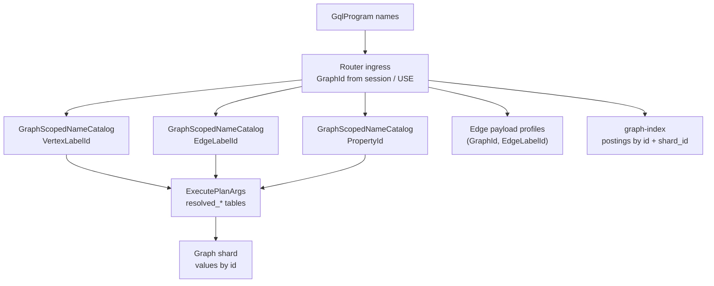

# 0018. Graph-scoped label and property catalogs

Date: 2026-06-17
Status: accepted
Last revised: 2026-06-17
Anchor timestamp: 2026-06-17 10:36:18 UTC +0000

## Revision history

| Date | Change |
|------|--------|
| 2026-06-17 | Proposed: scope `PropertyId`, `VertexLabelId`, and `EdgeLabelId` catalogs per `GraphId`; supersede ADR 0011 global-catalog policy. |
| 2026-06-17 | Clarified label live-by-shard keys after ADR 0019: router-wide maps must include `GraphId` once `ShardId` becomes graph-local. |
| 2026-06-17 | **Accepted.** V0–V5 implemented; design docs synced (`glossary.md`, `property-index.md`, `stable-memory-inventory.md`, ADR 0011 amendments). |

## Context

[ADR 0006](0006-pre-federation-foundation.md) §2 makes the **router** the single source of truth
for **name → numeric id** of vertex properties, vertex labels, and edge labels. Graph shards
store **values only**, keyed by router-issued ids. Index postings use the same numeric ids
([property-index.md](../index/property-index.md)).

[ADR 0011](0011-gql-graph-resolution-and-catalog-scoping.md) scoped **logical graph names** and
**index names** per `GraphId`. Its original draft left **label / property ids global**; **this ADR
supersedes that policy** (0011 amended 2026-06-17).

That choice optimized federation wiring: one intern table, fixed-width posting keys without
`GraphId`, and simple plan resolution. It diverges from common property-graph products (Neo4j per
database, JanusGraph per graph instance) where the same string name in two logical graphs may
denote unrelated semantics.

### Router catalogs (implemented, as of 2026-06-17 UTC)

| Catalog | Stable regions | Key shape | Scope |
|---------|----------------|-----------|-------|
| Vertex labels | 8–9 | `(GraphId, name) ↔ (GraphId, VertexLabelId)` | **Per graph** |
| Edge labels | 10–11 | `(GraphId, name) ↔ (GraphId, EdgeLabelId)` | **Per graph** |
| Properties | 12–13 | `(GraphId, name) ↔ (GraphId, PropertyId)` | **Per graph** |
| Index names | 16–17 | `(GraphId, String) → IndexNameId` | Per graph ([0011](0011-gql-graph-resolution-and-catalog-scoping.md)) |
| Edge payload profiles | 20 | `(GraphId, EdgeLabelId) → EdgePayloadProfile` | **Per graph** ([0008](0008-edge-payload-profile-router-ssot.md)) |
| Label stats aggregates | 25–28 | `(GraphId, label_id)` / `(GraphId, ShardId, label_id)` | **Per graph** ([0015](0015-label-stats-projection-log.md)) |

GQL **graph type** metadata is already per federation graph via `GraphCatalog.binding_map`
keyed by `GraphId` ([0013](0013-gql-graph-type-catalog-on-router.md)). Runtime vocabulary ids
are the outlier.

### Symptoms

| Issue | Impact |
|-------|--------|
| **Semantic collision** | `tenant_a.status` and `tenant_b.status` share one `PropertyId` |
| **No vocabulary lifecycle** | `DROP GRAPH` cannot reclaim label/property id partitions |
| **Stats / profile coupling** | `ROUTER_VERTEX_LABEL_STATS` keyed by raw `label_id` would collide after scoping unless migrated |
| **Product mismatch** | Multi-tenant operators expect graph-local namespaces like Neo4j / JanusGraph |

### What already isolates data (unchanged)

| Boundary | Mechanism |
|----------|-----------|
| Vertex / edge values | Graph shard canister + `GlobalVertexId { shard_id, local_vertex_id }` (graph-scoped via dispatch `GraphId`; [0019](0019-graph-local-shard-id-and-index-clusters.md)) |
| Shard ownership | `ShardRegistryEntry.graph_id` |
| Index fan-out | Router dispatches only shards registered for target `GraphId` |
| Posting keys | `(property_id, value, shard_id, local_vertex_id)` — no `GraphId` ([0010](0010-index-sharding-extensibility.md)) |

Graph-scoped **catalog ids** align vocabulary semantics with these boundaries without requiring
`GraphId` in posting keys. Before ADR 0019, router-global `ShardId` disambiguates posting hits.
After ADR 0019, posting hits are interpreted inside the target graph's dispatch/index-cluster
context, where graph-local `ShardId` values identify shards only for that `GraphId`.

---

## Problem

| Issue | Impact |
|-------|--------|
| **Global name → id SSOT** | Same string in different logical graphs must share one id even when semantics differ |
| **Irreversible intern** | Removing a logical graph does not drop its vocabulary partition |
| **Downstream keys assume global ids** | Edge payload profiles and label stats maps keyed by raw id only |
| **Inconsistent catalog pattern** | Index names are graph-scoped; labels and properties are not |

---

## Existing architecture assessment

| Component | Can it absorb graph-scoped vocabulary? |
|-----------|----------------------------------------|
| `GraphScopedNameCatalog` (router) | **Yes** — already implements `(GraphId, name) ↔ id` for `IndexNameId` |
| `BidirectionalCatalog` (graph-kernel) | **No** — global `String → Id`; keep for `GraphId`, `GraphTypeId` |
| Graph shard storage | **Yes without layout change** — shard is bound to one graph; wire carries graph-local resolved tables |
| graph-index postings | **Yes without key change** — lookups scoped by target graph's `ShardId` set |
| `gleaph-gql` / planner | **Yes** — remain name-based; router resolves at ingress with `GraphId` |
| `GraphCatalog` | **Complementary** — schema bindings already per `GraphId`; optional follow-up auto-intern |

---

## Decision

### 1. Scope label and property catalogs per `GraphId`

Replace the three global `BidirectionalCatalog` instances with **graph-scoped** bidirectional
catalogs using the same composite-key pattern as index names ([0011](0011-gql-graph-resolution-and-catalog-scoping.md) §4,
[`scoped_name_catalog.rs`](../../crates/graph-kernel/src/scoped_name_catalog.rs)):

| Catalog | Id type | Name key | Id key |
|---------|---------|----------|--------|
| Vertex labels | `VertexLabelId` | `(GraphId, name)` | `(GraphId, VertexLabelId)` |
| Edge labels | `EdgeLabelId` | `(GraphId, name)` | `(GraphId, EdgeLabelId)` |
| Properties | `PropertyId` | `(GraphId, name)` | `(GraphId, PropertyId)` |

**Id semantics:** `PropertyId`, `VertexLabelId`, and `EdgeLabelId` remain the same Rust /
wire types. A raw id is **meaningful only together with `GraphId`** (same contract as
`IndexNameId`).

**Allocation:** per-graph dense `max(existing)+1` from `1`, mirroring `GraphScopedNameCatalog`
for index names. Reserved `0` unchanged.

**GQL / Candid boundary:** clients and GQL programs continue to use **names** (`Person`, `age`).
Router resolves `effective_graph` / `UseGraph` target → `GraphId`, then interns or looks up
within that graph's partition.

### 2. Generalize `GraphScopedNameCatalog` in graph-kernel

Promote the router-local `GraphScopedNameCatalog<IndexNameId>` pattern to
**`GraphScopedNameCatalog<Id: CatalogId>`** in `gleaph-graph-kernel`:

- Reuse `GraphScopedNameKey { graph_id, name }`
- Parameterize `GraphScopedIdKey { graph_id, id: Id }` (fixed-width id encoding per `CatalogId`)
- Router mounts four instances (or three + keep index catalog on the generalized type):
  vertex label, edge label, property, index name

**Do not** merge vocabulary catalogs with `ROUTER_GRAPH_CATALOG` or `ROUTER_GRAPH_TYPE_CATALOG` —
different namespaces.

### 3. Router resolution API requires `GraphId`

All production resolution paths take **`GraphId`** (internal) or resolve graph name → `GraphId`
at the Candid / admin boundary:

| API (conceptual) | Change |
|------------------|--------|
| `lookup_property_id(graph_id, name)` | Add `graph_id` |
| `lookup_vertex_label_id` / `lookup_edge_label_id` | Add `graph_id` |
| `admin_intern_*` | Add graph name or `GraphId` |
| `resolve_plan_labels(graph_id, plans)` | Add `graph_id` |
| `resolve_plan_properties(graph_id, plans)` | Add `graph_id` |
| `reverse_*_name(graph_id, id)` | Add `graph_id` |

Ingress (`gql.rs`, `index_catalog.rs`, `seed.rs`, aggregate fast path) passes the **focused
graph's `GraphId`** from `resolve_graph_context` / per-`UseGraph` dispatch ([0011](0011-gql-graph-resolution-and-catalog-scoping.md)).

**Multi-graph plans (U2):** each `UseGraph` segment resolves vocabulary against **its** `GraphId`.
Union merge combines rows only; id namespaces are not merged across graphs.

### 4. Migrate graph-coupled router maps to `(GraphId, …)` keys

| Region | Current key | Target key |
|--------|-------------|------------|
| `ROUTER_EDGE_PAYLOAD_PROFILES` (20) | `EdgeLabelId` | **`(GraphId, EdgeLabelId)`** |
| `ROUTER_VERTEX_LABEL_STATS` (25) | `u16` | **`(GraphId, VertexLabelId)`** or equivalent composite |
| `ROUTER_EDGE_LABEL_STATS` (26) | `u16` | **`(GraphId, EdgeLabelId)`** |
| `ROUTER_*_LABEL_LIVE_BY_SHARD` (27–28) | `(ShardId, u16)` | **`(GraphId, ShardId, label_id)`** or graph-partitioned map whose router-wide key includes `GraphId` |

`ROUTER_NAMED_INDEXES` / `ROUTER_INDEXED_PROPERTY_SET` already include `GraphId`; stored
`property_id` and `label_id` values become **graph-local** interpretations (no key shape change).

**ADR 0019 interaction:** after `ShardId` becomes graph-local, no router-wide map may rely on
raw `ShardId` alone to imply one graph. Per-shard label live maps either carry `GraphId` in the
stable key or are physically partitioned by `GraphId` with that partition key used for every
lookup, replay, and invariant check.

`enrich_edge_labels_for_predicate_fusion` enumerates payload profiles **per `GraphId`**, not
globally.

### 5. Graph shard and graph-index — no posting key change

| Layer | Policy |
|-------|--------|
| **Graph shard** | No stable layout change. `ExecutePlanArgs.resolved_labels` / `resolved_properties` carry graph-local ids from router dispatch. |
| **graph-index** | Posting keys unchanged ([0010](0010-index-sharding-extensibility.md)). Router resolves names with target `GraphId` before `lookup_equal` / label APIs; filters `PostingHit` to shards in `ROUTER_SHARDS_BY_GRAPH_ID[graph_id]`. |
| **Cross-graph index scan waste** | Eliminated when paired with [ADR 0019](0019-graph-local-shard-id-and-index-clusters.md) (dedicated index cluster per graph). Without 0019, acceptable v1: router shard filter; see 0019 for target layout. |

### 6. `DROP GRAPH` catalog cascade

Extend graph catalog DDL / federation unregister to drop **vocabulary partition** for
`graph_id`:

1. Remove all `(graph_id, *)` rows from vertex / edge / property scoped catalogs
2. Remove `(graph_id, *)` from edge payload profiles
3. Remove `(graph_id, *)` label stats rows, including graph-partitioned shard-live rows
4. Existing index catalog + `GraphCatalog` binding removal ([0011](0011-gql-graph-resolution-and-catalog-scoping.md), [0013](0013-gql-graph-type-catalog-on-router.md))

Freed ids may be **reused within the same graph** on re-intern (`max+1` policy). No global id
reuse across graphs is required.

### 7. Supersede ADR 0011 global-catalog policy

[ADR 0011](0011-gql-graph-resolution-and-catalog-scoping.md) §Catalog problem and §5 **Not migrated**
listed global label/property catalogs as intentional. **This ADR supersedes that policy.**

[ADR 0006](0006-pre-federation-foundation.md) §2 router SSOT for name → id **remains**; scope
changes from federation-global to **per `GraphId`**.

[ADR 0014](0014-graph-type-id-catalog-on-router.md) non-goal (global label/property catalogs
separate from graph types) **remains**; graph types stay router-global. Only runtime vocabulary
ids become graph-scoped.

---

## Ownership summary

| Concern | Owner |
|---------|--------|
| Name → id (labels, properties) | Router scoped catalogs per **`GraphId`** |
| Graph name → `GraphId` | `ROUTER_GRAPH_CATALOG` (unchanged) |
| Index name → `IndexNameId` | `ROUTER_INDEX_NAME_CATALOG` (unchanged scope) |
| Edge payload schema | Router `(GraphId, EdgeLabelId)` map |
| Label stats projection | Router maps keyed by **`GraphId` + label id** |
| Values on vertices/edges | Graph shard |
| Postings | graph-index (ids interpreted in shard's graph) |

---

## Consequences

### Positive

- Vocabulary semantics align with logical graph boundaries and mainstream graph DB expectations
- `DROP GRAPH` can reclaim catalog partitions
- Consistent pattern with graph-scoped index names ([0011](0011-gql-graph-resolution-and-catalog-scoping.md))
- Graph shard and index posting layouts preserved — smaller blast radius than embedding `GraphId` in postings
- Enables `GraphCatalog` → auto-intern on `CREATE GRAPH` / `CREATE GRAPH TYPED` ([0013](0013-gql-graph-type-catalog-on-router.md) follow-up, **V5**)

### Trade-offs

- **Breaking router Candid** for `admin_intern_*` and lookup helpers without graph context
- **Router repack** (regions 8–13 at minimum; likely 20, 25–26) per [ADR 0007](0007-stable-memory-layout.md)
- All resolution call sites must thread `GraphId` (wide but mechanical router change)
- Index property buckets may scan postings from other graphs' shards **without [0019](0019-graph-local-shard-id-and-index-clusters.md)** (filtered at router; eliminated with per-graph index clusters)
- Debug dumps need `GraphId` to interpret raw label/property ids

---

## Alternatives considered

| Alternative | Verdict |
|-------------|---------|
| **Keep global catalogs (0011 status quo)** | Rejected — semantic collision and no vocabulary lifecycle on graph drop |
| **Embed `GraphId` in posting keys** | Rejected — [ADR 0010](0010-index-sharding-extensibility.md); redundant with `shard_id` |
| **Qualified names in GQL (`g.Person`)** | Rejected — non-standard surface; planner and validator churn |
| **Wire `(GraphId, PropertyId)` tuples to graph shard** | Rejected — shard is single-graph; redundant on every DML |
| **Separate router canister per logical graph** | Rejected — operational cost; does not match single-router federation model |
| **Reuse `GraphTypeId` as vocabulary scope** | Rejected — multiple graphs share one type; vocabulary is per graph instance |

---

## Implementation phases

| Phase | Scope | Status |
|-------|--------|--------|
| **V0** | `GraphScopedNameCatalog<Id: CatalogId>` in graph-kernel; unit tests | **done** |
| **V1** | Migrate regions 8–13; router lookup / intern / reverse APIs take `GraphId` | **done** |
| **V2** | `resolve_plan_*` + gql ingress + seed + index_catalog + aggregate fast path | **done** |
| **V3** | `(GraphId, EdgeLabelId)` payload profiles; `(GraphId, label_id)` label stats keys; `(GraphId, ShardId, label_id)` live-by-shard keys or equivalent graph partition | **done** |
| **V4** | `DROP GRAPH` / unregister cascade for vocabulary partitions | **done** |
| **V5** (optional) | `GraphCatalog` DDL auto-intern labels/properties into graph partition | **done** |

**Stable repack:** V0–V3 share one [ADR 0007](0007-stable-memory-layout.md) gate. Dev snapshot
discard acceptable pre-production.

**Sequencing:** land V0–V2 before multi-tenant PocketIC scenarios that rely on distinct
vocabulary per graph.

---

## Migration

1. **Dev / pre-production:** reinstall router canister; discard snapshots (ADR 0007 policy).
2. **If retaining snapshots:** one-shot upgrade hook:
   - For each `GraphId` in `ROUTER_GRAPHS`, walk global catalogs and re-insert into scoped catalogs (requires attributing existing interned names to a graph — **only valid for single-graph deployments**; multi-graph snapshots need discard or manual partition script).
3. ~~Update [stable-memory-inventory.md](../storage/stable-memory-inventory.md), [glossary.md](../glossary.md), and layout tests when V1 lands.~~ **Done** (2026-06-17).
4. ~~Amend [0011](0011-gql-graph-resolution-and-catalog-scoping.md) §Catalog problem / §5 to cross-link here.~~ **Done** (2026-06-17).
5. ~~PocketIC / SDK: pass graph context to `admin_intern_*` helpers.~~ **Done** — attach/register APIs and federation helpers pass `GraphId` / graph name.

---

## Design documentation impact

| Document | Update | Status |
|----------|--------|--------|
| [adr/README.md](README.md) | Index ADR 0018 | **done** |
| [glossary.md](../glossary.md) | Property / label id scoped per `GraphId` | **done** |
| [storage/stable-memory-inventory.md](../storage/stable-memory-inventory.md) | Catalog key shapes for regions 8–13, 20, 25–28 | **done** |
| [index/property-index.md](../index/property-index.md) | Resolve per `GraphId`; posting keys unchanged | **done** |
| [0011-gql-graph-resolution-and-catalog-scoping.md](0011-gql-graph-resolution-and-catalog-scoping.md) | Superseded global-catalog bullets | **done** |

---

## Related ADRs

- [0006](0006-pre-federation-foundation.md) — router catalog SSOT (scope amended here)
- [0008](0008-edge-payload-profile-router-ssot.md) — edge payload profiles move to `(GraphId, EdgeLabelId)`
- [0010](0010-index-sharding-extensibility.md) — posting keys unchanged
- [0011](0011-gql-graph-resolution-and-catalog-scoping.md) — graph-scoped index names; global vocabulary policy superseded
- [0013](0013-gql-graph-type-catalog-on-router.md) — optional auto-intern follow-up
- [0014](0014-graph-type-id-catalog-on-router.md) — graph types remain global
- [0015](0015-label-stats-projection-log.md) — label stats keys gain `GraphId`
- [0019](0019-graph-local-shard-id-and-index-clusters.md) — graph-local `ShardId`; per-graph index cluster (complementary partition)
