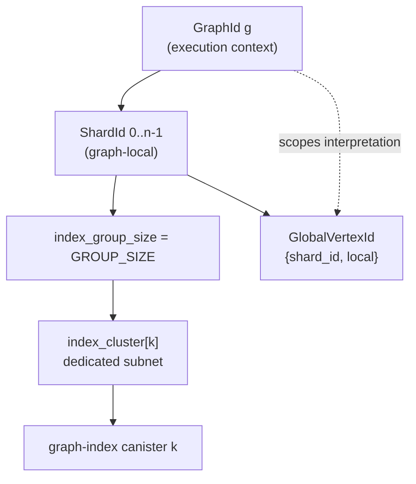

# 0019. Graph-local `ShardId` and per-graph index clusters

Date: 2026-06-17  
Status: accepted  
Last revised: 2026-06-17  

Anchor timestamp: 2026-06-17 13:34:18 UTC +0000

## Revision history

| Date | Change |
|------|--------|
| 2026-06-17 | **Accepted** — S0–S5 implemented; post-accept doc sync (0005/0006/0010, capacity-planning, federation-target). |
| 2026-06-17 | Repack: `ROUTER_GRAPH_RUNTIME_CONFIG` → MemoryId **5** (after registry); `INDEX_OWNERSHIP_CONFIG` → MemoryId **3** (before postings). |
| 2026-06-17 | Proposed: `ShardId` dense per `GraphId`; one index cluster per logical graph; commit `GROUP_SIZE` shard-group routing. |
| 2026-06-17 | **`GlobalVertexId` / `GlobalEdgeId` unchanged** — remain `(ShardId, …)` without `GraphId`; graph partition is execution context, not embedded in element keys ([§3](#3-global-vertex-and-edge-identity-graph-scoped-not-federation-wide)). |
| 2026-06-17 | **Encoded ids are graph-context-bound** — `ElementIdEncodingKey` is derived per graph from IC randomness, but encoded bytes alone are not graph-agnostic ids ([§3.1](#31-element-id-encoding-key-per-logical-graph)). |

## Context

[ADR 0006](0006-pre-federation-foundation.md) §1 assigns **`ShardId`** as a **federation-global**
`u32`: contiguous `0..n-1` across all registered graph shards on the router. The router registry
maps **`ShardId → ShardRegistryEntry`** globally (`ROUTER_SHARDS`).

[ADR 0005](0005-vertex-identity.md) builds **`GlobalVertexId`** as `{ shard_id, local_vertex_id }`
(8 bytes) and **`GlobalEdgeId`** as `{ shard_id, owner_local, edge_slot_index }` (12 bytes).
As of 2026-06-17 UTC, **`shard_id` is treated as federation-globally unique** in the router
registry; this ADR makes **`shard_id` graph-local** while **keeping the 8 B / 12 B wire layouts
unchanged**.

[ADR 0010](0010-index-sharding-extensibility.md) defers index split policy. Posting keys tag
**`shard_id`** without `GraphId`. As of 2026-06-17 UTC, index routing dedupes
**`index_canister`** principals from per-shard registry rows; `group_index = shard_id / GROUP_SIZE`
is an **example only** — **`GROUP_SIZE` is not chosen**.

[ADR 0011](0011-gql-graph-resolution-and-catalog-scoping.md) already maintains
**`ROUTER_SHARDS_BY_GRAPH_ID: GraphId → Vec<ShardId>`**, but the listed `ShardId` values are
**global keys** into `ROUTER_SHARDS`, not graph-local ordinals.

### Target operations model

Operators want:

1. **`ShardId` dense and per logical graph** — graph `g` uses `0, 1, …, n-1` independently of
   other graphs.
2. **Deterministic index shard-group routing** — for a fixed `GROUP_SIZE`, index canister `k`
   owns graph-local shards `[k × GROUP_SIZE, (k+1) × GROUP_SIZE)`.
3. **Separate index cluster per logical graph** — graph `g`'s index canisters live on a dedicated
   cluster/subnet; no shared index canister holds postings for two logical graphs.

Together with [ADR 0018](0018-graph-scoped-label-property-catalogs.md) (graph-scoped vocabulary
ids), this yields **self-contained partitions**: one logical graph → local shard ordinals → local
catalog ids → dedicated index cluster.

### Problems with federation-global `ShardId`

| Issue | Impact |
|-------|--------|
| **Global ordinal allocation** | Graph `b`’s first shard is `ShardId(5)` if graph `a` already has five shards — leaks federation layout |
| **Raw-id ambiguity after this ADR** | `ShardId(0)` on graph `a` and graph `b` are different shards but share the same raw id — **graph context** must scope interpretation |
| **Index routing needs registry scan** | `shard_id / GROUP_SIZE` is ill-defined when shard ids are not graph-local from zero |
| **Multi-tenant index isolation** | Shared index canister + global `shard_id` forces cross-graph posting buckets ([0018](0018-graph-scoped-label-property-catalogs.md) trade-off) |

---

## Problem

| Issue | Impact |
|-------|--------|
| **Wrong namespace for `ShardId`** | Shard identity is a property of a **logical graph**, not the whole router |
| **Deferred index grouping** | Operators cannot provision index capacity from a simple formula |
| **`ROUTER_SHARDS` key collision** | As of 2026-06-17 UTC, two graphs cannot both use `ShardId(0)` as distinct registry rows |

---

## Existing architecture assessment

| Component | Assessment |
|-----------|------------|
| `ROUTER_SHARDS_BY_GRAPH_ID` | **Correct shape** — becomes the primary shard listing; values are graph-local ordinals |
| `ROUTER_SHARDS` global map | **Wrong key** — must become `(GraphId, ShardId)` |
| `ShardRegistryEntry.graph_id` | **Keep** — redundant with key but useful on wire; validate `key.graph_id == entry.graph_id` |
| graph-index posting keys | **Compatible** — graph-local `shard_id` within a graph-dedicated index cluster |
| `gleaph-gql` / planner | **No change** — router supplies shard context at dispatch |
| [0018](0018-graph-scoped-label-property-catalogs.md) | **Complementary** — eliminates cross-graph posting ambiguity inside shared index canisters |

---

## Decision

### 1. `ShardId` is graph-local and dense per `GraphId`

**Semantics (amended from ADR 0006 §1):**

| Rule | Value |
|------|-------|
| Type | `ShardId(u32)` unchanged |
| Scope | **Meaningful only with `GraphId`** (same contract as graph-scoped `PropertyId` / label ids) |
| Assignment | Per graph: **`0..n-1`**, issued **`n`** on next `admin_register_shard` for that graph |
| Validity | `ShardId(0)` is the first shard of **each** graph (standalone: one graph, one shard `0`) |
| Unregistered | Still an error at router dispatch — no sentinel inside `ShardId` |

**Do not** allocate federation-wide monotonic shard ids.

### 2. Router registry keys use `(GraphId, ShardId)`

| Map | Current key | Target key |
|-----|-------------|------------|
| `ROUTER_SHARDS` | `ShardId` | **`GraphShardKey { graph_id, shard_id }`** |
| `ROUTER_SHARDS_BY_GRAPH_ID` | `GraphId → Vec<ShardId>` | **Unchanged list shape** — entries are **graph-local** ordinals |
| `ROUTER_SHARD_BY_GRAPH` | `Principal → ShardId` | **`Principal → GraphShardKey`** (one graph canister → one graph-local shard) |

**Derived index vs query API**

| Layer | Shape | Notes |
|-------|--------|-------|
| `ROUTER_SHARDS_BY_GRAPH_ID` | **`GraphId → Vec<ShardId>`** | Denormalized fan-out index; dense **`0..n-1`** insertion order per graph |
| `list_shards_for_graph_id` / `list_shards_for_graph` | **`Vec<ShardRegistryEntry>`** | Walks the index, hydrates each ordinal from `ROUTER_SHARDS[GraphShardKey]`, validates `entry.graph_id` |
| `list_live_shards_for_graph_id` / `list_live_shards_for_graph` | **`Vec<ShardRegistryEntry>`** | Same as above, filtered to `index_attached == true` (dispatch / index fan-out / backfill) |

Listing APIs do **not** return bare `ShardId` vectors; callers get full registry rows
(`graph_canister`, `index_canister`, `index_attached`, …).

### 3. Global vertex and edge identity: graph-scoped, not federation-wide

**Keep** [ADR 0005](0005-vertex-identity.md) / [0006](0006-pre-federation-foundation.md) element
key shapes **unchanged**:

```text
GlobalVertexId { shard_id: ShardId, local_vertex_id: LocalVertexId }     // 8 bytes LE
GlobalEdgeId   { shard_id, owner_vertex_id, edge_slot_index }          // 12 bytes LE
```

**Semantic change:** **`Global`** means **within one logical graph partition** (across that
graph’s shards), **not** unique across the whole router federation. **`GraphId` is never embedded**
in `GlobalVertexId`, `GlobalEdgeId`, posting keys, or `EncodedVertexId` / `EncodedEdgeId`
payloads.

| Layer | Policy |
|-------|--------|
| **Execution context** | Every router dispatch, index lookup, graph `execute_plan_*`, and GQL `USE GRAPH` segment carries an explicit **`GraphId`** ([0011](0011-gql-graph-resolution-and-catalog-scoping.md)). Element ids are interpreted **only inside that context**. |
| **`ShardId` in element keys** | **Graph-local** ordinal ([§1](#1-shardid-is-graph-local-and-dense-per-graphid)). `(ShardId(0), local)` on graph `a` ≠ `(ShardId(0), local)` on graph `b`. |
| **Index postings** | **`(…, shard_id, local_vertex_id)`** — no `GraphId`; index canister is graph-dedicated ([§6](#6-one-index-cluster-per-logical-graph)) |
| **Client wire** | **`EncodedVertexId` (8 B) / `EncodedEdgeId` (12 B)** unchanged; encoded bytes are **meaningful only with graph context**. Decode requires the same `GraphId` context and encoding key as encode (session / `USE GRAPH` / prepared plan's `GraphId`). |
| **Cross-graph U2** | Each sub-plan carries its own **`GraphId`**; merged rows do not unify element ids across graphs. Remote / expand handles are **not** passed between graphs without re-resolution. |

**No wire layout bump** for `GlobalVertexId` / `GlobalEdgeId` / encoded element ids. Federation
code must thread **`GraphId`** alongside physical keys wherever a call could otherwise be
ambiguous (registry lookup, multi-graph orchestration).

**Invariant:** APIs that accept `GlobalVertexId` or `ShardId` **without** `GraphId` are valid
**only** when the callee’s scope is already bound to one logical graph (e.g. a single graph
shard canister, a graph-dedicated index canister, or router code mid-dispatch for one
`GraphId`).

#### 3.1 Element id encoding key (per logical graph)

[ADR 0005](0005-vertex-identity.md) already specifies a **per-graph `ElementIdEncodingKey`**
(Feistel bijection over the 8 B / 12 B canonical keys). As of 2026-06-17 UTC, implementation
still uses **`ElementIdEncodingKey::host_test_fixture()`** (test/canbench only) when the router key
is not set — **not** in production wasm paths.

**Encoded ids are graph-context-bound handles.** `EncodedVertexId` and `EncodedEdgeId` remain
8 B / 12 B opaque payloads and do **not** embed `GraphId`. A raw encoded payload is meaningful
only together with the graph context whose `ElementIdEncodingKey` encoded it. Any graph-agnostic
cache key, log correlation key, SDK handle, prepared result reference, or cross-graph result
handle must use `(GraphId, Encoded*)`.

**Problem without per-graph keys:** graph `a` and graph `b` can both have
`GlobalVertexId { shard_id: 0, local_vertex_id: 42 }`. A single global `standalone()` key maps
both to the **same `EncodedVertexId` bytes**. Per-graph keys avoid that deterministic same-key
collision and reduce cross-tenant layout correlation, but they do **not** make encoded bytes
globally unique across graphs: every graph still maps into the same 8 B / 12 B output space.

**Decision:** each logical graph has its **own `ElementIdEncodingKey`**. The key is **not**
embedded in `EncodedVertexId` (still 8 B / 12 B). **`GraphId` is not XOR-mixed into the output
block** — there is no room for a second namespace without growing the wire type or shrinking the
canonical payload.

| Approach | Policy |
|----------|--------|
| **A. IC randomness at graph registration (recommended)** | On `admin_register_graph` / `CREATE GRAPH`, router obtains **32 bytes** from `ic_cdk_management_canister::raw_rand()`, derives a **16-byte** `ElementIdEncodingKey` with domain separation, stores it in router-owned graph runtime config, and never changes it for the life of the graph (rotate only via explicit admin / new graph). |
| **B. Deterministic test provider** | Tests / PocketIC may inject a deterministic key source so fixtures are reproducible. This is not the production source. |
| **C. KDF from `GraphId` + router secret** | `ElementIdEncodingKey::derive(router_master_secret, graph_id)` — no extra stable field; acceptable fallback if a router master secret exists, but production prefers **A** so keys are not derivable from sequential `GraphId` alone. |
| **Rejected: global `standalone()` in production** | All graphs share one bijection → deterministic same-byte encoding when graph-local canonical keys match across graphs. |
| **Rejected: embed `GraphId` in Feistel plaintext** | Would require canonical > 8 B for vertices or non-bijective compression into 8 B. |

**Production derivation:**

```text
ElementIdEncodingKey =
  first_16_bytes(sha256(
    "gleaph:element-id-key:v1" ||
    graph_id_le_bytes ||
    raw_rand_32
  ))
```

`raw_rand_32` is the 32-byte value returned by `ic_cdk_management_canister::raw_rand()`.
The domain string separates element-id keys from future uses of IC randomness.

**Encode / decode contract:**

```text
encode(key_for(graph_id), GlobalVertexId) → EncodedVertexId
decode(key_for(graph_id), EncodedVertexId) → GlobalVertexId   // same graph_id
```

- **Router** owns keys (SSOT) in graph runtime config. Lookup by `GraphId` when materializing
  query results or validating client-supplied `ELEMENT_ID` at ingress.
- **Graph shard** receives the key for its graph on the plan wire (e.g. extend `ExecutePlanArgs`
  or a router-side materialization step) — graph must **not** hard-code `standalone()` in
  production paths after this ADR.
- **Prepared plans** are already keyed by `GraphId` ([0011](0011-gql-graph-resolution-and-catalog-scoping.md));
  execute uses that graph’s key.
- **Cross-graph U2:** merged result rows carry encoded ids from **different graph contexts**;
  clients and router-side row merge code must not treat encoded bytes as graph-agnostic handles.

**Obfuscation note:** per-graph random keys hide shard layout **per tenant**. They are **not** a
crypto access-control boundary ([0005](0005-vertex-identity.md)).

### 4. Router-owned graph runtime config

Keep public/admin graph metadata separate from router execution configuration:

| Store | Key | Owns |
|-------|-----|------|
| `ROUTER_GRAPHS` | `GraphId` | `GraphRegistryEntry`: display/admin metadata such as name, owner, status, HOME flag |
| `ROUTER_GRAPH_RUNTIME_CONFIG` | `GraphId` | Router-owned execution config: element-id key, index grouping, index cluster (**router MemoryId 5**, immediately after registry regions) |

`GraphRegistryEntry` currently lives in `gleaph-gql-ic` for Candid/admin registry presentation.
Do **not** require that type to expose `ElementIdEncodingKey` or index topology. The router may
offer explicit admin/debug APIs for runtime config, but ordinary graph registry/list APIs must
not return the element-id key.

Target runtime config:

| Field | Role |
|-------|------|
| `index_group_size: u32` | **`GROUP_SIZE`** — shards per index canister within this graph |
| `index_cluster: Vec<Principal>` | Index canister principals for groups `0, 1, …` |
| `element_id_encoding_key` | **`ElementIdEncodingKey`** for client `ELEMENT_ID` / path wire ([§3.1](#31-element-id-encoding-key-per-logical-graph)) |

### 5. Commit index shard-group routing (`GROUP_SIZE`)

**Routing formula (authoritative):**

```text
group_index = shard_id.raw() / index_group_size
index_principal = index_cluster[group_index]
```

**Registry invariants:**

| Invariant | Enforcement |
|-----------|-------------|
| `index_group_size > 0` | Runtime config construction rejects zero |
| `index_cluster.len() > group_index` for every registered shard | Shard registration extends the cluster before commit or fails |
| `ShardRegistryEntry.index_canister == index_cluster[shard_id / index_group_size]` | Registration commit and registry invariant checks |
| `index_cluster` contains no anonymous principal | Runtime config validation |

| Case | Policy |
|------|--------|
| Standalone (`n = 1`) | `shard_id = 0`, `group_index = 0`, `|index_cluster| = 1` |
| Shard registration | Router assigns next graph-local `shard_id = n`; computes `group_index`; extends `index_cluster` when a new group is needed, or fails before committing the shard |
| `ShardRegistryEntry.index_canister` | **Denormalized cache** of `index_principal` — must match formula at commit ([registry invariants](0011-gql-graph-resolution-and-catalog-scoping.md)) |

[ADR 0010](0010-index-sharding-extensibility.md) **defers split strategy** policy is **closed**
for the **shard-group** axis: `GROUP_SIZE` is operator-chosen per graph (with documented capacity
defaults in [capacity-planning.md](../index/capacity-planning.md)).

**Subject split** and **property-range split** remain future optional axes **within** a graph’s
cluster.

### 6. One index cluster per logical graph

| Rule | Value |
|------|-------|
| **Isolation** | Index canisters for graph `g` store postings **only** for shards of `g` |
| **Deployment** | Separate subnet/cluster per logical graph (operator policy); router stores principals in that graph’s `index_cluster` |
| **graph-index metadata** | Canister records owning **`GraphId`** at init / first `admin_attach_shard_canister`; rejects attachments for other graphs |
| **Read routing** | `graph_index_lookup_targets(graph_id)` → **deduped `index_canister` principals from live `ROUTER_SHARDS` rows** for that graph (not a stale `index_cluster` scan) |
| **Write routing** | Graph shard uses formula (or cached `index_canister` on registry row) for **its** graph |

Posting keys stay **`(property_id, value, shard_id, local_vertex_id)`** ([0010](0010-index-sharding-extensibility.md) invariant preserved). **`graph_id` is not added to postings** because the **canister boundary** is the graph partition.

With [ADR 0018](0018-graph-scoped-label-property-catalogs.md), **`property_id` / label ids are also graph-local**, so a graph-dedicated index canister’s posting space is fully self-contained.

### 7. graph-index shard attach / detach

**`admin_attach_shard_canister`**

| Check | Policy |
|-------|--------|
| `graph_id` match | Attachment’s graph (from router) must equal index canister `GraphId` |
| `shard_id` range | For canister at `group_index = k`, only shards with `shard_id ∈ [k×G, (k+1)×G)` |
| Catalog | `INDEX_SHARD_CANISTER_BY_SHARD` keys **graph-local `shard_id`** only |

**`admin_detach_shard_canister`**

| Effect | Policy |
|--------|--------|
| Auth catalog | Remove `shard_id` ↔ graph-canister mapping |
| Postings | Purge vertex, label, and edge postings for that **graph-local `shard_id`** so unregister does not leave stale index hits |
| Router read path | `RouterIndexLookup` also filters index hits to **live registered shards** before merge |

### 8. Supersede ADR 0006 §1 and amend ADR 0010 / 0005 (semantics only)

| ADR | Change |
|-----|--------|
| [0006](0006-pre-federation-foundation.md) §1 | Federation-global contiguous `ShardId` → **graph-local dense ids** |
| [0006](0006-pre-federation-foundation.md) §5 | Illustrative deferred `GROUP_SIZE` → **committed per graph** ([§5](#5-commit-index-shard-group-routing-group_size)) |
| [0005](0005-vertex-identity.md) | **Layouts unchanged**; clarify **`Global*` = within logical graph**; `GraphId` is context, not part of element key |
| [0010](0010-index-sharding-extensibility.md) | Shard-group policy **chosen**; per-graph index cluster is the **default multi-tenant layout** |

---

## Ownership summary



| Concern | Owner |
|---------|--------|
| Logical graph **context** | `GraphId` on router ingress / dispatch / index cluster |
| Graph-local `ShardId` allocation | Router per `GraphId` |
| `(GraphId, ShardId) → graph canister` | `ROUTER_SHARDS` |
| `GROUP_SIZE` + `index_cluster` | `ROUTER_GRAPH_RUNTIME_CONFIG` |
| `group_index = shard_id / GROUP_SIZE` | Router (registration + read/write routing) |
| Postings | graph-index canister in graph `g`’s cluster only |
| Element encoding key | `ROUTER_GRAPH_RUNTIME_CONFIG` derives/stores per-graph `ElementIdEncodingKey` |
| Element identity | **`GlobalVertexId` / `GlobalEdgeId`** — **`GraphId` not embedded**; context-bound |

---

## Consequences

### Positive

- Aligns with Neo4j / JanusGraph **per-graph shard namespace** expectations
- **Deterministic** index provisioning: shard ordinal → group → canister without cross-graph tables
- Index posting buckets contain **one graph’s** shards only — removes [0018](0018-graph-scoped-label-property-catalogs.md) cross-graph scan waste
- `ROUTER_SHARDS_BY_GRAPH_ID` lists human-meaningful `0..n-1` ordinals
- Operator model: **one logical graph = one index cluster** (clear blast radius and capacity)

### Trade-offs

- **Context discipline** — any federation-wide code path must carry **`GraphId`**; raw `GlobalVertexId` alone is insufficient across graphs
- **Router repack** — `ROUTER_SHARDS` key shape; `ROUTER_SHARD_BY_GRAPH` value shape
- **Runtime config region** — new router-owned graph config must be created and kept in sync with `ROUTER_GRAPHS`
- **Encoded id discipline** — encoded bytes alone are not graph-agnostic cache/log/SDK handles; use `(GraphId, Encoded*)` when graph boundaries may be crossed
- **More index canisters** at scale (one cluster per graph) — accepted operator cost for isolation
- **Cross-graph queries (U2)** — each segment keeps its own `GraphId`; element ids are not portable across graphs in merged results

---

## Alternatives considered

| Alternative | Verdict |
|-------------|---------|
| **Keep federation-global `ShardId` (0006)** | Rejected — blocks per-graph `0..n-1` and simple `shard_id / GROUP_SIZE` |
| **Embed `GraphId` in `GlobalVertexId` / `GlobalEdgeId`** | Rejected — logical graphs are handled separately; context carries `GraphId`; preserves 8 B / 12 B layouts ([§3](#3-global-vertex-and-edge-identity-graph-scoped-not-federation-wide)) |
| **Embed `GraphId` in `EncodedVertexId` ciphertext** | Rejected — no spare bits without larger wire type; keep encoded ids graph-context-bound and use `(GraphId, Encoded*)` where a complete handle is needed ([§3.1](#31-element-id-encoding-key-per-logical-graph)) |
| **Global `ElementIdEncodingKey::standalone()` for all graphs** | Rejected — deterministic same-byte encoding when graph-local canonical keys match across graphs |
| **Embed `GraphId` in posting keys only** | Rejected — duplicates canister boundary; larger keys on every posting |
| **Global `ShardId` + formula on global id** | Rejected — ordinals do not restart per graph; leaks layout |
| **Shared index cluster across graphs** | Rejected — conflicts with dedicated cluster requirement; reintroduces cross-graph buckets |
| **Separate router per graph** | Rejected — operational fragmentation; `GraphId` partition on one router suffices |

---

## Implementation phases

| Phase | Scope | Status |
|-------|--------|--------|
| **S0** | `GraphShardKey` storable; `ROUTER_SHARDS` / `ROUTER_SHARD_BY_GRAPH` key migration | **done** |
| **S1** | Graph-local shard allocation on `commit_register_shard`; invariant tests | **done** |
| **S2** | Document graph-scoped `Global*` semantics; audit router paths for missing `GraphId` context | **done** |
| **S2b** | `ROUTER_GRAPH_RUNTIME_CONFIG.element_id_encoding_key`; `raw_rand()` derivation; router encode/decode; remove production `standalone()` | **done** |
| **S3** | `ROUTER_GRAPH_RUNTIME_CONFIG.index_group_size` + `index_cluster`; registration computes group and validates invariants | **done** |
| **S4** | graph-index owning `GraphId`; attach range checks; router `index_route` uses formula | done |
| **S5** | PocketIC multi-graph: two graphs both with `ShardId(0)`; distinct index clusters | done |

### S2 audit notes (2026-06-17)

Router dispatch and multi-graph call sites were audited for missing `GraphId` scope:

- `run_gql` resolves graph context first, then plans/dispatches with explicit `dispatch_graph_id`.
- `dispatch_plan_blob(graph_id, ...)` threads `graph_id` through shard listing, label/property resolution,
  idempotency records, routing, and projection advancement.
- `dispatch_multi_graph_use_segments` dispatches each segment with that segment's `graph_id`.
- `dispatch_use_graph_join` dispatches left/right branches with distinct `graph_id` values and only
  merges wire rows at the router boundary.
- `prepared_register` / `prepared_execute` key and execute prepared plans by `GraphId`.

S2 confirms graph context ownership at router dispatch boundaries; no element wire layout change.

### Post-S5 contract fixes (2026-06-17)

- **`admin_register_graph_with_random_key`:** fetch `raw_rand()` entropy **before** `intern_graph_name` so a failed entropy call cannot leave an orphan `ROUTER_GRAPH_CATALOG` row.
- **Index lookup targets:** `graph_index_lookup_targets` derives from **live shard registry** (`ShardRegistryEntry.index_canister`), not a stale `index_cluster` vector left over after unregister.
- **Shard unregister:** `admin_detach_shard_canister` purges postings for the detached `shard_id`; router `RouterIndexLookup` filters merged hits to registered shards.

**Sequencing:** S0–S1 before multi-graph federation tests; S2 is docs + call-site audit (no element wire bump); land with [0018](0018-graph-scoped-label-property-catalogs.md) V0–V2 when possible (shared router repack gate per [0007](0007-stable-memory-layout.md)).

---

## Migration

1. **Dev / pre-production:** discard snapshots; re-register graphs and shards with graph-local ids.
2. **Element wire:** no `GlobalVertexId` / `EncodedVertexId` layout migration — semantics only.
3. **Runtime config:** create `ROUTER_GRAPH_RUNTIME_CONFIG` rows for each graph; derive or fixture
   `element_id_encoding_key` during graph re-registration.
4. **Single-graph deployments:** existing `ShardId(0)` remains `ShardId(0)` under the sole `GraphId` — behavioral change only when a **second graph** is added.
5. Update [stable-memory-inventory.md](../storage/stable-memory-inventory.md), [glossary.md](../glossary.md), [0005](0005-vertex-identity.md), [0010](0010-index-sharding-extensibility.md) on acceptance. **Done** (2026-06-17).

---

## Design documentation impact

| Document | Update | Status |
|----------|--------|--------|
| [adr/README.md](README.md) | Index ADR 0019 | **This patch** |
| [0018-graph-scoped-label-property-catalogs.md](0018-graph-scoped-label-property-catalogs.md) | Cross-link; label live-by-shard keys include `GraphId` after graph-local `ShardId` | **This patch** |
| [storage/stable-memory-inventory.md](../storage/stable-memory-inventory.md) | `ROUTER_SHARDS` key shape; `ROUTER_SHARD_BY_GRAPH` value shape; new `ROUTER_GRAPH_RUNTIME_CONFIG` region | **done** |
| [glossary.md](../glossary.md) | `ShardId` graph-local; `GlobalVertexId` graph-scoped semantics; encoded ids are graph-context-bound (8 B unchanged) | **done** |
| [index/capacity-planning.md](../index/capacity-planning.md) | Per-graph cluster + committed `GROUP_SIZE` | **done** |
| [sharding/standalone-mode.md](../sharding/standalone-mode.md) | `ShardId(0)` under sole `GraphId` | **done** |
| [0005](0005-vertex-identity.md), [0006](0006-pre-federation-foundation.md) §1/§5, [0010](0010-index-sharding-extensibility.md) | Graph-scoped `Global*` semantics; graph-local `ShardId`; shard-group policy committed | **done** |

---

## Related ADRs

- [0005](0005-vertex-identity.md) — `GlobalVertexId` / `GlobalEdgeId` semantics clarified (layouts unchanged)
- [0006](0006-pre-federation-foundation.md) — §1 / §5 shard and index grouping amended
- [0010](0010-index-sharding-extensibility.md) — shard-group policy committed; per-graph cluster default
- [0011](0011-gql-graph-resolution-and-catalog-scoping.md) — `ROUTER_SHARDS_BY_GRAPH_ID` semantics clarified
- [0018](0018-graph-scoped-label-property-catalogs.md) — graph-local vocabulary + graph-local shards + graph index cluster
