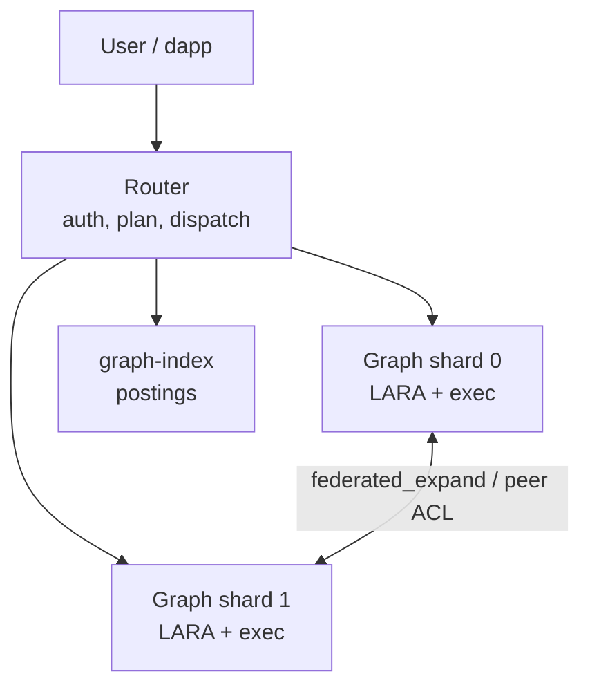
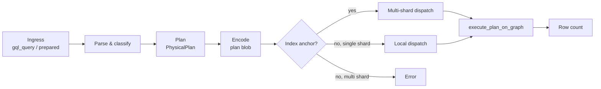

# System overview

## Purpose

Describe how Gleaph runs on the Internet Computer: which canisters exist, how a GQL request flows, and where responsibilities sit between crates.

## Non-goals

- Frontend or SDK wire formats (see `sdk/`, `frontend/`).
- Full GQL language tutorial (see [gqlstandards.org](https://www.gqlstandards.org/)).

## Canister topology

| Canister | Crate | Responsibilities |
|----------|-------|------------------|
| Router | `crates/router` | RBAC, parse+plan ad-hoc GQL, prepared registry, shard registry, **vertex placement authority**, multi-shard `dispatch_plan_blob` |
| Graph | `crates/graph` | Stable graph state, `execute_plan_*`, federated expand, migration payloads, local indexes |
| Graph index | `crates/graph-index` | Global property equality index with `PostingHit { shard_id, vertex_id }` |

Graph shards **do not** expose arbitrary GQL to end users; they accept `ExecutePlanArgs` from the router (or sibling graph shards for federation helpers).

## Request flow (read path)

1. **Ingress** — `router::gql_query` / `prepared_execute` (see `crates/router/src/gql.rs`, `prepared.rs`).
2. **Parse & classify** — `gleaph_gql::parser`, `program_modification::classify_program`.
3. **Plan** — `gleaph_gql_planner::build_block_plan_with_schema` → `PhysicalPlan`.
4. **Encode** — `encode_block_plans` → plan blob + write-path flag.
5. **Route** — `dispatch_plan_blob`:
   - If plan has an **index anchor** (`SeedProbe`), lookup postings and fan out to shards.
   - If **no anchor** and multiple shards → error (`no index anchor: single-shard graph required`).
   - If single shard → execute locally with optional empty seed.
6. **Execute** — `execute_plan_on_graph` with `ExecutePlanArgs { target_shard_id, plan_blob, seed_bindings_blob, mode }` (`crates/graph-kernel/src/plan_exec.rs`).
7. **Return** — Row count (values materialized on graph; router aggregates counts for multi-shard).

Update path uses `GqlExecutionMode::Update` and DML operators; graph performs posting maintenance where configured.

## Crate boundaries (important)

From `AGENT.md`:

| Crate | Scope |
|-------|--------|
| `gleaph-gql` | ISO-oriented parser, validator, AST — **no** IC/Gleaph-specific logic |
| `gleaph-gql-planner` | AST → `PhysicalPlan` — **no** IC/Gleaph storage |
| `gleaph-gql-ic` | IC value encoding (params blob, etc.) |
| `gleaph-graph-kernel` | Shared wire types: federation, `ExecutePlanArgs`, index hits |
| `gleaph-graph` | Storage facade, plan **executor**, federation expand |
| `gleaph-router` | Control plane + dispatch |
| `ic-stable-lara` | CSR/LARA primitives — **no** `LogicalVertexId` |

IC extensions (`IC.PRINCIPAL`, `IC.MSG_CALLER()`) are implemented in the GQL/IC bridge and executor, not in the portable parser crate.

## Execution modes

| Mode | Router | Graph | Use |
|------|--------|-------|-----|
| `Query` | composite query | `execute_plan_query` | Read-only plans |
| `Update` | update | `execute_plan_update` | DML, index maintenance |

A composite query must not call graph update methods (`plan_exec.rs` module docs).

## Deployment modes

| Mode | Configuration | Behavior |
|------|---------------|----------|
| **Standalone graph** | No `FederationRouting` in graph metadata | `standalone_logical_vertex_id`; single-process dev/tests |
| **Federated graph** | Router + N shards + index | Placement via router; cross-shard expand and index routing |

See [federation/model.md](../federation/model.md).

## Source of truth (code)

- Router dispatch: `crates/router/src/gql.rs`
- Graph execution entry: `crates/graph/src/plan/query/executor.rs`, canister handlers
- Wire types: `crates/graph-kernel/src/plan_exec.rs`, `federation.rs`
- RBAC: `crates/auth`, `crates/router/src/rbac.rs`

## Related documents

- [gql/layers.md](../gql/layers.md)
- [federation/model.md](../federation/model.md)
- [security/rbac-and-prepared.md](../security/rbac-and-prepared.md)
