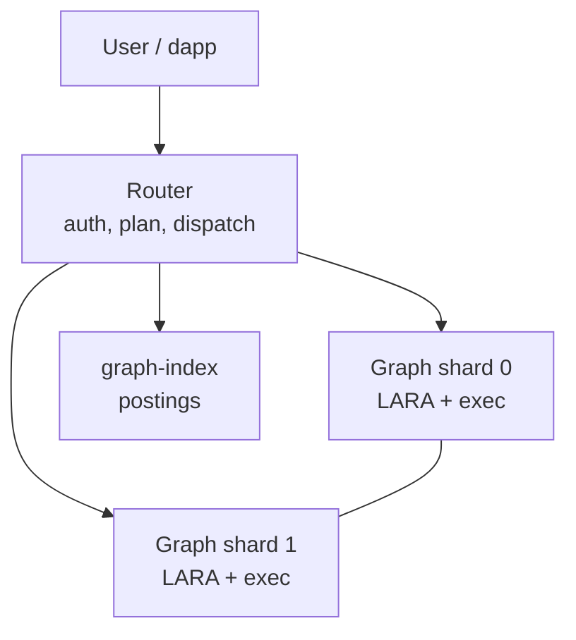
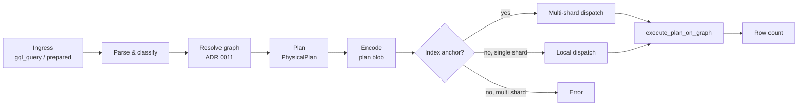

# System overview

## Purpose

Describe how Gleaph runs on the Internet Computer: which canisters exist, how a GQL request flows, and which crate owns each state boundary, API surface, and execution step.

## Non-goals

- Frontend or SDK wire formats (see `sdk/`, `frontend/`).
- Full GQL language tutorial (see [gqlstandards.org](https://www.gqlstandards.org/)).

## Canister topology

```mermaid
flowchart TB
    User["User / dapp"] --> Router["Router<br/>auth, plan, dispatch"]
    Router --> G0["Graph shard 0<br/>LARA + exec"]
    Router --> G1["Graph shard 1<br/>LARA + exec"]
    Router --> Idx["graph-index<br/>postings"]
    G0 --- G1
```

| Canister | Crate | State / API / execution boundary |
|----------|-------|--------------------------------|
| Router | `crates/router` | RBAC decisions, ad-hoc GQL parse+plan entry, prepared registry, shard registry, resolution catalogs, multi-shard `dispatch_plan_blob` |
| Graph | `crates/graph` | Stable graph state, `execute_plan_*` entrypoints, local indexes |
| Graph index | `crates/graph-index` | Optional global property equality postings and lookup APIs returning `PostingHit { shard_id, vertex_id }` |
| Vector index | `crates/graph-vector-index` | Optional derived vector search state and ANN lookup APIs |
| Provision | `crates/provision` | Service-wide durable canister issuance jobs, receipts, artifact/release handling, and deployment trust binding ([ADR 0035](../adr/0035-provision-canister-and-issuance-protocol.md)) |

The planned provisioned topology is described by [ADR 0054](../adr/0054-provisioned-logical-graph-topology-and-resource-activation.md): initial bootstrap creates Router, the default logical graph, and its first Graph shard; optional Property, Vector, Text, and Procedure canisters are activated by subsequent requests. Text Index and Procedure are not current Router canisters in this overview and remain future integration surfaces.

Graph shards **do not** expose arbitrary GQL to end users; they accept `ExecutePlanArgs` from the router (or sibling graph shards for federation helpers).

## Request flow (read path)

```mermaid
flowchart LR
    A[Ingress<br/>gql_query / prepared] --> B[Parse & classify]
    B --> R[Resolve graph<br/>ADR 0011]
    R --> C[Plan<br/>PhysicalPlan]
    C --> D[Encode<br/>plan blob]
    D --> E{Index anchor?}
    E -->|yes| F[Multi-shard dispatch]
    E -->|no, single shard| G[Local dispatch]
    E -->|no, multi shard| H[Error]
    F --> I[execute_plan_on_graph]
    G --> I
    I --> J[Row count]
```

1. **Ingress** — `router::gql_query` / `prepared_execute` (see `crates/router/src/gql.rs`, `prepared.rs`).
2. **Parse & classify** — `gleaph_gql::parser`, `program_modification::classify_program`.
3. **Resolve graph** — effective graph from `session_activity` + HOME (`is_home` or sole visible) / default; index catalog and shard list keyed by resolved `GraphId` ([ADR 0011](../adr/0011-gql-graph-resolution-and-catalog-scoping.md)).
4. **Validate & ingress dispatch** — `validate_with_seed(SessionGraphSeed)`; defocus remote top-level `USE GRAPH` when applicable (`resolve_ingress_dispatch`).
5. **Plan** — `gleaph_gql_planner::build_block_plan_with_schema` → `PhysicalPlan`.
6. **Encode** — `encode_block_plans` → plan blob + write-path flag.
7. **Route** — `dispatch_plan_blob` (see [sharding/federation-target.md](../sharding/federation-target.md) for target; [sharding/standalone-mode.md](../sharding/standalone-mode.md) for current standalone focus):
   - **Target:** Router calls index (`lookup_equal` / `lookup_intersection`), slices `PostingHit` by shard, dispatches with seeds.
   - **Current:** If plan has an **index anchor** (`SeedProbe` on `IndexScan` only), lookup postings and fan out to shards.
   - If **no anchor** and multiple shards → error (`no index anchor: single-shard graph required`).
   - If single shard → execute locally with optional empty seed.
8. **Execute** — `execute_plan_on_graph` with `ExecutePlanArgs { target_shard_id, element_id_encoding_key, plan_blob, seed_bindings_blob, mode }` (`crates/graph-kernel/src/plan_exec.rs`).
9. **Return** — Row count (values materialized on graph; router aggregates counts for multi-shard).

Update path uses `GqlExecutionMode::Update` and DML operators; graph performs posting maintenance where configured.

Deferred physical reclamation (tombstone compaction, span rebalance) is drained by a graph-canister **maintenance timer** (`ic-cdk-timers`): mutations bound their inline drain and arm an adaptive self-rescheduling one-shot, which is also armed from `#[init]` / `#[post_upgrade]` and stops when the stable queue empties. Tombstones gate reads synchronously, so deferral is visibility-neutral. See [ADR 0020](../adr/0020-deferred-maintenance-timer-drain.md).

## Crate boundaries (important)

From `AGENT.md`:

| Crate | Scope |
|-------|--------|
| `gleaph-gql` | ISO-oriented parser, validator, AST — **no** IC/Gleaph-specific logic |
| `gleaph-gql-planner` | AST → `PhysicalPlan` — **no** IC/Gleaph storage |
| `gleaph-gql-ic` | IC value encoding (params blob, etc.) |
| `gleaph-graph-kernel` | Shared wire types: federation, `ExecutePlanArgs`, index hits |
| `gleaph-graph` | Storage facade, plan **executor**, federation expand |
| `gleaph-router` | Control plane + dispatch |
| `ic-stable-lara` | CSR/LARA primitives — **no** `GlobalVertexId` |

IC extensions (`IC.PRINCIPAL`, `IC.MSG_CALLER()`) are implemented in the GQL/IC bridge and executor, not in the portable parser crate.

## Execution modes

| Mode | Router | Graph | Use |
|------|--------|-------|-----|
| `Query` | composite query | `execute_plan_query` | Read-only plans |
| `Update` | update | `execute_plan_update` | DML, index maintenance |

A composite query must not call graph update methods (`plan_exec.rs` module docs).

## Deployment modes

| Mode | Configuration | Behavior |
|------|---------------|----------|
| **Standalone graph** | No `FederationRouting` in graph metadata | `GlobalVertexId(0, local)`; single-process dev/tests |
| **Federated graph (current)** | Router + N shards + index cluster | Shard routing via router; vertex existence on graph shard ([ADR 0017](../adr/0017-graph-vertex-existence-ssot.md)); current shard registration requires an `index_canister` and completes the attach handshake; cross-shard expand deferred |
| **Provisioned graph (target)** | Router + N shards; optional index cluster | Initial bootstrap may be indexless; Property/Vector/Text/Procedure resources are activated independently as their provisioning and registration contracts are implemented ([ADR 0054](../adr/0054-provisioned-logical-graph-topology-and-resource-activation.md)) |

See [federation/model.md](../federation/model.md).

## Source of truth (code)

- Router dispatch: `crates/router/src/gql.rs`
- Graph execution entry: `crates/graph/src/plan/query/executor.rs`, canister handlers
- Wire types: `crates/graph-kernel/src/plan_exec.rs`, `federation.rs`
- RBAC: `crates/auth`, `crates/router/src/rbac.rs`

## Related documents

- [gql/layers.md](../gql/layers.md)
- [federation/model.md](../federation/model.md)
- [security/rbac-and-prepared.md](../security/rbac-and-prepared.md)
- [ADR 0053: Prepared-query code generation and client-runtime boundary](../adr/0053-prepared-query-codegen-and-client-runtime-boundary.md)
- [ADR 0054: Provisioned logical-graph topology and on-demand resource activation](../adr/0054-provisioned-logical-graph-topology-and-resource-activation.md)
