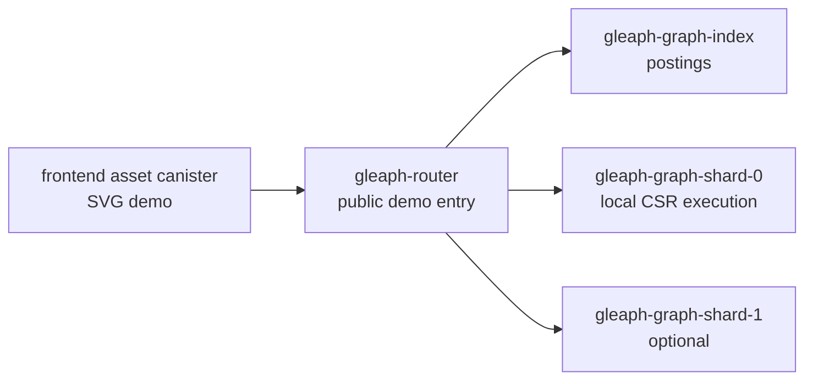
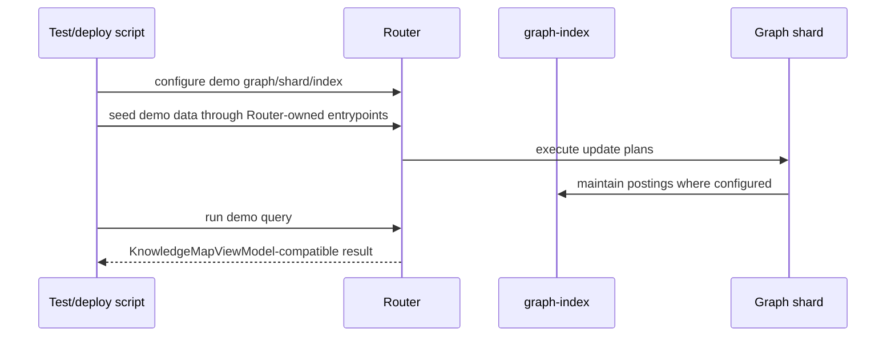

# Gleaph Knowledge Map Demo

Last updated: 2026-07-02
Anchor timestamp: 2026-07-02 08:38:37 UTC +0000

## Status

**Partially implemented** — the frontend MVP exists under `frontend/apps/knowledge-map` with a lightweight SVG renderer, a Router-row adapter, and an optional live Router `gql_query` source. Preview and live modes share one canonical graph definition in `frontend/apps/knowledge-map/seeds/knowledge-map-graph.json` (24 nodes, 26 edges, default scenario `alice-fan-out`). Local deploy and PocketIC tests seed the same graph through Router `gql_execute_idempotent` and verify Router `gql_query` returns all demo edges through `rows_blob`.

## Purpose

Build a non-technical visual demo that shows Gleaph as a graph database where answers are found by following relationships, not only by matching keywords.

The demo should be able to truthfully say:

> The frontend is visualizing results returned by Gleaph canisters running in the local PocketIC-backed environment.

## Audience

- Non-technical viewers who need to understand graph traversal visually.
- Technical reviewers who need to verify that the demo respects Gleaph's Router / Graph / graph-index boundaries.
- Contributors who will implement or maintain the demo.

## Non-goals

- Full GQL tutorial.
- Production GraphRAG or vector database positioning.
- Cross-shard expand. Federation docs mark cross-shard expand as unsupported until a follow-up ADR.
- Direct frontend calls to graph shards or graph-index.
- Replacing the dashboard or operator UI.

## Product experience

The user sees an animated knowledge map. They choose a natural-language question such as:

```text
Show Alice's related projects.
```

The graph then animates a path:

```text
Alice -> Post -> Topic -> Project -> Document
```

The visible story is:

1. Find the starting entity.
2. Follow its relationships.
3. Reveal related knowledge.
4. Explain why each result was found.

Technical labels such as Router, graph-index, shard, seed binding, and GQL should be hidden by default. A technical mode may reveal the backend flow for reviewers.

## Visual direction

Use a light, Internet Computer-inspired product style:

- white or near-white page background;
- fine slate borders and restrained shadows;
- black-to-slate typography;
- blue, cyan, violet, and teal accents;
- light gradient washes instead of dark space or heavy glow;
- SVG animation over WebGL for the MVP.

The graph should feel like a precise product diagram that comes alive, not like a game scene.

## Runtime topology

For this demo, "local IC network" means the repository's PocketIC-backed local/e2e environment.



### Boundary rule

The frontend calls only the Router-facing demo/query API. It must not call graph shards or graph-index directly.

This preserves the existing architecture:

| Domain | Demo responsibility |
|--------|---------------------|
| Frontend asset canister | Render the animated map and story panels. |
| Router | Own authentication, query entry, label/property resolution, index lookup, shard dispatch, and result merge. |
| graph-index | Own posting lookup and intersection. |
| Graph shard | Own local graph storage and local plan execution. |

### ICP CLI manifest

The repository root contains `icp.yaml` with these canisters:

| Canister | Recipe | Purpose |
|----------|--------|---------|
| `gleaph-router` | `@dfinity/rust@v3.2.0` | Public Router entrypoint for query/demo calls. |
| `gleaph-graph-index` | `@dfinity/rust@v3.2.0` | Posting lookup canister. |
| `gleaph-graph-shard-0` | `@dfinity/rust@v3.2.0` | First graph shard canister. |
| `knowledge-map` | `@dfinity/asset-canister@v2.2.1` | Solid/Vite frontend asset canister. |

The local network uses `mode: managed` with `gateway.port: 0`, so parallel worktrees can start local IC gateways without hard-coded port collisions.

Current status: `icp build` succeeds for all configured canisters, and `scripts/deploy-knowledge-map-local.sh` deploys the local IC demo stack. The asset build commands run `corepack pnpm` with `HOME`, `COREPACK_HOME`, `XDG_CACHE_HOME`, and `XDG_DATA_HOME` under `.icp/`, so local CLI builds do not depend on global package-manager cache paths. The script wires local deployment order, init args, and the Alice fan-out demo graph:

- `RouterInitArgs`: `issuing_principal`, `initial_admins` (auth bootstrap);
- `IndexInitArgs`: `router_canister`;
- `GraphInitArgs`: logical graph name, Router canister id, shard id, and index canister id;
- `gql_execute_idempotent`: 28 idempotent mutations generated from `knowledge-map-graph.json` (node inserts plus `MATCH ... RETURN ... NEXT INSERT ...` edge inserts).

Seed generation and application:

```text
frontend/apps/knowledge-map/scripts/generate-seeds.mjs
  -> seeds/knowledge-map-seeds.json
frontend/apps/knowledge-map/scripts/apply-knowledge-map-seeds.mjs
  -> Router gql_execute_idempotent (local icp)
crates/pocket-ic-tests::seed_knowledge_map_graph
  -> same seeds JSON for PocketIC e2e
```

The verified local deployment used:

- Router: `a2cb4-hh777-77775-aaaba-cai`;
- graph-index: `a5dhi-k7777-77775-aaabq-cai`;
- graph shard 0: `aiewf-lx777-77775-aaaca-cai`;
- frontend asset canister: `apfqr-gp777-77775-aaacq-cai`;
- gateway: `http://localhost:53916/`.

The frontend asset canister responded with `200 OK`, and its `ic_env` cookie included the Router, graph-index, graph-shard, and frontend canister ids. The browser-rendered app loaded the live Router relationship. Script-level Router query verification is optional through `GLEAPH_DEMO_VERIFY_QUERY=1`; the default path keeps deployment from depending on local CLI query behavior.

## Source of truth

The source of truth for demo state is the Gleaph query result returned through the Router.

The frontend must not treat hard-coded visual scenarios as canonical data. A scenario is presentation configuration only: question text, optional preferred layout hints, and viewer-friendly copy.

```text
Router row result
  -> KnowledgeMapViewModel
    -> SVG graph
    -> story steps
    -> result cards
```

The current frontend fixture intentionally uses Router-shaped rows before adaptation. This keeps mocked data on the same presentation path that a future Router response will use.

The frontend also includes an optional live source. When a Router canister id is available, the demo calls Router `gql_query`, decodes `rows_blob`, maps `edge_id` and `edge_kind` into the canonical graph fixture, and then reuses the same `KnowledgeMapViewModel` adapter. The live query intentionally projects edge properties only:

```gql
MATCH ()-[e]->() WHERE e.demo_edge_id IS NOT NULL
RETURN e.demo_edge_id AS edge_id, e.demo_kind AS edge_kind
ORDER BY edge_id
```

Node `demo_id` projection on multi-label traversals is omitted because the current planner rejects `a.demo_id` bindings on the full fan-out graph query.

## Demo data model

The seed dataset should be small, memorable, and relationship-heavy:

| Kind | Examples |
|------|----------|
| Person | Alice, Bob, Chandra |
| Post | "Graph storage notes", "Query routing note" |
| Topic | Storage, Routing, Access Control |
| Project | Gleaph |
| Document | LARA overview, Federation query semantics, RBAC and prepared queries |

Representative path:

```text
(Alice:Person)-[:WROTE]->(GraphStoragePost:Post)
  -[:TAGGED]->(Storage:Topic)
  -[:USED_BY]->(Gleaph:Project)
  -[:DOCUMENTED_BY]->(LaraOverview:Document)
```

The first implementation should use one shard unless the specific demo story needs multi-shard seed routing. A second shard can be added after the single-shard story is reliable.

## Query contract

The frontend should request a named demo scenario from the Router, or call a prepared query registered on the Router.

The preferred rendering shape is a demo view model, not raw GQL rows:

```ts
type KnowledgeMapViewModel = {
  nodes: DemoNode[];
  edges: DemoEdge[];
  activePath: string[];
  storySteps: StoryStep[];
  results: ResultCard[];
  technicalFlow: TechnicalFlowStep[];
};

type DemoNode = {
  id: string;
  label: string;
  kind: "person" | "post" | "topic" | "project" | "document";
  positionHint?: [number, number, number];
};

type DemoEdge = {
  id: string;
  source: string;
  target: string;
  label: string;
};

type StoryStep = {
  nodeId?: string;
  edgeId?: string;
  text: string;
};

type ResultCard = {
  title: string;
  kind: string;
  reason: string;
  nodeId?: string;
};
```

### Router-row adapter

The implemented MVP uses a frontend adapter that consumes Router-shaped rows and returns `KnowledgeMapViewModel`.

```ts
type RouterKnowledgeMapResponse = {
  id: string;
  title: string;
  question: string;
  rows: RouterKnowledgeMapRow[];
};

type RouterKnowledgeMapRow =
  | RouterNodeRow
  | RouterEdgeRow
  | RouterPathRow
  | RouterResultRow
  | RouterTechnicalFlowRow;
```

This row contract is still a frontend-side integration contract, not a committed Router canister API. The backend phase should either make Router return this shape directly for demo scenarios or map prepared-query rows into the same adapter input.

### API placement

There are two acceptable implementation options:

1. **Preferred long-term:** use prepared queries plus the frontend adapter that maps rows into `KnowledgeMapViewModel`.
2. **Acceptable MVP backend:** expose a small Router-owned demo endpoint that returns Router-shaped rows for a fixed scenario.

The MVP endpoint is acceptable only if it stays in Router-owned demo/integration code and does not leak demo concepts into `gleaph-gql` or `gleaph-gql-planner`.

## Frontend architecture

Place the app under:

```text
frontend/apps/knowledge-map/
```

Suggested structure:

```text
frontend/apps/knowledge-map/src/
  App.tsx
  types.ts
  api/
    knowledgeMapClient.ts
    viewModelAdapter.ts
  components/
    KnowledgeMapDemo.tsx
    DemoHeader.tsx
    QuestionPanel.tsx
    GraphStage.tsx
    InsightPanel.tsx
    StorySteps.tsx
    ResultCards.tsx
    TechnicalFlow.tsx
    DemoControls.tsx
  graph/
    graphLayout.ts
    playback.ts
```

### Component responsibilities

| Component | Responsibility |
|-----------|----------------|
| `KnowledgeMapDemo` | Own selected scenario, playback state, active step, and technical mode. |
| `QuestionPanel` | Show natural-language demo questions. |
| `GraphStage` | Render the responsive SVG graph and relationship trail. |
| `StorySteps` | Show plain-language traversal narration. |
| `ResultCards` | Show found items and why they were found. |
| `TechnicalFlow` | Reveal Router / index / shard execution steps when enabled. |

### Visualization rule

The SVG graph must be a rendering layer. It consumes `KnowledgeMapViewModel` and playback state; it does not own query semantics, graph truth, or canister state.

## Playback model

```ts
type PlaybackStatus = "idle" | "playing" | "paused" | "complete";

type PlaybackFrame = {
  activeStepIndex: number;
  activeNodeId?: string;
  activeEdgeId?: string;
  visitedNodeIds: string[];
  visitedEdgeIds: string[];
  progress: number;
  complete: boolean;
};
```

The same playback frame drives:

- node glow and edge trail in the SVG graph;
- highlighted story step;
- delayed result-card reveal;
- optional technical-flow progress.

## Seed and bootstrap flow

The demo needs deterministic data setup.



Seed data should be inserted through the same Router-controlled path the frontend will exercise, unless an existing PocketIC-only helper is deliberately used for setup speed. If a helper is used, the query path still must go through Router.

## Implementation phases

### Phase 1: Design and contract

- Add this design document.
- Define the view model and scenario list.
- Decide whether the MVP uses a Router demo endpoint or prepared query plus frontend adapter.

Status: complete for the frontend contract; backend API placement remains open.

### Phase 2: PocketIC backend loop

- Start Router, graph-index, and one graph shard in PocketIC.
- Seed the knowledge-map dataset.
- Query through Router and assert the returned data can produce `KnowledgeMapViewModel`.
- Keep graph-index and graph shard hidden behind Router.

Status: partially implemented. `router_gql_query::single_shard_knowledge_map_relationship_rows` verifies the Router can return source vertex id, edge id, target vertex id, and edge metadata through `gql_query` / `rows_blob`. A full named scenario API or prepared-query mapping is still planned.

### Phase 3: Frontend shell

- Create `frontend/apps/knowledge-map`.
- Add Solid, Vite, Tailwind, and a lightweight SVG graph renderer.
- Render the UI shell with a mocked `KnowledgeMapViewModel` that matches the backend contract.

Status: implemented with Router-row fixtures adapted into `KnowledgeMapViewModel`.

### Phase 4: Frontend-to-Router connection

- Generate or hand-wire the Router client used by the frontend.
- Read canister ids from the IC asset-canister environment for deployed local/demo builds.
- Replace mocked data with Router results.

Status: partially implemented. The frontend has a hand-wired Router `gql_query` client that reads `PUBLIC_CANISTER_ID:gleaph-router` or `PUBLIC_CANISTER_ID:router` from the asset canister `ic_env` cookie, with `VITE_ROUTER_CANISTER_ID` as a local Vite fallback. Live mode validates all 26 seeded demo edges against the `alice-fan-out` scenario from `knowledge-map-graph.json`.

### Phase 5: ICP CLI deploy wiring

- Keep `icp.yaml` as the shared build/deploy manifest.
- Add a script that creates canisters, resolves canister ids, encodes init args, deploys Router, graph-index, graph shard, and asset canister, then seeds the demo graph.
- Keep all seed/query calls Router-owned unless a PocketIC-only setup helper is explicitly documented for test speed.

Status: partially implemented. The manifest exists; `icp build` validates all configured canisters; `scripts/deploy-knowledge-map-local.sh` handles local network startup, canister id resolution, Router/Index/Graph init args, Router graph/shard registration, full fan-out graph seeding, and asset canister deployment. Sandbox-external execution starts the local network successfully and deploys the stack. Full live browser-to-Router validation is still planned.

### Phase 6: Graph polish

- Add node category materials, active route glow, camera follow, and result reveal.
- Keep labels sparse and readable.
- Keep non-technical copy visible by default; keep technical flow optional.

### Phase 7: Validation

- PocketIC e2e: canisters start, seed data loads, Router query returns expected path.
- Frontend build: app compiles and can be deployed as an asset canister.
- Browser validation: SVG graph is visible, route playback completes, result cards match the Router result.

Current validation includes PocketIC tests for Router relationship rows and the full knowledge-map fan-out seed/query path, plus frontend type/build checks. It does not yet deploy the frontend as an asset canister or validate a live browser-to-Router call.

## Validation commands

Current validation commands:

```text
cargo fmt --all
cargo check -p gleaph-pocket-ic-tests --tests
cargo clippy -p gleaph-pocket-ic-tests --tests -- -D warnings
cargo test -p gleaph-pocket-ic-tests --test router_gql_query single_shard_knowledge_map_fan_out
pnpm knowledge-map:check
pnpm --filter @gleaph/knowledge-map build
icp build knowledge-map
```

Do not add broad benchmarks for the first visual demo unless the implementation changes graph traversal, storage layout, index routing, serialization, or canister-facing execution paths.

## Design constraints

- Preserve Router ownership of public GQL/prepared entrypoints.
- Preserve graph-index ownership of postings.
- Preserve graph shard ownership of local CSR execution.
- Keep demo-only concepts out of `gleaph-gql` and `gleaph-gql-planner`.
- Avoid cross-shard expand stories until the underlying architecture is implemented.
- Make planned or mocked behavior explicit in UI and docs.

## Open decisions

1. Should the MVP Router contract be a dedicated demo endpoint or prepared query plus frontend adapter?
2. Should the first demo use one shard only, or include a second shard to visualize Router fan-out?
3. Should the seed dataset use repository concepts, a generic knowledge workspace, or both?
4. Should the asset canister be part of the first PocketIC e2e test, or validated separately through `icp deploy`?
5. Should the initial `icp-cli` wiring script live under a root `scripts/` directory or inside `frontend/apps/knowledge-map` as a demo-specific tool?

## Related documents

- [../architecture/overview.md](../architecture/overview.md)
- [../sharding/federation-target.md](../sharding/federation-target.md)
- [../federation/query-semantics.md](../federation/query-semantics.md)
- [../security/rbac-and-prepared.md](../security/rbac-and-prepared.md)
- [../gql/layers.md](../gql/layers.md)
