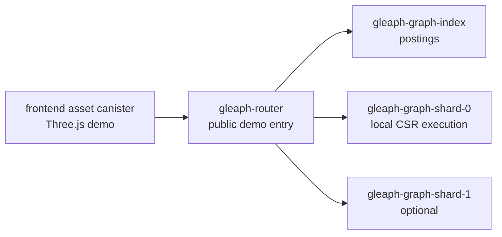
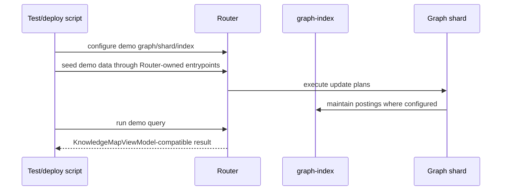

# Gleaph Knowledge Map Demo

Last updated: 2026-06-13  
Anchor timestamp: 2026-06-13 14:20:35 UTC +0000

## Status

**Planned** — this document defines the demo architecture before implementation. It is not an implemented runtime contract yet.

## Purpose

Build a non-technical visual demo that shows Gleaph as a graph database where answers are found by following relationships, not only by matching keywords.

The demo should be able to truthfully say:

> The frontend is visualizing results returned by Gleaph canisters running in the local PocketIC-backed environment.

## Audience

- Non-technical viewers who need to understand graph traversal visually.
- Technical reviewers who need to verify that the demo respects Gleaph's Router / Graph / graph-index boundaries.
- Contributors who will implement or maintain the demo.

## Non-goals

- Full GQL tutorial.
- Production GraphRAG or vector database positioning.
- Cross-shard expand. Federation docs mark cross-shard expand as unsupported until a follow-up ADR.
- Direct frontend calls to graph shards or graph-index.
- Replacing the dashboard or operator UI.

## Product experience

The user sees a 3D knowledge map. They choose a natural-language question such as:

```text
Show Alice's related projects.
```

The graph then animates a path:

```text
Alice -> Post -> Topic -> Project -> Document
```

The visible story is:

1. Find the starting entity.
2. Follow its relationships.
3. Reveal related knowledge.
4. Explain why each result was found.

Technical labels such as Router, graph-index, shard, seed binding, and GQL should be hidden by default. A technical mode may reveal the backend flow for reviewers.

## Runtime topology

For this demo, "local IC network" means the repository's PocketIC-backed local/e2e environment.



### Boundary rule

The frontend calls only the Router-facing demo/query API. It must not call graph shards or graph-index directly.

This preserves the existing architecture:

| Domain | Demo responsibility |
|--------|---------------------|
| Frontend asset canister | Render the 3D map and story panels. |
| Router | Own authentication, query entry, label/property resolution, index lookup, shard dispatch, and result merge. |
| graph-index | Own posting lookup and intersection. |
| Graph shard | Own local graph storage and local plan execution. |

## Source of truth

The source of truth for demo state is the Gleaph query result returned through the Router.

The frontend must not treat hard-coded Three.js scenarios as canonical data. A scenario is presentation configuration only: question text, optional preferred camera path, and viewer-friendly copy.

```text
Router result
  -> KnowledgeMapViewModel
    -> Three.js scene
    -> story steps
    -> result cards
```

## Demo data model

The seed dataset should be small, memorable, and relationship-heavy:

| Kind | Examples |
|------|----------|
| Person | Alice, Bob, Chandra |
| Post | "Graph storage notes", "Query routing note" |
| Topic | Storage, Routing, Access Control |
| Project | Gleaph |
| Document | LARA overview, Federation query semantics, RBAC and prepared queries |

Representative path:

```text
(Alice:Person)-[:WROTE]->(GraphStoragePost:Post)
  -[:TAGGED]->(Storage:Topic)
  -[:USED_BY]->(Gleaph:Project)
  -[:DOCUMENTED_BY]->(LaraOverview:Document)
```

The first implementation should use one shard unless the specific demo story needs multi-shard seed routing. A second shard can be added after the single-shard story is reliable.

## Query contract

The frontend should request a named demo scenario from the Router, or call a prepared query registered on the Router.

The preferred frontend-facing shape is a demo view model, not raw GQL rows:

```ts
type KnowledgeMapViewModel = {
  nodes: DemoNode[];
  edges: DemoEdge[];
  activePath: string[];
  storySteps: StoryStep[];
  results: ResultCard[];
  technicalFlow: TechnicalFlowStep[];
};

type DemoNode = {
  id: string;
  label: string;
  kind: "person" | "post" | "topic" | "project" | "document";
  positionHint?: [number, number, number];
};

type DemoEdge = {
  id: string;
  source: string;
  target: string;
  label: string;
};

type StoryStep = {
  nodeId?: string;
  edgeId?: string;
  text: string;
};

type ResultCard = {
  title: string;
  kind: string;
  reason: string;
  nodeId?: string;
};
```

### API placement

There are two acceptable implementation options:

1. **Preferred long-term:** use prepared queries plus a frontend adapter that maps rows into `KnowledgeMapViewModel`.
2. **Preferred MVP:** expose a small Router-owned demo endpoint that returns `KnowledgeMapViewModel` for a fixed scenario.

The MVP endpoint is acceptable only if it stays in Router-owned demo/integration code and does not leak demo concepts into `gleaph-gql` or `gleaph-gql-planner`.

## Frontend architecture

Place the app under:

```text
frontend/apps/knowledge-map/
```

Suggested structure:

```text
frontend/apps/knowledge-map/src/
  App.tsx
  types.ts
  api/
    knowledgeMapClient.ts
    viewModelAdapter.ts
  components/
    KnowledgeMapDemo.tsx
    DemoHeader.tsx
    QuestionPanel.tsx
    GraphStage.tsx
    InsightPanel.tsx
    StorySteps.tsx
    ResultCards.tsx
    TechnicalFlow.tsx
    DemoControls.tsx
  graph/
    GraphScene.ts
    graphObjects.ts
    graphMaterials.ts
    playback.ts
    camera.ts
    labels.ts
```

### Component responsibilities

| Component | Responsibility |
|-----------|----------------|
| `KnowledgeMapDemo` | Own selected scenario, playback state, active step, and technical mode. |
| `QuestionPanel` | Show natural-language demo questions. |
| `GraphStage` | Mount and resize the Three.js canvas. |
| `GraphScene` | Own Three.js renderer, scene, camera, meshes, and animation loop. |
| `StorySteps` | Show plain-language traversal narration. |
| `ResultCards` | Show found items and why they were found. |
| `TechnicalFlow` | Reveal Router / index / shard execution steps when enabled. |

### Three.js rule

Three.js must be a rendering layer. It consumes `KnowledgeMapViewModel` and playback state; it does not own query semantics, graph truth, or canister state.

## Playback model

```ts
type PlaybackStatus = "idle" | "playing" | "paused" | "complete";

type PlaybackFrame = {
  activeStepIndex: number;
  activeNodeId?: string;
  activeEdgeId?: string;
  visitedNodeIds: string[];
  visitedEdgeIds: string[];
  progress: number;
  complete: boolean;
};
```

The same playback frame drives:

- node glow and edge trail in Three.js;
- highlighted story step;
- delayed result-card reveal;
- optional technical-flow progress.

## Seed and bootstrap flow

The demo needs deterministic data setup.



Seed data should be inserted through the same Router-controlled path the frontend will exercise, unless an existing PocketIC-only helper is deliberately used for setup speed. If a helper is used, the query path still must go through Router.

## Implementation phases

### Phase 1: Design and contract

- Add this design document.
- Define the view model and scenario list.
- Decide whether the MVP uses a Router demo endpoint or prepared query plus frontend adapter.

### Phase 2: PocketIC backend loop

- Start Router, graph-index, and one graph shard in PocketIC.
- Seed the knowledge-map dataset.
- Query through Router and assert the returned data can produce `KnowledgeMapViewModel`.
- Keep graph-index and graph shard hidden behind Router.

### Phase 3: Frontend shell

- Create `frontend/apps/knowledge-map`.
- Add Solid, Vite, Tailwind, and Three.js.
- Render the UI shell with a mocked `KnowledgeMapViewModel` that matches the backend contract.

### Phase 4: Frontend-to-Router connection

- Generate or hand-wire the Router client used by the frontend.
- Read canister ids from the IC asset-canister environment for deployed local/demo builds.
- Replace mocked data with Router results.

### Phase 5: Three.js polish

- Add node category materials, active route glow, camera follow, and result reveal.
- Keep labels sparse and readable.
- Keep non-technical copy visible by default; keep technical flow optional.

### Phase 6: Validation

- PocketIC e2e: canisters start, seed data loads, Router query returns expected path.
- Frontend build: app compiles and can be deployed as an asset canister.
- Browser validation: 3D canvas is nonblank, route playback completes, result cards match the Router result.

## Validation commands

Exact commands will depend on the final `icp.yaml`, PocketIC test target, and frontend package name. The intended validation classes are:

```text
cargo fmt --check
cargo test -p gleaph-router <knowledge-map/pocketic target>
pnpm --filter @gleaph/knowledge-map build
icp deploy <local/PocketIC environment>
```

Do not add broad benchmarks for the first visual demo unless the implementation changes graph traversal, storage layout, index routing, serialization, or canister-facing execution paths.

## Design constraints

- Preserve Router ownership of public GQL/prepared entrypoints.
- Preserve graph-index ownership of postings.
- Preserve graph shard ownership of local CSR execution.
- Keep demo-only concepts out of `gleaph-gql` and `gleaph-gql-planner`.
- Avoid cross-shard expand stories until the underlying architecture is implemented.
- Make planned or mocked behavior explicit in UI and docs.

## Open decisions

1. Should the MVP Router contract be a dedicated demo endpoint or prepared query plus frontend adapter?
2. Should the first demo use one shard only, or include a second shard to visualize Router fan-out?
3. Should the seed dataset use repository concepts, a generic knowledge workspace, or both?
4. Should the asset canister be part of the first PocketIC e2e test, or validated separately through `icp deploy`?

## Related documents

- [../architecture/overview.md](../architecture/overview.md)
- [../sharding/federation-target.md](../sharding/federation-target.md)
- [../federation/query-semantics.md](../federation/query-semantics.md)
- [../security/rbac-and-prepared.md](../security/rbac-and-prepared.md)
- [../gql/layers.md](../gql/layers.md)
