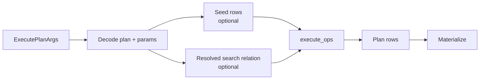

# Execution pipeline

Last updated: 2026-07-02
Anchor timestamp: 2026-07-02 00:11:35 UTC +0000

## Purpose

Describe how `gleaph-graph` runs a physical plan: row representation, operator dispatch, memory pooling, and materialization.

## Non-goals

- Mutation executor internals (`crates/graph/src/plan/mutation/`).
- GQL client result serialization (router/SDK).

## Entry points

| API | Path |
|-----|------|
| `execute_plan_query_bindings` | `crates/graph/src/plan/query/executor.rs` |
| Canister | `execute_plan_query` / `execute_plan_update` handlers |

Flow:

`ExecutePlanArgs.resolved_search_blob` carries the Router-resolved non-leading `SEARCH` relation for the target shard. `QueryArena::reset()` at query start; thread-local pool reused across operators within one query.

## PlanRow

**Module:** `crates/graph/src/plan/query/row.rs`

| Field | Role |
|-------|------|
| `layout: Option<Rc<BindingLayout>>` | Dense column schema |
| `slots: Vec<Option<PlanBinding>>` | Column values |
| `spill: BTreeMap<String, PlanBinding>` | Overflow bindings |

**Operations:**

- `fork` / `fork_with_arena` — copy row with updates (expand, branch)
- `try_merge` / `try_merge_skip_one` — hash join combine (skip join keys)
- `insert` — in-place binding update

**Arena:** `QueryArena` (`arena.rs`) recycles slot `Vec` capacity after hash join; `fork_with_arena` uses pool only when buffers are available. Merge stays on slot clone for probe hot path.

## Operator dispatch

`execute_ops` matches `PlanOp` variants and calls specialized functions (`execute_expand`, `execute_hash_join`, `execute_shortest_path`, …).

Optimizations layered in executor (not only planner):

- CSR fast paths for expand
- Streaming expand when later ops preserve cardinality
- Indexed hash join merge when layouts match
- Path-only shortest-path rows with shared `PathBinding` arc

### `PlanOp::Search`

The Graph executor supports one top-level non-leading `PlanOp::Search` per plan when the Router provides a `resolved_search_blob`:

- Decode the blob into `ResolvedSearchWire` at plan-entry time and build an invocation-local lookup from local vertex id to the user-visible scalar value.
- Validate that the wire binding and alias match the plan, that all values are finite, that there are no duplicate vertex ids, and that the hit count does not exceed `MAX_VECTOR_SEARCH_TOP_K`.
- Execute as an inner join/filter against the current row set: rows whose bound vertex variable is present in the lookup survive, the scalar alias is bound to the lookup value, and row multiplicity is preserved.
- If the bound vertex is absent from a row the row is dropped (inner-join semantics).
- A `PlanOp::Search` without a decoded `resolved_search_blob` fails closed because the Router has not lowered it.

For a leading `NodeScan + Search` with a `WHERE` predicate (one equality, one to eight
`AND`-connected same-binding equalities on distinct properties, one numeric range predicate,
exactly two same-property range predicates forming one lower and one upper bound, one to eight
equality predicates on distinct properties together with one one- or two-sided numeric range
predicate on a distinct property, two to eight `OR`-connected same-binding same-property
equality predicates, two to eight `OR`-connected same-binding pure equality predicates where
property names may repeat or differ, two to eight `OR`-connected same-binding same-property
numeric range predicates, two to eight `OR`-connected same-binding cross-property numeric
range predicates, or two to eight `OR`-connected same-binding heterogeneous comparison
predicates where each leaf is independently an equality or a one-sided numeric range
comparison), the Router does not forward a vector request when the Property Index
candidate set is empty. For a two-sided range with an empty intersection (`low >= high`) the Router
short-circuits before any Property Index or Vector Index call and dispatches the stripped tail plan
with an empty `SeedBindingsWire` to every shard.

The two-to-eight same-property equality `OR` path executes as a bounded union of `lookup_equal_page`
streams: the Router deduplicates globally, label-filters before counting, and fails closed if the
allowlist would exceed `MAX_VECTOR_SEARCH_FILTER_CANDIDATES`. When the candidate set is non-empty,
the vector canister receives a bounded allowlist and returns exact top-k hits; the normal
leading-search hit-shard-only dispatch then applies.

The two-to-eight cross-property pure equality `OR` path generalizes the same-property disjunction:
each arm resolves its own `(graph_id, label_id, property_id)` tuple, each tuple must have an active
vertex property index, and the candidate set is the union of paginated `lookup_equal_page` streams for
every distinct `(property_id, encoded_value)` source, with the same per-page label filtering, global
`(shard_id, vertex_id)` deduplication, 4096 candidate bound, and empty-candidate dispatch contract.

The two-to-eight same-property or cross-property numeric range `OR` path generalizes the same-property disjunction: each arm resolves its own `(graph_id, label_id, property_id)` tuple, each tuple must have an active vertex property index, the arms for each property are converted to finite half-open encoded intervals via `gleaph_gql::numeric_range_bounds`, overlapping/touching intervals are merged **within each property id**, and the candidate set is the union of paginated `lookup_range_page` streams for every merged interval across all involved properties, with the same per-page label filtering, global `(shard_id, vertex_id)` deduplication, 4096 candidate bound, and empty-candidate dispatch contract. Intervals are not merged across property ids because encoded numeric keys are property-specific.

The two-to-eight same-binding heterogeneous equality/range `OR` path (ADR 0034 Slice 19) unifies the equality and range disjunction paths: each arm is independently classified as equality or range, every arm resolves its own `(graph_id, label_id, property_id)` tuple and must have an active vertex property index, equality values are encoded and deduplicated by `(property_id, encoded_value)`, range intervals are derived via `gleaph_gql::numeric_range_bounds` and merged **within each property id**, and the normalized equality and range sources are collected together through the shared bounded union collector. The same per-page label filtering, global `(shard_id, vertex_id)` deduplication, 4096 candidate bound, and empty-candidate dispatch contract apply. Equality and range sources are not merged with each other because they correspond to semantically distinct postings lookups.

For a non-leading `PlanOp::Search` with a `WHERE` predicate (one equality, one to eight
`AND`-connected same-binding equalities on distinct properties, one numeric range predicate,
exactly two same-property range predicates forming one lower and one upper bound, one to eight
equality predicates on distinct properties together with one one- or two-sided numeric range
predicate on a distinct property, two to eight `OR`-connected same-binding same-property
equality predicates, two to eight `OR`-connected same-binding pure equality predicates where
property names may repeat or differ, two to eight `OR`-connected same-binding same-property
numeric range predicates, two to eight `OR`-connected same-binding cross-property numeric
range predicates, or two to eight `OR`-connected same-binding heterogeneous comparison
predicates where each leaf is independently an equality or a one-sided numeric range
comparison), the Router requires exactly one positive simple label proof for the searched
binding from the top-level prefix, resolves every filter arm through the same bounded Property Index
candidate collection (`lookup_equal_page` for one equality arm, `lookup_intersection_page` for two to
eight equality arms, one `lookup_range_page` stream with the intersected finite half-open encoded
interval for one or two range arms, one `lookup_range_intersection_page` stream that walks the finite
range and sieves each page by one to eight equality arms for one to eight equality arms plus one or
two same-property range arms on a distinct property, a union of `lookup_equal_page` streams for
two to eight same-property or cross-property equality disjunction arms, a union of `lookup_range_page`
streams for two to eight same-property or cross-property one-sided range disjunction arms, or a
union of normalized equality and/or range sources for two to eight same-binding heterogeneous
disjunction arms), and skips the vector canister when the
candidate set is empty. For a two-sided range with an empty intersection (`low >= high`) the Router
short-circuits before any Property Index or Vector Index call and dispatches the full plan with an
explicit empty `ResolvedSearchWire` to every live shard, so the Graph executor still runs the prefix
and any global aggregate returns one `count = 0` row. When the candidate set is non-empty, the vector
canister ranks exactly within the allowlist and the Router partitions hits into per-shard resolved
relations as for unfiltered non-leading search.

### Inline edge property reads

Edge property evaluation uses one inline-aware read helper (`try_read_inline_edge_property`):

1. Resolve the property name through the plan's `ResolvedPropertyTable`.
2. Use the concrete `EdgeBinding.handle.label_id` to look up the `ResolvedEdgeLabel`.
3. If `inline_property_id` matches the requested property id, decode the bound `EdgeBinding.payload` with the profile's exact width and encoding, returning the corresponding `Value`.
4. If the property is not the inline slot, fall back to the sidecar `store.edge_property`.
5. If the inline slot matches but the payload/schema is malformed, return `PlanQueryError` instead of `NULL` or sidecar rescue.

Projection, filtering, comparison, aggregate input, `ORDER BY`, and shortest-path hop cost (`COST BY e.property`) all route through this helper, so the precedence and fail-closed rules are enforced uniformly. Weighted shortest-path evaluation receives the plan-scoped `ResolvedLabelTable` and `ResolvedPropertyTable` and resolves the cost property once before search; if it is not the concrete label's inline slot, the search fails closed before scanning adjacency.

### Inline edge property mutation packing

Ordinary GQL edge mutations for an `InlineScalar` edge label write the named inline property only
through the fixed-width payload slot, never through the sidecar `EDGE_PROPERTIES` store or a Property
Index maintenance queue:

1. The mutation executor resolves the concrete edge label and reads `inline_property_id` plus the
derived `EdgePayloadProfile` from the `ResolvedEdgeLabel` projection supplied by the Router.
2. Before any adjacency record is created, every assignment for the mutation is evaluated, property
ids are resolved, and assignments are classified into at most one inline value and a list of
non-inline sidecar assignments.
3. The inline value is encoded through the same scalar codec used for reads and predicate-byte
preparation. Every sidecar property is also preflighted: reserved property ids are rejected and the
value must be encodable via `Value::to_binary_bytes()`. Missing, duplicate, `NULL`, malformed,
overflowing, unpersistable, or otherwise invalid values fail closed before storage writes begin.
4. Directed and undirected `INSERT` creates the edge with the prepared payload bytes; non-inline
assignments are applied as ordinary sidecar properties afterward.
5. `SET e.inline_property = ...` and `SET e = { ... }` update the payload through the existing
mirrored `update_edge_payload_at_handle` commit, which synchronizes the forward, reverse, and
undirected physical mirrors so reads are direction-independent. All-properties replacement first
materializes the complete new record, rejects it if the inline property is missing or invalid, then
replaces only the sidecar properties and updates the payload once.
6. `REMOVE e.inline_property` is rejected because this slice has no absence representation.

Non-inline properties retain their existing sidecar storage and index-maintenance behavior. Graph
does not persist a duplicate inline schema; Router stable state remains the source of truth.

## Materialization

Internal bindings may stay lazy until output:

| Binding | Materialized as |
|---------|-----------------|
| `Vertex` | Record with properties (projection-aware) |
| `Edge` | Edge record |
| `Path` | Walk `PathBinding` states → vertex/edge sequence |
| `RemoteVertex` | Logical id reference (limited property access) |
| `Value` | Already materialized |

`materialize_plan_rows` / `PlanQueryResult` convert rows for GQL clients.

## Error model

`PlanQueryError` — unsupported ops, federated call failures, invalid expressions.

Federation-specific failures: see [federation/query-semantics.md](../federation/query-semantics.md).

## Benchmarks

Hot scopes instrumented under `feature = "canbench"` (e.g. `hash_join_vertex_probe_merge`, `expand_*`). See `crates/graph/src/bench/mod.rs` and `design/` benchmarking doc when added.

## Related documents

- [operators.md](operators.md)
- [gql/plan-format.md](../gql/plan-format.md)
- [federation/query-semantics.md](../federation/query-semantics.md)
