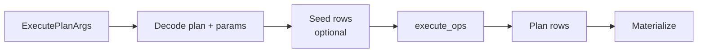

# Execution pipeline

## Purpose

Describe how `gleaph-graph` runs a physical plan: row representation, operator dispatch, memory pooling, and materialization.

## Non-goals

- Mutation executor internals (`crates/graph/src/plan/mutation/`).
- GQL client result serialization (router/SDK).

## Entry points

| API | Path |
|-----|------|
| `execute_plan_query_bindings` | `crates/graph/src/plan/query/executor.rs` |
| Canister | `execute_plan_query` / `execute_plan_update` handlers |

Flow:

`QueryArena::reset()` at query start; thread-local pool reused across operators within one query.

## PlanRow

**Module:** `crates/graph/src/plan/query/row.rs`

| Field | Role |
|-------|------|
| `layout: Option<Rc<BindingLayout>>` | Dense column schema |
| `slots: Vec<Option<PlanBinding>>` | Column values |
| `spill: BTreeMap<String, PlanBinding>` | Overflow bindings |

**Operations:**

- `fork` / `fork_with_arena` — copy row with updates (expand, branch)
- `try_merge` / `try_merge_skip_one` — hash join combine (skip join keys)
- `insert` — in-place binding update

**Arena:** `QueryArena` (`arena.rs`) recycles slot `Vec` capacity after hash join; `fork_with_arena` uses pool only when buffers are available. Merge stays on slot clone for probe hot path.

## Operator dispatch

`execute_ops` matches `PlanOp` variants and calls specialized functions (`execute_expand`, `execute_hash_join`, `execute_shortest_path`, …).

Optimizations layered in executor (not only planner):

- CSR fast paths for expand
- Streaming expand when later ops preserve cardinality
- Indexed hash join merge when layouts match
- Path-only shortest-path rows with shared `PathBinding` arc

## Materialization

Internal bindings may stay lazy until output:

| Binding | Materialized as |
|---------|-----------------|
| `Vertex` | Record with properties (projection-aware) |
| `Edge` | Edge record |
| `Path` | Walk `PathBinding` states → vertex/edge sequence |
| `RemoteVertex` | Logical id reference (limited property access) |
| `Value` | Already materialized |

`materialize_plan_rows` / `PlanQueryResult` convert rows for GQL clients.

## Error model

`PlanQueryError` — unsupported ops, federated call failures, invalid expressions.

Federation-specific failures: see [federation/query-semantics.md](../federation/query-semantics.md).

## Benchmarks

Hot scopes instrumented under `feature = "canbench"` (e.g. `hash_join_vertex_probe_merge`, `expand_*`). See `crates/graph/src/bench/mod.rs` and `design/` benchmarking doc when added.

## Related documents

- [operators.md](operators.md)
- [gql/plan-format.md](../gql/plan-format.md)
- [federation/query-semantics.md](../federation/query-semantics.md)
