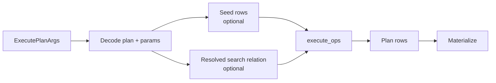
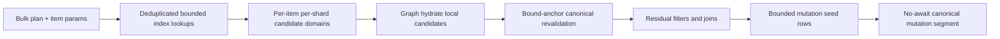

# Execution pipeline

Last updated: 2026-08-22
Anchor timestamp: 2026-08-22 08:49:10 UTC +0000

## Purpose

Describe how `gleaph-graph` runs a physical plan: row representation, operator dispatch, memory pooling, and materialization.

## Non-goals

- Mutation executor internals (`crates/graph/src/plan/mutation/`).
- GQL client result serialization (router/SDK).

## Result message boundary

Graph materializes the last read rows into `IcWirePlanQueryResult` only for the composite query
mode. The Graph canister validates the Candid-encoded `ExecutePlanResult` against the shared
current portable cross-subnet-safe payload ceiling before returning it. Router validates each
shard result again while merging and validates the final `GqlQueryResult` before returning it to
the caller. These checks reject oversized results explicitly; they never truncate rows. Vector
`SEARCH` remains bounded by `MAX_VECTOR_SEARCH_TOP_K`, but that bound applies only to search hits,
not to later graph expansion or join cardinality.

The shared encoded-message sizing policy is defined in
`gleaph-message-sizing`. Its current portable ceiling is
`MAX_SAFE_INTER_CANISTER_REQUEST_PAYLOAD_BYTES`; the preferred target is derived
by subtracting the fixed 500 KiB `INTER_CANISTER_MESSAGE_HEADROOM_BYTES`, and
callers still perform an authoritative final Candid encode check. Router and
Graph use this policy for request/response boundaries. Instruction ceilings
remain in `gleaph-graph-kernel` (`MAX_QUERY_CALL_INSTRUCTIONS`,
`MAX_UPDATE_CALL_INSTRUCTIONS`, and the derived dynamic update budget).

## Entry points

| API | Path |
|-----|------|
| `execute_plan_query_bindings` | `crates/graph/src/plan/query/executor.rs` |
| Canister | `execute_plan_query` / `execute_plan_update` handlers |

The canister handlers separate the intermediate incomplete journal write from the
final completed journal write. Scalar single-message updates (`execute_plan_update`)
keep only the completed journal entry because the whole message is atomic and there
is no resumable boundary before completion. The internal independent-operation path
(`execute_plan_update_batch`) and non-bulk operations inside that path still write the incomplete
journal so the Router can resume or replay per-operation progress across calls. The retired typed
and shared seed envelopes are not decoded. `atomic_insert` and `bulk_load` use their ordered Graph
mutation families rather than plan aggregation.

Flow:

```mermaid
flowchart LR
    A[ExecutePlanArgs] --> B[Decode plan + params]
    B --> C[Seed rows<br/>optional]
    B --> G[Resolved search relation<br/>optional]
    C --> D[execute_ops]
    G --> D
    D --> E[Plan rows]
    E --> F[Materialize]
```

`ExecutePlanArgs.resolved_search_blob` carries the Router-resolved non-leading `SEARCH` relation for the target shard. `QueryArena::reset()` at query start; thread-local pool reused across operators within one query.

## Seed hydration and mutation read prefixes

Current `SeedBindingsWire` hydration expands grouped entries into one-variable rows and complete row
seeds into `PlanRow`s. It validates local existence, tombstones, and required labels. Seeded execution
may then skip the supported leading scan/index anchor while retaining residual `PropertyFilter`
operators.

`SeedBindingsWire.complete_prefix_rows` (ADR 0046 Phase 1/2 historical transport) signals that the supplied `rows` are
complete for the entire read prefix. When set, Graph executes the read prefix starting from the seed
rows, skips the leading index/label scan operators, and re-validates those skipped operators against
current canonical Graph state. Residual `PropertyFilter`s, joins, and Cartesian products run normally;
the surviving rows are then fed into the no-await canonical mutation segment. This is currently used
for multi-variable leading prefixes on the historical GQL bulk path: Router resolved each variable's equality
anchors on the target shard, multiplies the per-variable candidate domains with checked arithmetic
  (retaining the domains and materializing only the request-sized chunk needed for the current
  dispatch), and sends one complete row per Cartesian-product tuple in that chunk. Empty domains are
encoded as a zero-row complete-prefix relation and report zero matches without a separate Router
short-circuit.

A multi-variable prefix is only seeded when every anchored variable has at least one non-label
equality anchor. Label-only or unsupported multi-variable prefixes still fall back to Graph-local
execution. Single-variable parameter-dependent seeds continue to use the sequential path.

ADR 0046 records the historical planned general pipeline:

```mermaid
flowchart LR
    A[Bulk plan + item params] --> B[Deduplicated bounded index lookups]
    B --> C[Per-item per-shard candidate domains]
    C --> D[Graph hydrate local candidates]
    D --> E[Bound-anchor canonical revalidation]
    E --> F[Residual filters and joins]
    F --> G[Bounded mutation seed rows]
    G --> H[No-await canonical mutation segment]
```

The Phase 2 implementation validates skipped bound `NodeScan` / equality `IndexScan` /
`IndexIntersection` operators against the current canonical label and property state before the rows
reach the mutation segment. The full design still keeps Graph as the canonical match authority and
extends the same principle: bound label scans check the current label; bound equality index scans
read the current canonical property locally; intersections validate every arm; and residual
filters/joins run unchanged. Graph should produce independent-domain products lazily or in bounded
chunks, using checked multiplication and proving the shared row/instruction bound. Exceeding a
candidate, product, payload, consistency, or instruction bound never truncates the relation:
execution uses an exact local fallback or rejects the broad mutation explicitly.

An active declared constraint may choose a semantics-equivalent access path. A single-shard
`ShardLocalGlobal` UNIQUE owner lookup can avoid both Property Index lookup and full scan; other
strategies may narrow routing but do not remove Graph canonical revalidation. The full candidate-
domain V2 envelope, bound-anchor revalidation, lazy/chunked products, cross-shard routing, bulk
lookup deduplication, and constraint fast paths remain planned work.

## PlanRow

**Module:** `crates/graph/src/plan/query/row.rs`

| Field | Role |
|-------|------|
| `layout: Option<Rc<BindingLayout>>` | Dense column schema |
| `slots: Vec<Option<PlanBinding>>` | Column values |
| `spill: BTreeMap<String, PlanBinding>` | Overflow bindings |

**Operations:**

- `fork` / `fork_with_arena` — copy row with updates (expand, branch)
- `try_merge` / `try_merge_skip_one` — hash join combine (skip join keys)
- `insert` — in-place binding update

**Arena:** `QueryArena` (`arena.rs`) recycles slot `Vec` capacity after hash join; `fork_with_arena` uses pool only when buffers are available. Merge stays on slot clone for probe hot path.

## Operator dispatch

`execute_ops` matches `PlanOp` variants and calls specialized functions (`execute_expand`, `execute_hash_join`, `execute_shortest_path`, …).

Optimizations layered in executor (not only planner):

- CSR fast paths for expand
- Streaming expand when later ops preserve cardinality
- Indexed hash join merge when layouts match
- Path-only shortest-path rows with shared `PathBinding` arc

### `PlanOp::Search`

The Graph executor supports one top-level non-leading `PlanOp::Search` per plan when the Router provides a `resolved_search_blob`:

- Decode the blob into `ResolvedSearchWire` at plan-entry time and build an invocation-local lookup from local vertex id to the user-visible scalar value.
- Validate that the wire binding and alias match the plan, that all values are finite, that there are no duplicate vertex ids, and that the hit count does not exceed `MAX_VECTOR_SEARCH_TOP_K`.
- Execute as an inner join/filter against the current row set: rows whose bound vertex variable is present in the lookup survive, the scalar alias is bound to the lookup value, and row multiplicity is preserved.
- If the bound vertex is absent from a row the row is dropped (inner-join semantics).
- A `PlanOp::Search` without a decoded `resolved_search_blob` fails closed because the Router has not lowered it.

For a leading `NodeScan + Search` with a `WHERE` predicate (one equality, one to eight
`AND`-connected same-binding equalities on distinct properties, one numeric range predicate,
exactly two same-property range predicates forming one lower and one upper bound, one to eight
equality predicates on distinct properties together with one one- or two-sided numeric range
predicate on a distinct property, two to eight `OR`-connected same-binding same-property
equality predicates, two to eight `OR`-connected same-binding pure equality predicates where
property names may repeat or differ, two to eight `OR`-connected same-binding same-property
numeric range predicates, two to eight `OR`-connected same-binding cross-property numeric
range predicates, or two to eight `OR`-connected same-binding heterogeneous comparison
predicates where each leaf is independently an equality or a one-sided numeric range
comparison), the Router does not forward a vector request when the Property Index
candidate set is empty. For a two-sided range with an empty intersection (`low >= high`) the Router
short-circuits before any Property Index or Vector Index call and dispatches the stripped tail plan
with an empty `SeedBindingsWire` to every shard.

The two-to-eight same-property equality `OR` path executes as a bounded union of `lookup_equal_page`
streams: the Router deduplicates globally, label-filters before counting, and fails closed if the
allowlist would exceed `MAX_VECTOR_SEARCH_FILTER_CANDIDATES`. When the candidate set is non-empty,
the vector canister receives a bounded allowlist and returns exact top-k hits; the normal
leading-search hit-shard-only dispatch then applies.

The two-to-eight cross-property pure equality `OR` path generalizes the same-property disjunction:
each arm resolves its own `(graph_id, label_id, property_id)` tuple, each tuple must have an active
vertex property index, and the candidate set is the union of paginated `lookup_equal_page` streams for
every distinct `(property_id, encoded_value)` source, with the same per-page label filtering, global
`(shard_id, vertex_id)` deduplication, 4096 candidate bound, and empty-candidate dispatch contract.

The two-to-eight same-property or cross-property numeric range `OR` path generalizes the same-property disjunction: each arm resolves its own `(graph_id, label_id, property_id)` tuple, each tuple must have an active vertex property index, the arms for each property are converted to finite half-open encoded intervals via `gleaph_gql::numeric_range_bounds`, overlapping/touching intervals are merged **within each property id**, and the candidate set is the union of paginated `lookup_range_page` streams for every merged interval across all involved properties, with the same per-page label filtering, global `(shard_id, vertex_id)` deduplication, 4096 candidate bound, and empty-candidate dispatch contract. Intervals are not merged across property ids because encoded numeric keys are property-specific.

The two-to-eight same-binding heterogeneous equality/range `OR` path (ADR 0034 Slice 19) unifies the equality and range disjunction paths: each arm is independently classified as equality or range, every arm resolves its own `(graph_id, label_id, property_id)` tuple and must have an active vertex property index, equality values are encoded and deduplicated by `(property_id, encoded_value)`, range intervals are derived via `gleaph_gql::numeric_range_bounds` and merged **within each property id**, and the normalized equality and range sources are collected together through the shared bounded union collector. The same per-page label filtering, global `(shard_id, vertex_id)` deduplication, 4096 candidate bound, and empty-candidate dispatch contract apply. Equality and range sources are not merged with each other because they correspond to semantically distinct postings lookups.

For a non-leading `PlanOp::Search` with a `WHERE` predicate (one equality, one to eight
`AND`-connected same-binding equalities on distinct properties, one numeric range predicate,
exactly two same-property range predicates forming one lower and one upper bound, one to eight
equality predicates on distinct properties together with one one- or two-sided numeric range
predicate on a distinct property, two to eight `OR`-connected same-binding same-property
equality predicates, two to eight `OR`-connected same-binding pure equality predicates where
property names may repeat or differ, two to eight `OR`-connected same-binding same-property
numeric range predicates, two to eight `OR`-connected same-binding cross-property numeric
range predicates, or two to eight `OR`-connected same-binding heterogeneous comparison
predicates where each leaf is independently an equality or a one-sided numeric range
comparison), the Router requires exactly one positive simple label proof for the searched
binding from the top-level prefix, resolves every filter arm through the same bounded Property Index
candidate collection (`lookup_equal_page` for one equality arm, `lookup_intersection_page` for two to
eight equality arms, one `lookup_range_page` stream with the intersected finite half-open encoded
interval for one or two range arms, one `lookup_range_intersection_page` stream that walks the finite
range and sieves each page by one to eight equality arms for one to eight equality arms plus one or
two same-property range arms on a distinct property, a union of `lookup_equal_page` streams for
two to eight same-property or cross-property equality disjunction arms, a union of `lookup_range_page`
streams for two to eight same-property or cross-property one-sided range disjunction arms, or a
union of normalized equality and/or range sources for two to eight same-binding heterogeneous
disjunction arms), and skips the vector canister when the
candidate set is empty. For a two-sided range with an empty intersection (`low >= high`) the Router
short-circuits before any Property Index or Vector Index call and dispatches the full plan with an
explicit empty `ResolvedSearchWire` to every live shard, so the Graph executor still runs the prefix
and any global aggregate returns one `count = 0` row. When the candidate set is non-empty, the vector
canister ranks exactly within the allowlist and the Router partitions hits into per-shard resolved
relations as for unfiltered non-leading search.

### Inline edge property reads

Edge property evaluation uses one inline-aware read helper (`try_read_inline_edge_property`):

1. Resolve the property name through the plan's `ResolvedPropertyTable`.
2. Use the concrete `EdgeBinding.handle.label_id` to look up the `ResolvedEdgeLabel`.
3. If `inline_schema` is `Scalar { property_id }` and the requested property id matches, decode the bound `EdgeBinding.inline_property_bytes` with the inline property profile's exact width and encoding, returning the corresponding GQL scalar `Value`.
4. If `inline_schema` is `Struct { property_id, fields }` and the requested property id matches the top-level struct property, validate the physical field projection (non-empty, unique field names, non-overlapping offsets, field-width sum equals inline property byte width) and decode each field slice with the shared scalar codec into a declaration-ordered GQL `Value::Record`. Accessing an unknown nested field evaluates to `Value::Null`.
5. If the property is not the inline slot, fall back to the sidecar `store.edge_property`.
6. If the inline slot matches but the projection/inline property bytes is malformed, return `PlanQueryError` instead of `NULL` or sidecar rescue.

Projection, filtering, comparison, aggregate input, `ORDER BY`, and shortest-path hop cost (`COST BY e.property`) all route through this helper, so the precedence and fail-closed rules are enforced uniformly. Weighted shortest-path evaluation receives the plan-scoped `ResolvedLabelTable` and `ResolvedPropertyTable` and resolves the cost property once before search; if it is not the concrete label's inline slot, the search fails closed before scanning adjacency.

### Inline edge property mutation packing

Ordinary GQL edge mutations for an `InlineScalar` edge label write the named inline property only through the fixed-width inline property bytes slot, never through the sidecar `EDGE_PROPERTIES` store or a Property Index maintenance queue. For an `InlineStruct` edge label, full and field-level mutation paths pack the canonical inline property bytes; the top-level struct property never falls through to sidecar storage. Leaf index postings are decoded from those same bytes and updated with the ordinary edge posting lifecycle.

1. The mutation executor resolves the concrete edge label and reads `inline_schema` from the `ResolvedEdgeLabel` projection supplied by the Router; for a scalar schema it derives the inline property profile from the same projection.
2. Before any adjacency record is created, every assignment for the mutation is evaluated, property
ids are resolved, and assignments are classified into at most one inline property and a list of
non-inline sidecar assignments.
3. The inline property is encoded through the same scalar codec used for reads and predicate-byte
preparation. Every sidecar property is also preflighted: reserved property ids are rejected and the
value must be encodable via `Value::to_binary_bytes()`. Missing, duplicate, `NULL`, malformed,
overflowing, unpersistable, or otherwise invalid values fail closed before storage writes begin.
4. Directed and undirected `INSERT` creates the edge with the prepared inline property bytes; non-inline
assignments are applied as ordinary sidecar properties afterward.
5. `SET e.inline_property = ...` and `SET e = { ... }` update the inline property bytes through the existing
mirrored `update_edge_inline_property_at_slot` commit, which synchronizes the forward, reverse, and
undirected physical mirrors so reads are direction-independent. All-properties replacement first
materializes the complete new record, rejects it if the inline property is missing or invalid, then
replaces only the sidecar properties and updates the inline property bytes once.
6. `REMOVE e.inline_property` is rejected because this slice has no absence representation.

Non-inline properties retain their existing sidecar storage and index-maintenance behavior. Graph
does not persist a duplicate inline schema; Router stable state remains the source of truth.

## Materialization

`Project` and `Materialize` keep a column that is a plain variable reference as the
original typed `PlanBinding` (vertex, edge, path).  An alias only changes the output key;
it still preserves the typed binding.  Only computed or non-variable expressions are eagerly
materialized to `Value`.  This preserves graph element identity across operator boundaries,
which is required for chained DML statements that reuse matched elements.

Internal bindings may stay lazy until output:

| Binding | Materialized as |
|---------|-----------------|
| `Vertex` | Record with properties (projection-aware) |
| `Edge` | Edge record |
| `Path` | Walk `PathBinding` states → vertex/edge sequence |
| `RemoteVertex` | Logical id reference (limited property access) |
| `Value` | Already materialized |

`materialize_plan_rows` / `PlanQueryResult` convert rows for GQL clients.

## Direct vertex embedding ingestion

The Router-admin endpoint `ingest_vertex_embeddings` resolves the opaque encoded vertex id, the
registered embedding definition, and the target Graph/Vector canisters. It validates each value
vector's dimension and finiteness, then synchronously allocates every nonzero Router stamp together
with one exact `AwaitingGraph` row in `ROUTER_VECTOR_INGEST_OUTBOX` (MemoryId 53) before the first
Graph await. The same admission operation revalidates the live shard, exact Graph and Vector
targets, immutable definition, row capacity, and encoded size; a returned error changes neither the
counter nor outbox. Router then sends only metadata and the stamp to Graph. Graph `stamp_embedding` validates vertex
existence/tombstone state, required label membership, and payload-independent embedding
metadata/encoding. This Graph call is validation-only: it does not write embedding bytes, a
mutation-journal row, a derived-index outbox row, or a watermark.

An observed exact Graph acceptance transitions only the matching row to `AwaitingVector`; an
observed logical rejection changes only that row to `AwaitingFrontier`. Transport/decode failure or
response loss leaves `AwaitingGraph` unchanged. Recovery uses the persisted Graph target and metadata,
and derives the complete `VectorEmbeddingSyncOp` from the same canonical row without resolving either
target from mutable catalog state. Vector owns indexed embedding bytes after delivery; Router MemoryId
53 durably owns pending/retry payload bytes until the exact frontier marker retires. The outbox is
bounded to 1,024 rows and 2 MiB per encoded row. Its
persisted value uses `StorableBound::Unbounded`; `VectorIngestOutboxState::encode_checked` enforces the
shared 2 MiB admission ceiling before the first stable insertion, so that transport limit does not
inflate `StableBTreeMap` node pages.

The Router then calls the typed-only Vector endpoint `vector_sync_batch_outcome`.
`Progress { applied }` transitions exactly the committed prefix to `AwaitingFrontier`.
`Terminal { failed_index: applied }` transitions that prefix to `AwaitingFrontier` but retains the
failed row and later suffix as `AwaitingVector`. Transport, typed-unavailable, or malformed replies
leave all submitted rows pending in their current phases. The bounded recovery timer retries all
three phases through their exact immutable targets. Each pass may key-scan up to the bounded
1,024-entry compact outbox while decoding at most the selected 16 payloads, and publishes at most one
exact `(Vector target, shard)` frontier lane per pass. Router `post_upgrade` re-arms the timer.
Appending work calls `recovery::arm_if_needed()`; an arm raised while a pass is awaiting a remote call
is latched and re-arms the floor delay after an empty pass, preventing a lost wake. A heap-only guard
excludes mutation IDs still driven by their originating API call from timer recovery; an upgrade
clears the guard so durable rows resume automatically.
Each batch adaptively fits a prefix from a complete Candid encode below the
2 MiB hard ceiling, targeting the ceiling minus the fixed 500 KiB envelope headroom. The typed Vector
driver processes internal chunks of at most 32 rows. This is durable at-least-once retry/convergence
without a finite-time guarantee or client-level exactly-once semantics.

For each marked lane, Router derives the frontier from the oldest unresolved exact-lane
`AwaitingGraph | AwaitingVector` intent minus one, or the durable mutation allocation ceiling when
none remains, and dispatches only if at least one `AwaitingFrontier` marker is covered. The Router-only
Vector endpoint rechecks Router ownership and exact shard attachment, applies the frontier
monotonically to MemoryId 15, and runs one bounded tombstone-GC step in the same no-await update.
The GC cutoff remains `min(graph_watermark, router_watermark)`. After an observed acknowledgement,
Router retires only the unchanged marker snapshot captured before the call; response loss retains it.
Graph-only lanes that never produce a marker remain deferred. The focused frontier lifecycle gate
passes exactly one PocketIC test in 25.67s using one `PocketIc`, one federation bootstrap, and four
canister installs (Router, Property Index, Graph, Vector). It covers response loss, Router/Vector
upgrades, exact retry and marker retirement, GC gating and physical collection, and stale-resurrection
prevention. Router and Vector tests, checks, and clippy pass; focused canbenches measure 3.29M
instructions for the single-lane 1,024-row derivation, 9.85M for 1,024 lanes, and 2.11B for the
Vector frontier plus bounded-GC step. Unfiltered persisted canbench artifacts and the final plan gate
remain pending, and the bounded Quint evidence is not production proof.

The prior targeted PocketIC lifecycle gates each ran one exact test and passed:
`cargo test -p gleaph-pocket-ic-tests --test adr0031_vertex_embedding_ingestion unavailable_vector_owner_rebinds_graph_and_router_direct_ingestion_outboxes -- --nocapture`
and `graph_response_loss_preserves_pregraph_intent_across_router_upgrade -- --exact --nocapture`.
They cover the earlier Graph/Vector intent path, Router/Vector upgrades, exact GQL search, and
idempotent replay. They do not cover autonomous wall-clock timer firing or a global watermark/tombstone
GC completion bound; those remain outside this bounded safety slice.

## Error model

`PlanQueryError` — unsupported ops, federated call failures, invalid expressions.

Federation-specific failures: see [federation/query-semantics.md](../federation/query-semantics.md).

## Benchmarks

Hot scopes instrumented under `feature = "canbench"` (e.g. `hash_join_vertex_probe_merge`, `expand_*`). See `crates/graph/src/bench/mod.rs` and `design/` benchmarking doc when added.

## Related documents

- [operators.md](operators.md)
- [gql/plan-format.md](../gql/plan-format.md)
- [federation/query-semantics.md](../federation/query-semantics.md)
- [ADR 0046: multi-variable candidate seed relations](../adr/0046-multi-variable-candidate-seed-relations.md)
