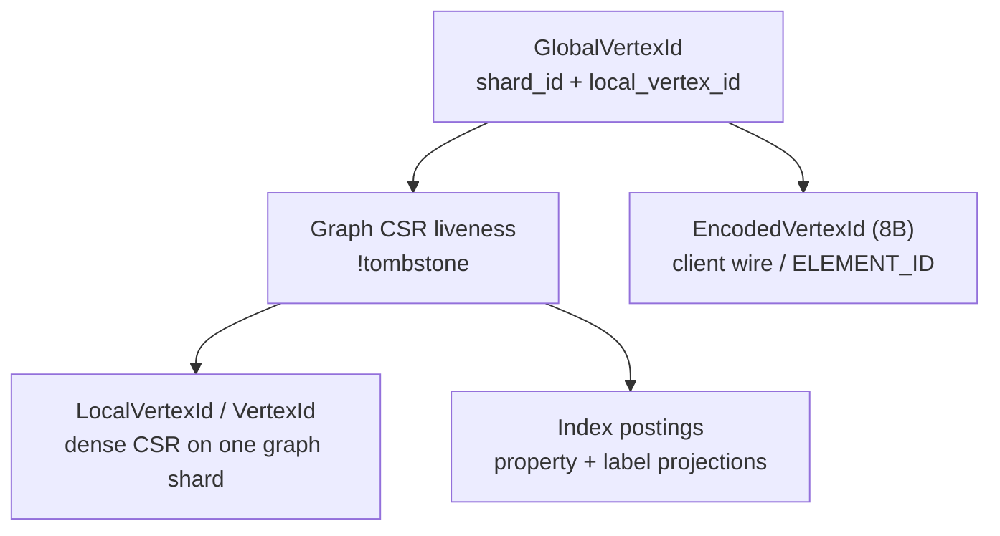

# Federation model

Last updated: 2026-06-17  
Status: **Partially Implemented** (global vertex identity per [ADR 0005](../adr/0005-vertex-identity.md) / [ADR 0006](../adr/0006-pre-federation-foundation.md); vertex **existence SSOT on graph shard** per [ADR 0017](../adr/0017-graph-vertex-existence-ssot.md); cross-shard remote CSR and `federated_expand` deferred)  
Anchor timestamp: 2026-06-17 00:16:22 UTC +0000

## Purpose

Define the **distributed graph identity and placement model** shared by router, graph shards, and graph-index. This is the contract implementers must preserve.

## Non-goals

- Future migration runbooks ([operations.md](operations.md)).
- Query planner rules ([query-semantics.md](query-semantics.md)).
- Production multi-shard dispatch and peer expand (see [../sharding/federation-target.md](../sharding/federation-target.md)).

## Source of truth

`crates/graph-kernel/src/federation.rs` and submodules:

- `federation/encoded.rs` — `EncodedVertexId`, `EncodedEdgeId`, `ElementIdEncodingKey`
- `federation/global_edge_id.rs` — `GlobalEdgeId`
- `federation/expand.rs` — wire types for future cross-shard expand (`FederatedExpandArgs`, `FederatedExpandNeighbor`)

- `federation/router_error.rs` — `RouterError`

## Identifiers

| Type | Owner / location | Notes |
|------|------------------|-------|
| `ShardId` | Router registry (`ROUTER_SHARDS`) | `ShardId(u32)` newtype; sole standalone shard is **`0`** |
| `GlobalVertexId` | Graph shard (derived) | Canonical global key: `(shard_id, local_vertex_id)` — 8 bytes LE |
| `LocalVertexId` | Graph shard | Same bits as LARA `VertexId` on that shard; **not reused** after delete |
| `GlobalEdgeId` | Query-time handle | `(shard_id, owner_local, edge_slot_index)` — 12 bytes; not stable across compaction |
| `EncodedVertexId` / `EncodedEdgeId` | Client wire only | Bijective encoding of global keys; see `federation/encoded.rs` |
| `PhysicalPlacementKey` | Type alias | Deprecated name for `GlobalVertexId` during migration |

**Removed:** `LogicalVertexId`, router `ROUTER_PLACEMENTS`, placement commit/release APIs ([ADR 0017](../adr/0017-graph-vertex-existence-ssot.md)).

**Standalone:** `GlobalVertexId { shard_id: ShardId(0), local_vertex_id }` when graph metadata has federation routing for shard 0. Graph derives the global key from `FederationRouting.shard_id` + local dense id.

## Vertex existence (graph shard SSOT)

A vertex is **live** on a graph shard when its CSR row exists in range and is **not tombstoned**. Delete DML clears property/label sidecars (and enqueues index removals) before tombstoning the CSR row.

### Invariants

1. **Graph shard is authoritative** for vertex/edge existence (CSR tombstone).
2. **`VertexId` is not reused** after delete; invalid global keys decode to tombstoned or out-of-range locals.
3. **Index postings** are derived projections; vertex delete must enqueue property/label index removals before tombstone.
4. **Router** owns shard registry and encoded wire ids only — not per-vertex existence.
5. Migration (future) tombstones the source vertex on the graph shard; no router placement transition state.

### Removed router APIs (ADR 0017)

`commit_vertex_placement`, `release_vertex_placement`, `resolve_placement`, `resolve_global_at`.

## Remote edges

**Status: Not implemented.** Kernel types (`RemoteVertexId`, `EdgeTarget::Remote`) exist for future cross-shard CSR, but graph shards have **no** remote-vertex stable, peer ACL stable, or `federated_expand` canister endpoint. Remote edge insert and cross-shard expand return `UnsupportedOp` / `RemoteEdgeNotSupported` until a follow-up ADR defines persistent `RemoteVertexId` → `GlobalVertexId` resolution.

## Shard registry

`ShardRegistryEntry` binds:

- `shard_id`
- `graph_canister`, `index_canister`
- `logical_graph_name`

Router `list_shards_for_graph` drives multi-shard dispatch (PocketIC experiments; not product-supported in standalone mode).

## Paths, ELEMENT_ID, and index hits

- **Paths** (`graph-kernel/src/path.rs`): client-visible vertex/edge elements use **encoded** opaque bytes — `EncodedVertexId` (8B), `EncodedEdgeId` (12B). Internal execution uses `GlobalVertexId` / `GlobalEdgeId`.
- **Index postings** (`graph-kernel/src/index.rs`): `PostingHit { shard_id, vertex_id }` where `vertex_id` is the **local** dense id on the owning shard.

Property and label **names** resolve to numeric ids on the **router** catalog only ([ADR 0006](../adr/0006-pre-federation-foundation.md) §2). Graph shards store values by `PropertyId` / label id without a property name catalog.

## LARA boundary

`ic-stable-lara` provides CSR storage and “external/remote” edge insertion APIs. It does **not** interpret `GlobalVertexId` or routing. All federation semantics are enforced in `gleaph-graph` and `gleaph-router`.

## Related documents

- [../adr/0005-vertex-identity.md](../adr/0005-vertex-identity.md) — encoded wire ids
- [../adr/0006-pre-federation-foundation.md](../adr/0006-pre-federation-foundation.md) — umbrella foundation
- [operations.md](operations.md) — registration, placement, and expand procedures
- [query-semantics.md](query-semantics.md) — executor bindings
- [../sharding/standalone-mode.md](../sharding/standalone-mode.md)
- [../architecture/overview.md](../architecture/overview.md)
