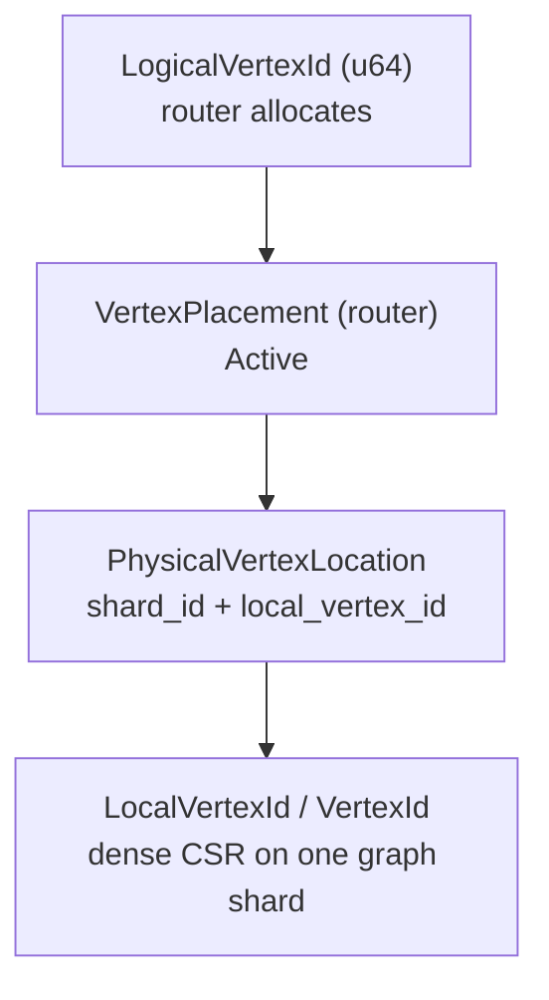
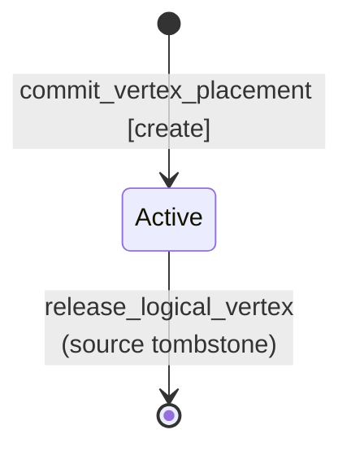

# Federation model

## Purpose

Define the **distributed graph identity and placement model** shared by router, graph shards, and graph-index. This is the contract implementers must preserve.

## Non-goals

- Future migration runbooks ([operations.md](operations.md)).
- Query planner rules ([query-semantics.md](query-semantics.md)).

## Source of truth

`crates/graph-kernel/src/federation.rs` and submodules:

- `federation/expand.rs` — `FederatedExpandArgs`, `FederatedExpandNeighbor`
- `federation/router_error.rs` — `RouterError`
- `federation/peer_sync.rs` — graph peer ACL sync

## Identifiers

| Type | Allocated / stored by | Notes |
|------|-----------------------|-------|
| `LogicalVertexId` | Router | Global key for federation-aware APIs |
| `ShardId` | Router registry | Maps to `graph_canister` + `index_canister` |
| `LocalVertexId` | Graph shard | Same bits as LARA `VertexId` on that shard |
| `PhysicalPlacementKey` | Router stable | Reverse map physical → logical |

**Standalone:** `standalone_logical_vertex_id(local)` sets logical = local when federation is off (`graph` metadata has no `FederationRouting`).

## Vertex placement state machine

### Invariants

1. **Router is authoritative** for `VertexPlacement` and logical id allocation.
2. **At most one active physical home** per logical vertex (`Active` location).
3. Graph shards **commit** placement after local insert; they do not invent logical ids independently in federated mode.
4. Migration is future work; adding it should introduce an explicit placement transition state and runtime protocol together.

## Remote edges

Cross-shard adjacency does not duplicate full vertex records on both sides.

| Mechanism | Location | Role |
|-----------|----------|------|
| `RemoteRefId` | `graph-kernel/entry/remote_ref.rs` | Compact far-end reference on an edge |
| `EdgeTarget::Remote` | kernel | Edge endpoint is remote |
| `REMOTE_FORWARD_IN` | `graph/src/facade/stable/remote_forward_in.rs` | Index incoming edges targeting a remote logical id |

Many edges may share one remote ref per logical target.

## Shard registry

`ShardRegistryEntry` binds:

- `shard_id`
- `graph_canister`, `index_canister`
- `logical_graph_name`

Router `list_shards_for_graph` drives multi-shard dispatch.

## Paths and index hits

- **Paths** (`graph-kernel/src/path.rs`): vertices identified by `LogicalVertexId`; edges carry `shard_id` + local slot (no global logical edge id).
- **Index postings** (`graph-kernel/src/index.rs`): `PostingHit { shard_id, vertex_id }` for property equality.

## LARA boundary

`ic-stable-lara` provides CSR storage and “external/remote” edge insertion APIs. It does **not** interpret `LogicalVertexId` or routing. All federation semantics are enforced in `gleaph-graph` and `gleaph-router`.

## Related documents

- [operations.md](operations.md) — registration, placement, and expand procedures
- [query-semantics.md](query-semantics.md) — executor bindings
- [architecture/overview.md](../architecture/overview.md)
