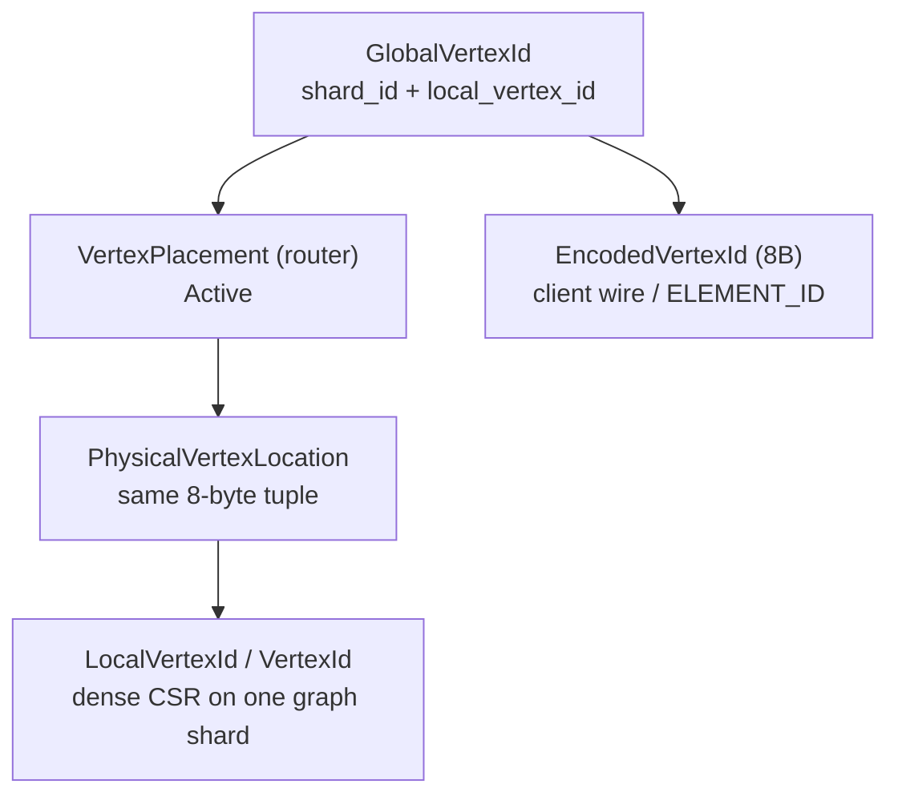
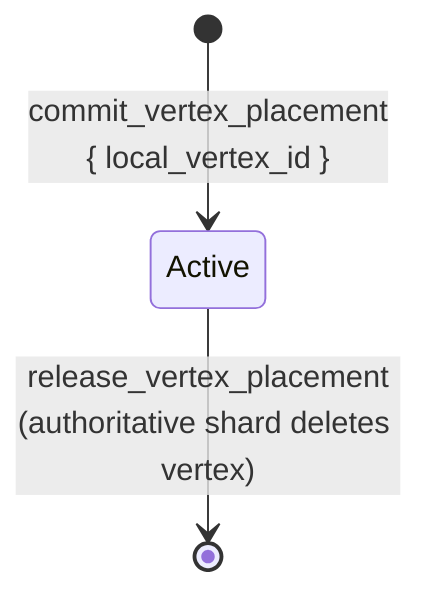

# Federation model

Last updated: 2026-06-11  
Status: **Partially Implemented** (global vertex identity and router placement per [ADR 0005](../adr/0005-vertex-identity.md) / [ADR 0006](../adr/0006-pre-federation-foundation.md); remote CSR stable and production peer expand remain deferred)  
Anchor timestamp: 2026-06-11 16:02:17 UTC +0000

## Purpose

Define the **distributed graph identity and placement model** shared by router, graph shards, and graph-index. This is the contract implementers must preserve.

## Non-goals

- Future migration runbooks ([operations.md](operations.md)).
- Query planner rules ([query-semantics.md](query-semantics.md)).
- Production multi-shard dispatch and peer expand (see [../sharding/federation-target.md](../sharding/federation-target.md)).

## Source of truth

`crates/graph-kernel/src/federation.rs` and submodules:

- `federation/encoded.rs` — `EncodedVertexId`, `EncodedEdgeId`, `ElementIdEncodingKey`
- `federation/global_edge_id.rs` — `GlobalEdgeId`
- `federation/expand.rs` — `FederatedExpandArgs`, `FederatedExpandNeighbor`
- `federation/router_error.rs` — `RouterError`
- `federation/peer_sync.rs` — graph peer ACL sync (deferred for standalone)

## Identifiers

| Type | Owner / location | Notes |
|------|------------------|-------|
| `ShardId` | Router registry (`ROUTER_SHARDS`) | `ShardId(u32)` newtype; sole standalone shard is **`0`** |
| `GlobalVertexId` | Derived + router `ROUTER_PLACEMENTS` | Canonical global key: `(shard_id, local_vertex_id)` — 8 bytes LE |
| `LocalVertexId` | Graph shard | Same bits as LARA `VertexId` on that shard |
| `GlobalEdgeId` | Query-time handle | `(shard_id, owner_local, edge_slot_index)` — 12 bytes; not stable across compaction |
| `EncodedVertexId` / `EncodedEdgeId` | Client wire only | Bijective encoding of global keys; see `federation/encoded.rs` |
| `PhysicalPlacementKey` | Type alias | Deprecated name for `GlobalVertexId` during migration |

**Removed:** `LogicalVertexId`, `allocate_logical_vertex_id`, graph `VERTEX_LOGICAL_IDS`, router logical counter / pending logical / placement-by-physical reverse map.

**Standalone:** `GlobalVertexId { shard_id: ShardId(0), local_vertex_id }` when graph metadata has no federation routing or for the sole registered shard. Graph derives the global key from `FederationRouting.shard_id` + local dense id — no per-vertex stable map on the graph shard.

## Vertex placement state machine

### Invariants

1. **Router is authoritative** for `VertexPlacement` keyed by `GlobalVertexId`.
2. **At most one active physical home** per `(shard_id, local_vertex_id)` registered in `ROUTER_PLACEMENTS`.
3. Graph shards **commit** placement after local insert with **local id only**; router resolves `shard_id` from `ROUTER_SHARD_BY_GRAPH`.
4. Migration is future work; adding it should introduce an explicit placement transition state and runtime protocol together.

### Router APIs (implemented)

| API | Args / result |
|-----|----------------|
| `commit_vertex_placement` | `{ local_vertex_id }` |
| `release_vertex_placement` | `{ local_vertex_id }` |
| `resolve_placement` | `GlobalVertexId` → `VertexPlacement` |
| `resolve_global_at` | `(shard_id, local_vertex_id)` → `GlobalVertexId` |

## Remote edges

**Status: Experimental / PocketIC only.** Stable regions exist at graph facade MemoryIds 30–32 (repacked 2026-06-11) for harness tests; production remote CSR is deferred until a follow-up ADR defines `RemoteVertexId` resolution.

Cross-shard adjacency does not duplicate full vertex records on both sides.

| Mechanism | Location | Role |
|-----------|----------|------|
| `RemoteRefId` | `graph-kernel/entry/remote_ref.rs` | Compact far-end reference on an edge (CSR bit in `VertexRef`) |
| `EdgeTarget::Remote` | kernel | Edge endpoint is remote |
| `REMOTE_FORWARD_IN` | `graph/src/facade/stable/remote_forward_in.rs` | Derived index: incoming edges targeting a `GlobalVertexId` via remote ref table |
| `REMOTE_VERTEX_REFS` | `graph/src/facade/stable/remote_vertex_refs.rs` | Maps `RemoteRefId` ↔ `GlobalVertexId` (stable; PocketIC / expand tests) |

Many edges may share one remote ref per global target vertex.

## Shard registry

`ShardRegistryEntry` binds:

- `shard_id`
- `graph_canister`, `index_canister`
- `logical_graph_name`

Router `list_shards_for_graph` drives multi-shard dispatch (PocketIC experiments; not product-supported in standalone mode).

## Paths, ELEMENT_ID, and index hits

- **Paths** (`graph-kernel/src/path.rs`): client-visible vertex/edge elements use **encoded** opaque bytes — `EncodedVertexId` (8B), `EncodedEdgeId` (12B). Internal execution uses `GlobalVertexId` / `GlobalEdgeId`.
- **Index postings** (`graph-kernel/src/index.rs`): `PostingHit { shard_id, vertex_id }` where `vertex_id` is the **local** dense id on the owning shard.

Property and label **names** resolve to numeric ids on the **router** catalog only ([ADR 0006](../adr/0006-pre-federation-foundation.md) §2). Graph shards store values by `PropertyId` / label id without a property name catalog.

## LARA boundary

`ic-stable-lara` provides CSR storage and “external/remote” edge insertion APIs. It does **not** interpret `GlobalVertexId` or routing. All federation semantics are enforced in `gleaph-graph` and `gleaph-router`.

## Related documents

- [../adr/0005-vertex-identity.md](../adr/0005-vertex-identity.md) — encoded wire ids
- [../adr/0006-pre-federation-foundation.md](../adr/0006-pre-federation-foundation.md) — umbrella foundation
- [operations.md](operations.md) — registration, placement, and expand procedures
- [query-semantics.md](query-semantics.md) — executor bindings
- [../sharding/standalone-mode.md](../sharding/standalone-mode.md)
- [../architecture/overview.md](../architecture/overview.md)
