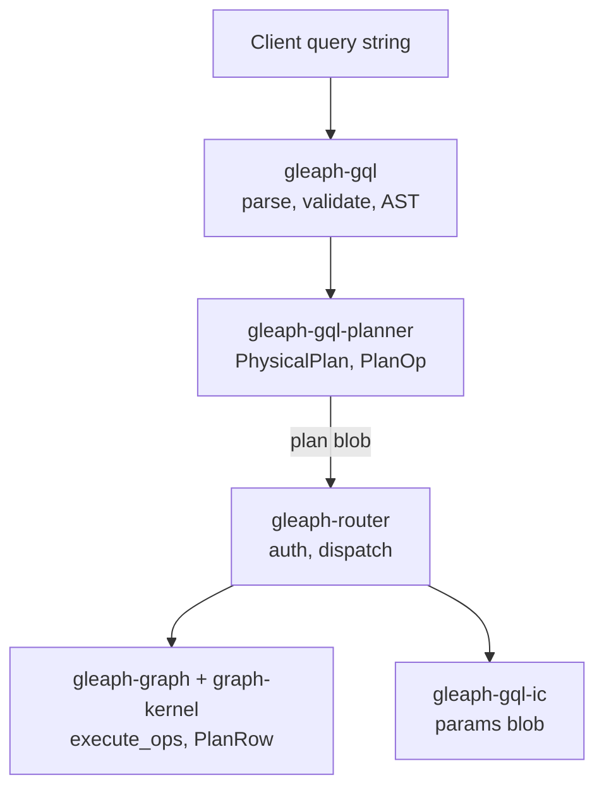

# GQL stack layers

## Purpose

Fix the **boundary between portable GQL crates and Gleaph-specific execution**, so IC state, storage APIs, and canister calls do not leak into ISO-oriented code.

## Non-goals

- GQL language specification (external).
- Every optimization pass algorithm ([`crates/gql-planner/CLAUDE.md`](../../crates/gql-planner/CLAUDE.md) for implementation detail).

## Layer diagram

## Crate boundaries

| Crate | Owns / exposes | Must not contain |
|-------|----------------|------------------|
| `gleaph-gql` | Parser, validator, `program_modification`, standard types | IC principals, shard ids, canister calls |
| `gleaph-gql-planner` | `build_*_plan`, `PhysicalPlan`, optimizations | GraphStore, federation, stable memory |
| `gleaph-gql-ic` | Parameter encoding for canisters | Planner logic |
| `gleaph-graph-kernel` | Wire types shared by router/graph/index | Full executor |
| `gleaph-graph` | Plan execution, storage, federation expand | GQL parse (except helpers) |
| `gleaph-router` | RBAC, planning entry, dispatch | LARA mutation |

Policy: **`AGENT.md`** — Gleaph/IC-specific behavior stays out of `gql` and `gql-planner`.

## End-to-end read path

1. **Parse** — `gleaph_gql::parser::parse`
2. **Resolve graph** — router `resolve_graph_context` from `session_activity` + HOME / sole-graph default ([ADR 0011](../adr/0011-gql-graph-resolution-and-catalog-scoping.md)); **not** a separate Candid graph argument (target)
3. **Classify** — `classify_program` → read vs write flags
4. **Authorize** — `router::rbac::authorize_adhoc_gql` (or prepared path)
5. **Plan** — `build_block_plan_with_schema(block, stats, schema)` with stats for resolved `GraphId`
6. **Encode** — `encode_block_plans` → bytes for `ExecutePlanArgs`
7. **Dispatch** — router seed routing per resolved graph (optional multi-shard; multi-`UseGraph` planned)
8. **Execute** — graph `execute_plan_query_bindings`
9. **Materialize** — bindings → GQL values for response

Prepared queries skip parse on hot path where a cached plan blob is stored.

## IC extensions

Documented in root `README.md`:

- Type `IC.PRINCIPAL`
- Function `IC.MSG_CALLER()`

Implemented in the IC bridge and evaluated in the graph executor (caller identity for filters and ACL patterns). These are **Gleaph extensions**, not portable GQL core.

### Planned: bulk ingest finalize (`CALL`)

**Status:** Planned — see [storage/bulk-ingest-finalize.md](../storage/bulk-ingest-finalize.md).

Proposed mutation-only procedures (`GLEAPH.FINALIZE_BULK_INGEST`, `GLEAPH.VERTEX_LIST`, etc.) would be parsed as standard `CALL` and executed in **gleaph-graph** mutation executor only. No new syntax in `gleaph-gql` / `gleaph-gql-planner`.

## USE GRAPH vs federation

| Feature | Meaning |
|---------|---------|
| **Session current graph** | `SESSION SET GRAPH` in `session_activity`; default for plain `MATCH` when no `USE` ([ADR 0011](../adr/0011-gql-graph-resolution-and-catalog-scoping.md)) |
| **USE GRAPH** (planner) | Focused sub-plan scope; router resolves name → shard list + index catalog for that graph |
| **Federation** (router/graph) | Shards of one logical graph; `GlobalVertexId`, placement, encoded element ids |

**Status:** Today router still takes Candid `logical_graph_name` and ignores session graph — **legacy**; ADR 0011 replaces that with program-based resolution.

Planner pushdown tests (`analyze_remote_use_graph_pushdown`) remain planner-local; shard routing tests belong on router ingress once U1 is implemented.

## Program modification (security input)

`gleaph_gql::program_modification::classify_program` drives:

- Whether ad-hoc execution needs Write/Manager/Admin
- Consistency check vs planner `has_dml()` in router

**Source:** `crates/gql/src/program_modification.rs`

## Related documents

- [plan-format.md](plan-format.md)
- [architecture/overview.md](../architecture/overview.md)
- [security/rbac-and-prepared.md](../security/rbac-and-prepared.md)
- [federation/query-semantics.md](../federation/query-semantics.md)
