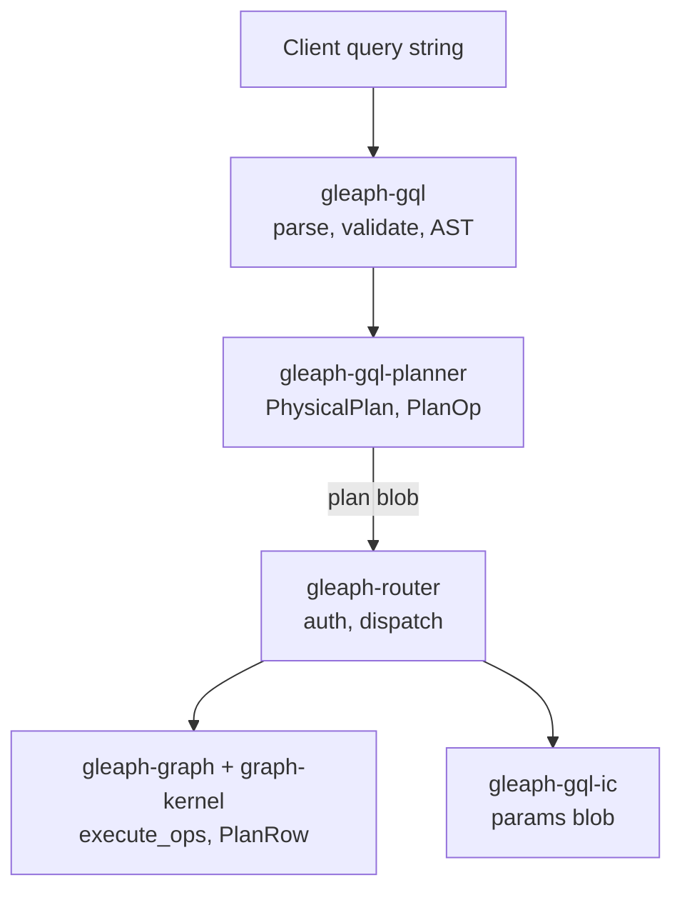

# GQL stack layers

## Purpose

Fix the **boundary between portable GQL crates and Gleaph-specific execution**, so IC state, storage APIs, and canister calls do not leak into ISO-oriented code.

## Non-goals

- GQL language specification (external).
- Every optimization pass algorithm ([`crates/gql-planner/CLAUDE.md`](../../crates/gql-planner/CLAUDE.md) for implementation detail).

## Layer diagram

## Crate boundaries

| Crate | Owns / exposes | Must not contain |
|-------|----------------|------------------|
| `gleaph-gql` | Parser, validator, `program_modification`, standard types | IC principals, shard ids, canister calls |
| `gleaph-gql-planner` | `build_*_plan`, `PhysicalPlan`, optimizations | GraphStore, federation, stable memory |
| `gleaph-gql-ic` | Parameter encoding for canisters | Planner logic |
| `gleaph-graph-kernel` | Wire types shared by router/graph/index | Full executor |
| `gleaph-graph` | Plan execution, storage, federation expand | GQL parse (except helpers) |
| `gleaph-router` | RBAC, planning entry, dispatch | LARA mutation |

Policy: **`AGENT.md`** — Gleaph/IC-specific behavior stays out of `gql` and `gql-planner`.

## End-to-end read path

1. **Parse** — `gleaph_gql::parser::parse`
2. **Resolve graph** — router `resolve_graph_context` from `session_activity` + HOME / sole-graph default ([ADR 0011](../adr/0011-gql-graph-resolution-and-catalog-scoping.md)); query APIs do **not** take a separate Candid graph name
3. **Validate** — `gleaph_gql::validate_with_seed` with router `SessionGraphSeed`; after ingress dispatch, **`validate_block_schema_with_seed`** on the defocused block with catalog-resolved `PropertySchema` when a binding exists ([ADR 0013](../adr/0013-gql-graph-type-catalog-on-router.md) §4)
4. **Classify** — `classify_program` → read vs write flags
5. **Authorize** — `router::rbac::authorize_adhoc_gql` (or prepared path)
6. **Ingress dispatch** — `resolve_ingress_dispatch` + `analyze_use_graph_v2_dispatch`: defocus top-level or nested `USE GRAPH`, resolve focused `GraphId`, replan with target graph stats ([ADR 0011](../adr/0011-gql-graph-resolution-and-catalog-scoping.md) U1b/U2)
7. **Plan** — `build_block_plan_with_schema(block, stats, schema)` with stats for dispatch `GraphId`; schema from router `GraphCatalog` via **`try_property_schema_for_graph_id`** when a binding exists for that `GraphId` ([ADR 0013](../adr/0013-gql-graph-type-catalog-on-router.md)). Graph type names from catalog DDL intern to **`GraphTypeId`** via `ROUTER_GRAPH_TYPE_CATALOG` ([ADR 0014](../adr/0014-graph-type-id-catalog-on-router.md)).
8. **Encode** — `encode_block_plans` → bytes for `ExecutePlanArgs`
9. **Dispatch** — router seed routing per dispatch `GraphId` (multi-shard federation merge on one logical graph)
10. **Execute** — graph `execute_plan_query_bindings` (single store per shard; `UseGraph` stripped after router defocus / peel)
11. **Materialize** — bindings → GQL values for response

Prepared queries skip parse on hot path where a cached plan blob is stored.

## IC extensions

Documented in root `README.md`:

- Type `IC.PRINCIPAL`
- Function `IC.MSG_CALLER()`

Implemented in the IC bridge and evaluated in the graph executor (caller identity for filters and ACL patterns). These are **Gleaph extensions**, not portable GQL core.

### Planned: bulk ingest finalize (`CALL`)

**Status:** Planned — see [storage/bulk-ingest-finalize.md](../storage/bulk-ingest-finalize.md).

Proposed mutation-only procedures (`GLEAPH.FINALIZE_BULK_INGEST`, `GLEAPH.VERTEX_LIST`, etc.) would be parsed as standard `CALL` and executed in **gleaph-graph** mutation executor only. No new syntax in `gleaph-gql` / `gleaph-gql-planner`.

## USE GRAPH vs federation

| Feature | Meaning |
|---------|---------|
| **Session current graph** | `SESSION SET GRAPH` in `session_activity`; default for plain `MATCH` when no `USE` ([ADR 0011](../adr/0011-gql-graph-resolution-and-catalog-scoping.md)) |
| **HOME graph** | `HOME_GRAPH` or sole visible graph; optional `GraphRegistryEntry.is_home` when multiple graphs are visible |
| **USE GRAPH** (planner) | Focused sub-plan scope; router **defocuses** or **peels** nested chains, replans with target graph stats, dispatches per graph (read path; pushdown rules in planner). Sequential top-level segments merge with row union at router (U2). |
| **Federation** (router/graph) | Shards of **one** logical graph; `GlobalVertexId`, placement, encoded element ids |

**Implemented (2026-06-13):** program-based graph resolution (R0–R2), validator session seed (R1), remote top-level `USE GRAPH` dispatch (U1b), multi-graph USE v2 (nested peel, NEXT union, cross-graph cartesian/hash join at router). **Not implemented:** remote `USE` DML, prepared multi-graph plans, cross-call session persistence.

Planner pushdown analysis (`analyze_remote_use_graph_pushdown`) runs at router ingress for remote `USE`; shard routing tests live in `crates/router/src/use_graph.rs` and PocketIC.

## Program modification (security input)

`gleaph_gql::program_modification::classify_program` drives:

- Whether ad-hoc execution needs Write/Manager/Admin
- Consistency check vs planner `has_dml()` in router

**Source:** `crates/gql/src/program_modification.rs`

## Related documents

- [plan-format.md](plan-format.md)
- [architecture/overview.md](../architecture/overview.md)
- [security/rbac-and-prepared.md](../security/rbac-and-prepared.md)
- [federation/query-semantics.md](../federation/query-semantics.md)
