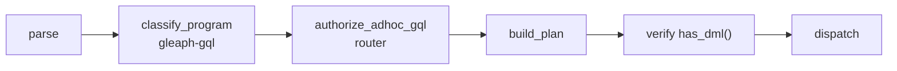

# RBAC and prepared queries

## Purpose

Document Gleaph’s **in-canister access model** and how Prepared Queries fit the threat model.

## Non-goals

- IC canister controller privileges (platform-level; separate from RBAC).
- Frontend auth UX.

## Role hierarchy

**Source:** root `README.md`, `crates/auth`, `crates/router/src/rbac.rs`

Five levels (each includes lower):

| Role | Ad-hoc GQL | Prepared | Catalog / admin |
|------|------------|----------|-----------------|
| **Executor** | Prepared only | Yes | No |
| **Read** | Read-only programs | Yes | No |
| **Write** | + data modification, DDL, `CALL` (conservative) | Yes | No |
| **Manager** | Same as Write | Yes | Capability bits (e.g. `PREPARE_REGISTER`) |
| **Admin** | Full | Yes | Grant roles |

Default: unknown principals are **Executor** until `admin_grant_role`.

## Classification pipeline

Write detection must agree between static classification and planner DML detection (`router/src/gql.rs`).

## Graph shard exposure

Graph canisters **do not** serve arbitrary GQL to end users. They execute:

- `ExecutePlanArgs` from router (trusted)
- Cross-shard graph endpoints (`federated_expand`, peer ACL) are **removed** until a follow-up ADR (router `peer_sync` is a no-op).
- Migration APIs (controlled)

This shrinks the attack surface: compromise of a user principal does not bypass router policy without also forging router calls.

## Prepared queries

**Product goal (README):** Admins register queries; frontends invoke them with parameters only.

Benefits:

- No arbitrary parse/plan on hot path for untrusted callers
- Stable plans for auditing and caching
- Combined with `IC.MSG_CALLER()` for row-level patterns

**Registration:** Manager with `PREPARE_REGISTER` or Admin (`README`).

**Implementation touchpoints:**

- `crates/router/src/prepared.rs`
- `crates/graph-prepared` (if present in workspace)
- Plan blob storage on router stable memory (`ROUTER_PREPARED_PLANS`, MemoryId 29); records are versioned (`PreparedPlanRecord::V1`)

## IC caller identity

GQL extensions:

- `IC.MSG_CALLER()` evaluated at execution time on graph
- Used in filters and prepared-query access patterns

Document query patterns that enforce “users see only their rows” in application guides (future).

## Federation and security

- Cross-shard expand requires peer graph principals in ACL.
- Router remains the entry for user GQL; shards trust router + peers, not arbitrary users.

## Related documents

- [architecture/overview.md](../architecture/overview.md)
- [gql/layers.md](../gql/layers.md)
