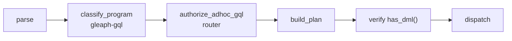

# RBAC and prepared queries

## Purpose

Document Gleaph’s **in-canister access model** and how Prepared Queries fit the threat model.

## Non-goals

- IC canister controller privileges (platform-level; separate from RBAC).
- Frontend auth UX.

## Role hierarchy

**Source:** root `README.md`, `crates/auth`, `crates/router/src/rbac.rs`

Five levels (each includes lower):

| Role | Ad-hoc GQL | Prepared | Catalog / admin |
|------|------------|----------|-----------------|
| **Executor** | Prepared only | Yes | No |
| **Read** | Read-only programs | Yes | No |
| **Write** | + data modification, GQL catalog DDL (`CREATE`/`DROP` graph type, graph), `CALL` (conservative) | Yes | No |
| **Manager** | Same as Write | Yes | Capability bits (e.g. `PREPARE_REGISTER`) |
| **Admin** | Full | Yes | Grant roles |

Default: unknown principals are **Executor** until `admin_grant_role`.

## Anonymous-principal invariant

**Status: Implemented**

`Principal::anonymous()` remains the **default Executor** so intentionally public prepared-query execution keeps working for unauthenticated callers (`authorize_prepared_execute`). The security invariant is that anonymous can **never** be persisted or made effective as an elevated RBAC role, and can **never** be configured as a trusted Router or Index canister identity. Enforcement lives at the invariant-owning write/configuration boundaries (not only at Candid entrypoints):

| Owner | Boundary (source of truth) | Behavior |
|-------|----------------------------|----------|
| `crates/auth` | `AuthState::upsert_record`, `AuthState::bootstrap_admins` | Reject anonymous before any mutation; bootstrap is **all-or-nothing** (anonymous issuer or any anonymous initial admin inserts no rows). Returns `AuthWriteError::AnonymousPrincipal`. |
| `crates/auth` (read) | `AuthState::role_of` | Defense in depth: anonymous always resolves to `Executor` even if a legacy/corrupt anonymous row exists, so effective authorization is never elevated. |
| Router | `canister::init` (traps), `admin_grant_role` → `admin_upsert_principal` | Route bootstrap/grant through the checked auth API; anonymous target surfaces `RouterError::InvalidArgument`. |
| Graph metadata | `GraphMetadata::validate_for_store` | Reject `FederationRouting` whose `router_canister` or `index_canister` is anonymous (`GraphMetadataError::AnonymousFederationPrincipal`). Shared by install-time `GraphInitArgs` and `set_federation_routing`; there is no post-install graph wiring endpoint (PocketIC fixtures wire routing through install-time `GraphInitArgs`). |
| Graph router guard | `guard_router_canister` (graph) | Defense in depth: reject anonymous caller. |
| Graph Index | `IndexStore::init_from_args` | Reject anonymous `router_canister` **before** clearing/writing any stable state (`IndexError::AnonymousRouter`); a failed init leaves catalog/postings/router untouched. |
| Graph Index guards | `guard_router_canister` (index), `assert_router_caller` | Defense in depth: reject anonymous caller even if the configured router record named it. |

Prepared-query execution for default Executor callers (including anonymous) is unchanged.

## Classification pipeline

Write detection must agree between static classification and planner DML detection (`router/src/gql.rs`).

## Catalog DDL authorization

GQL catalog statements set `has_catalog_modification` in [`ProgramModificationFlags`](../../crates/gql/src/program_modification.rs) (`CREATE`/`DROP` graph, graph type, schema). Router enforcement:

| DDL surface | Entry | Minimum role / gate |
|-------------|-------|---------------------|
| **Graph type catalog** (`CREATE`/`DROP GRAPH TYPE`, `CREATE`/`DROP GRAPH` in `gql_execute*`) | `authorize_adhoc_gql` after `classify_program` | **Write** (includes `has_catalog_modification`) |
| **Index DDL** (`CREATE INDEX` / `DROP INDEX` standalone parse path) | `authorize_index_ddl` | **Admin** or Manager with **`PREPARE_REGISTER`** |
| **Prepared plan registry** | `authorize_prepared_catalog_change` | Admin or Manager with **`PREPARE_REGISTER`** |
| **Federation graph registration** | `admin_register_graph` | **Admin** (`Role::Admin` in auth store) |
| **Shard registry / catalog intern / backfill** | `admin_*` Candid APIs | **Admin** |

Graph type catalog DDL runs on the main GQL path **before** ingress dispatch when the transaction block contains catalog statements ([ADR 0013](../adr/0013-gql-graph-type-catalog-on-router.md)). Catalog-only blocks return zero rows without dispatching DML/query ops.

**Note:** Index DDL is **stricter** than graph type catalog DDL — Write alone is insufficient for index create/drop.

## Per-graph tenancy (graph-scoped read authorization)

**Status: Implemented** ([ADR 0028](../adr/0028-per-graph-tenancy-metadata-reads.md))

RBAC roles above are **canister-global**. Graph-scoped *visibility* is a separate, orthogonal ACL carried on `GraphRegistryEntry.{owner, admins}`. A caller may resolve/read a graph's metadata and routing data when `caller_may_access_graph` holds (`crates/router/src/facade/store/registry.rs`):

| Allow path | Who | Why |
|------------|-----|-----|
| Tenant | `caller == owner` or `caller ∈ admins` | The graph's tenant(s). |
| Superuser bypass | global `Role::Admin` | Operations/migration/tooling (DB-superuser analogue). |
| Own shard | the graph's registered `graph_canister` (keyed in `ROUTER_SHARD_BY_GRAPH`, same `graph_id`) | Keeps federation/index-routing inter-canister calls working (`verify_shard_attachment`, `list_shards_for_graph`, `indexed_property_catalog`), which reach the router with the shard's `graph_canister` principal. |

Enforcement:

- **Name→id metadata endpoints** (`resolve_shard`, `lookup_graph_id`, `list_shards_for_graph`, `indexed_property_catalog`, `lookup_{vertex,edge}_label_id`, `lookup_property_id`, `reverse_{vertex,edge}_label_name`, `reverse_property_name`) resolve via `resolve_graph_id_authorized`. Previously these used a bare name lookup with no ACL (cross-tenant disclosure).
- **Non-disclosure:** a non-tenant gets `NotFound`, not `Forbidden`, so it cannot confirm a graph exists. `resolve_graph` follows the same rule and gains the Admin bypass.
- **Default/HOME selection is excluded:** `list_visible_graph_ids` / `resolve_home_graph_id` keep membership-only checks (no Admin bypass) so an Admin's HOME does not become ambiguous. The intentionally-public `prepared_execute_*` path already scopes through `list_visible_graph_ids` and is unchanged.
- **Registration validation:** `validate_registration_principals` rejects the anonymous principal as `owner` or in `admins` (before any state mutation); an anonymous owner/admin would make the ACL match every unauthenticated caller. This complements the [anonymous-principal invariant](#anonymous-principal-invariant).

## Graph shard exposure

Graph canisters **do not** serve arbitrary GQL to end users. They execute:

- `ExecutePlanArgs` from router (trusted)
- Cross-shard graph endpoints (`federated_expand`, peer ACL) are **removed** until a follow-up ADR (router `peer_sync` is a no-op).
- Migration APIs (controlled)

This shrinks the attack surface: compromise of a user principal does not bypass router policy without also forging router calls.

## Prepared queries

**Product goal (README):** Admins register queries; frontends invoke them with parameters only.

Benefits:

- No arbitrary parse/plan on hot path for untrusted callers
- Stable plans for auditing and caching
- Combined with `IC.MSG_CALLER()` for row-level patterns

**Registration:** Manager with `PREPARE_REGISTER` or Admin (`README`).

**Implementation touchpoints:**

- `crates/router/src/prepared.rs`
- `crates/graph-prepared` (if present in workspace)
- Plan blob storage on router stable memory (`ROUTER_PREPARED_PLANS`, MemoryId 8); records are versioned (`PreparedPlanRecord::V1`)

## IC caller identity

GQL extensions:

- `IC.MSG_CALLER()` evaluated at execution time on graph
- Used in filters and prepared-query access patterns

Document query patterns that enforce “users see only their rows” in application guides (future).

## Federation and security

- Cross-shard expand requires peer graph principals in ACL.
- Router remains the entry for user GQL; shards trust router + peers, not arbitrary users.

## Related documents

- [architecture/overview.md](../architecture/overview.md)
- [gql/layers.md](../gql/layers.md)
