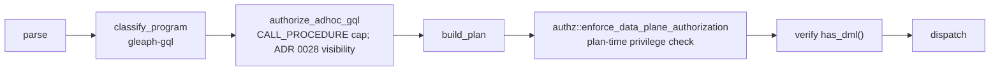

# RBAC and prepared queries

> **Status (2026-08-25):** [ADR 0074](../adr/0074-data-plane-authorization-core.md) Phase 1
> slices 1–3 are **implemented**: administrative capabilities plus per-graph data-plane
> grants with a virtual `PUBLIC` subject and default deny; **plan-time enforcement**
> (slice 2b): every vertex label, edge label × direction, projected property, and mutation
> in a built plan must be covered by the caller's effective privileges; and **caller-bounded
> prepared publication with record-level static extraction** (slice 3): registered queries
> store their statically extracted requirement set, publication is an explicit invariant-7-
> gated `GRANT EXECUTE ON PREPARED QUERY` statement, and ownership is the documented
> implicit root of data-plane authority (amended §3 invariant 3). [ADR 0080]
> JIT metadata elevation is **implemented** (below): the ADR 0028 superuser bypass is
> deleted and cross-tenant metadata reads require time-boxed, approval-backed elevation.

> **ReBAC (implemented, 2026-08-26):** [ADR 0082](../adr/0082-rebac-bounded-exists-traversal.md)
> extends the conditional-policy DSL with a bounded 1–2 hop `EXISTS` traversal clause
> lowered to a new shard-executed semi-join `PlanOp::SemiApply` (below). Organization
> permissions are graph-local relationships; the account-canister `Role` enum
> ([ADR 0068](../adr/0068-account-canister-and-per-developer-router-issuance.md)) is a
> separate domain and is out of scope.

> **Elevation retention (proposed, not implemented):** [ADR 0083](../adr/0083-authorization-audit-log.md)
> formalizes expired elevation-row retention and GC in the grant store: a bounded review
> window (default 90 days) with an autonomous-timer GC driver. It adds no separate audit
> store; grant/revoke/caps history and a unified time-ordered view are deferred until DAO
> governance is designed.

## Purpose

Document Gleaph’s **in-canister access model** and how Prepared Queries fit the threat model.

## Non-goals

- IC canister controller privileges (platform-level; separate from RBAC).
- Frontend auth UX.

## Authorization model

**Source:** `crates/auth`, `crates/router/src/rbac.rs`, `crates/router/src/authz.rs`,
`crates/router/src/facade/auth.rs`,
[ADR 0074](../adr/0074-data-plane-authorization-core.md)

Two orthogonal dimensions replace the former five-role ladder:

### Administrative capabilities (`AdminCaps`)

A global bitset stored per principal (`crates/auth::AuthState`, MemoryId 0). Principals with
**no stored row hold an empty set** (**default deny**). Bootstrap init seeds
`issuing_principal` and every `initial_admins` entry with the **full set**; grant
administration writes rows under `MANAGE_AUTHORIZATION` (`admin_grant_caps`, replacing the
former `grant_role`; `my_caps` reports the caller's set).

| Capability             | Governs                                                                                        |
| ---------------------- | ---------------------------------------------------------------------------------------------- |
| `PREPARE_REGISTER`     | Prepared-query registration / drop (`prepare`, `drop_prepared`)                                 |
| `INDEX_CREATE`         | `CREATE INDEX`, vector-index DDL creation                                                       |
| `INDEX_DROP`           | `DROP INDEX`, vector-index DDL drops                                                            |
| `MANAGE_CATALOG`       | Graph-type catalog DDL, schema migrations, catalog interning                                    |
| `CALL_PROCEDURE`       | Named `CALL` procedures (until procedures become catalog objects)                               |
| `MANAGE_FEDERATION`    | Graph/shard topology, backfill, maintenance sweeps, diagnostics, vector activation/maintenance  |
| `MANAGE_AUTHORIZATION` | Writing other principals' capability rows; approving and reviewing metadata elevations          |
| `EMERGENCY_ELEVATE`    | Approval-free flagged self-elevation ([ADR 0080] §3)                                            |

Router gates name the narrowest governing capability (`facade::auth::require_cap`, store-level
surfaces surface `NotAuthorized`; the GQL-path gates in `rbac.rs` surface `Forbidden`). There
is no implicit elevation between capabilities, and administrative authority never implies
data-plane or metadata access ([ADR 0074] invariant 1; [ADR 0080] §2 deleted the former ADR
0028 superuser arm, so caps holders without an elevation are treated exactly like strangers
on metadata reads).

### Data-plane grants

`(principal | PUBLIC) × privilege` rows (`crates/auth::GrantState`, MemoryId 55) with a
dormant `expires_at` field (expired rows read as absent). `PUBLIC` is a virtual pseudo-subject
resolved at evaluation time — it is never persisted as a principal, and the anonymous
principal can never hold a stored row. Effective data-plane privilege is
`caller-grants ∪ PUBLIC-grants ∪ ownership-root`, where ownership derives from
`GraphRegistryEntry.owner`/`admins` at evaluation time (ADR 0074 §3 invariant 3, amended:
ownership is the implicit root of data-plane authority and is **never materialized as grant
rows**). Plan-time evaluation checks the full requirement set against these rows
(`EXECUTE PreparedQuery`, `MATCH`, `TRAVERSE` (± direction), `READ`, `READ_PROPERTY`,
`CREATE`, `UPDATE`, `DELETE`).

### Plan-time data-plane enforcement (slice 2b)

**Source:** `crates/router/src/authz.rs`

After `build_plan`, the Router walks the built `PhysicalPlan` and extracts an exact
requirement set — every `PlanOp` variant is matched exhaustively with no wildcard op arm, so
a future planner variant fails compilation instead of silently bypassing enforcement. Names
resolve to graph-scoped catalog ids at extraction time; evaluation then demands coverage by
the caller's effective privileges. Any uncovered demand fails the whole query with the uniform
non-disclosing `Forbidden` that never names the missing privilege or resource (ADR 0074 §4).

Attribution contract (fail closed where the plan cannot name a resource):

| Plan fact | Requirement |
| --- | --- |
| Labeled vertex scan | `MATCH` on the label; full property map adds `READ`; explicit projections add `READ_PROPERTY` per key; empty hydration list adds nothing beyond `MATCH` |
| Traversal hop | `TRAVERSE` rows from pattern direction × schema directedness: declared directed labels probe one directional row per orientation (undirected patterns need both); undirected or undeclared labels take the unoriented row — mirroring GRANT lowering |
| Edge-inline property bytes | covered by the edge label's traversal row (no edge-property resource exists in Phase 1) |
| Element-id reads (`ELEMENT_ID(v)` / `ELEMENT_ID(e)`) on any binding | attributed through the variable's label facts: a vertex binding rides its `MATCH` row, an edge binding rides its `TRAVERSE` row — element ids are intrinsic identity metadata of covered elements, never separately grantable resources ([Element-id projection guidance](#element-id-projection-guidance)). Returned EDGE element ids remain query-time physical handles `(shard, owner vertex row, edge slot)`, not persistent references: compaction can invalidate them |
| Filter / projection / aggregation expressions | property reads attributed through variable→label facts; ambiguous or unresolvable attribution degrades to tenancy-only |
| Unlabeled scans, `NOT`/wildcard label expressions, `DETACH DELETE`, unresolvable open-schema names | tenancy-only: owners/admins proceed; Phase 1 grants enumerate labels, so wildcard reads are not expressible as grants |
| Mutations | `CREATE` for inserted elements; `UPDATE` for `SET`/`REMOVE`; `DELETE` for deletes, attributed via bound-variable labels |
| Vector `SEARCH` | scan-equivalent rows on the index-spanned labels plus the projected embedding source property ([ADR 0078](../adr/0078-authz-aware-vector-search.md) layer 1); filter expressions attribute like other reads |
| `USE GRAPH` segments | each child segment resolves names against its target graph's catalogs |

Prepared execution evaluates the **static requirement set stored on the record** (slice 3)
as the primary checked artifact, with the live plan walk retained as the fail-closed
fallback for catalog drift and for derived sorted plans whose shape the stored set does not
describe. Both evaluations run under SECURITY INVOKER (`caller ∪ PUBLIC` plus ownership
root); a stored demand can never re-bind to different vocabulary because catalog ids are
monotonic (ADR 0074 invariant 4). Registration proves equivalence: the stored set must equal
a fresh dynamic walk of the same program (regression-tested).

**Vocabulary drop: grant cascade and fail-closed staleness (2026-08-24).** ADR 0074 §3
invariant 4 is enforced at the only vocabulary-drop boundary that exists today,
`purge_graph_vocabulary_partitions` (whole-graph teardown behind `unregister_graph`; there
is no per-label DROP DDL): once the graph's vertex-label, edge-label, and property
partitions leave the catalogs, every graph-scoped grant row targeting it references ids
that can never be reallocated, so the same commit segment sweeps exactly those rows from
`ROUTER_AUTH_GRANTS` — other graphs' rows (even with identical numeric label ids), other
subjects' rows elsewhere, and name-keyed `EXECUTE PreparedQuery` rows survive. Stored
prepared requirement sets referencing the dropped vocabulary are **intentionally not
recomputed**: dead-id demands can never be covered again (no future grant can match a
dropped id), so they fail closed uniformly — the query stays denied until its prepared
query is re-registered against current catalogs. This staleness is a documented property,
not a gap; re-registration replaces the whole record.

### Element-id projection guidance

**Status: Implemented (2026-08-25); authorization symmetry across bindings pinned by
plan 0306 (2026-08-26).** `ELEMENT_ID` differs between a **vertex** and an **edge**
binding only in handle stability; its authorization treatment is symmetric. Two
historically conflated concerns, kept separate:

1. **Stability — a design decision, independent of authorization.** A vertex element id is a
   stable, round-trippable client reference ([ADR 0005](../adr/0005-vertex-identity.md)
   §“Client wire”), and its read attributes through variable→label facts exactly like other
   value reads — pinned by the contract tests `labeled_scan_projection_contract` and
   `filter_and_project_reads_are_attributed_through_label_facts`
   (`crates/router/src/authz.rs`), never by an unattributed fallback when the label is known.
   An edge element id, by contrast, is a **query-time physical handle** `(shard, owner vertex
   row, edge slot)` (ADR 0005 §“Global edge identity”;
   [ADR 0052](../adr/0052-per-label-adjacency-order-and-tombstone-reuse.md) §8 “Edge identity
   and compaction”): compaction or slot reuse can invalidate a previously returned value, so it
   cannot serve as a persistent reference regardless of any future authorization change.
2. **Status update (plan 0306, 2026-08-26).** Requirement extraction on the current tree
   attributes `ELEMENT_ID(e)` through the edge label fact and demands nothing beyond the
   covered `TRAVERSE` row — symmetric with vertex element-id reads (contract test
   `edge_element_id_projection_demands_stay_attributed` in `crates/router/src/gql_grants.rs`;
   probe artifact `design/investigations/artifacts/0306-edge-element-id-demand-probe.txt`).
   The historical non-owner DENY of the knowledge demo's `citation-reach` was the GAP-008
   root cause (missing property-level READ rows for projected keys), not edge element-id
   semantics. No edge-property grant resource is required for element-id reads.
   Group-binding element-id reads (quantified-path variables) now evaluate at execution as
   a `Value::List` of element ids in traversal order, empty group → empty list (plan 0307,
   GAP-2026-08-26-001); the authorization treatment described here is unchanged — group
   forms add no demand beyond the same label-fact rows.

The CLI surfaces the stability fact (1) at authoring time: `gleaph prepared plan` / `apply` /
`run` print a stderr warning when an operation projects `ELEMENT_ID` on a MATCH-bound edge
variable (detector over the parsed operation source in `crates/cli/src/prepared.rs`; the
printed text is sanitized and names only the operation and variables). The warning is a
stability notice about the returned physical handles, not an authorization statement. The
knowledge demo's `citation-reach` intentionally keeps its edge projection — the browser page
renders the relationship trail from the returned edge identities.

### Conditional policy pushdown ([ADR 0075], Phase 2a — implemented)

**Source:** `crates/router/src/policy_pushdown.rs` (lowering), `crates/router/src/gql_grants.rs`
(compilation), `crates/auth` (`CompiledPredicate`, stable encoding).
Implemented per [ADR 0075]; the §7 vector-search contract is now implemented by
[ADR 0078](../adr/0078-authz-aware-vector-search.md) (below).

A grant row gains an optional compiled predicate: an AND-only conjunction of catalog-checked
comparisons over one vertex label (`<property> <op> <literal | MSG_CALLER()>`, depth ≤ 8),
stored in the row's stable bytes under fresh-state tags (`2`/`3`; superseded tags reject).
One logical rule may normalize into several rows (e.g. a directed-edge grant), all carrying
the same predicate.

Semantics ([ADR 0075] §4, as refined during implementation):

- **AND-only is per-row DSL shape.** Each row's condition is a conjunction; authoring has
  no OR.
- **Across rows, evaluation composes a union.** Grants are additive ([ADR 0074]
  alternatives semantics): a caller covered by several predicate rows on one label sees
  the OR of their matches. The demonstrated shape — PUBLIC narrowed to public posts plus
  a member row for own-private posts — requires this union; "always AND" refers to policy
  predicates being additional conjuncts over user-authored `WHERE` content within one
  rule, never to cross-row narrowing.
- **Implicit root stays policy-free:** ownership-derived tenancy never consults grant
  rows, so grant-attached predicates cannot narrow owners/admins.

Evaluation architecture ([ADR 0075] §5):

1. After plan build **and after** data-plane enforcement (policies constrain outputs;
   they add no requirements — requirement extraction never sees policy-derived property
   reads), the Router collects every applicable conditional row for
   `caller ∪ PUBLIC` on the dispatched graph, expiry-aware, in canonical key order.
2. `MSG_CALLER()` substitutes the invoking caller as a literal constant (principal-domain
   extension value) — the second resolution site. Shard-side runtime resolution keeps
   serving user-authored predicates.
3. Equality on an indexed property at a labeled pipeline-head vertex scan covered by
   exactly one applicable row seeds the existing index-scan anchor path with the resolved
   value; index canisters execute lookups indistinguishable from any other.
4. All remaining comparisons lower into ordinary `PropertyFilter` ops inside the
   dispatched plan. Definite labeled scans take plain conjunct filters; may-bind sites
   (unlabeled/index scans without label facts, expansion destinations via
   `Expand`/`ExpandFilter`/`EdgeBindEndpoints`) take guarded filters
   `NOT IsLabeled(v, L) OR visible(v)` so rows of any other label pass untouched.
   Scan/binding hydration lists gain the referenced properties so filters evaluate against
   hydrated values.
5. Variable-length quantifier bindings, shortest-path records, parameter-driven
   conditional scans, and multi-graph `USE GRAPH` segments defer their policy treatment
   ([ADR 0075] §7 lineage).

Cache discipline ([ADR 0075] §5 trade-off): prepared base plans stay policy-free
(registration artifacts); per-execution lowered shapes cache in heap keyed by the exact
fingerprint of the lowering inputs (applicable rows' identities + resolved caller bytes +
operation/sort identity), so plans never reuse across callers with different resolved
constants. Any grant write invalidates the cache, making grants/revocations immediately
effective. Ad-hoc ingress caches already key on `(caller, graph, query)` and store
pre-lowering shapes; replay re-enforces authorization against user-authored demands and
re-resolves constants deterministically.

Introspection prints the stored condition inline (`list_graph_grants.predicate`) with
catalog-resolved property names ([ADR 0075] §1).

### ReBAC bounded EXISTS traversal ([ADR 0082] — implemented)

**Source:** `crates/gql/src/parser/statement.rs` (chain grammar),
`crates/router/src/policy_pushdown.rs` (lowering + reverse seeding), `crates/auth`
(`CompiledPredicate` V2 + `PredicateChain`), `crates/graph/src/plan/query/executor/ops.rs`
(`execute_semi_apply`).

A conditional grant row may carry a bounded traversal clause alongside (or instead of) its
property conjuncts: `EXISTS { (d)-[:GRANTED_TO]->(a:Acct) WHERE a.principal_id = MSG_CALLER() }`
— 1–2 hops, vertex → vertex, each hop enumerating one concrete edge label, one direction
spelling (`->`, `<-`, `-`), and one concrete destination label; the terminal `WHERE` reuses
the exact [ADR 0075] comparison DSL against the terminal variable and is required. The row is
visible iff at least one matching chain exists from the selector vertex.

- **Semi-join semantics:** the chain never duplicates rows, never projects chain values, and
  never turns a missing match into an error. Each probe is bounded at one proof row
  (first-match short-circuit); the executor keeps the input row iff the probe yields ≥ 1.
- **The relationship is the gate.** Chain traversals and terminal reads are authorization
  machinery: they add no requirement rows (the walker stays blind to `PlanOp::SemiApply`)
  and are never constrained by label policies on chain-internal vertices. Enforcement
  strictly precedes lowering.
- **Lowering:** labeled-scan binding sites emit `PlanOp::SemiApply` after the scan — an
  optional source-conjunct gate plus per-hop expansions carrying `IsLabeled` facts and the
  terminal filters. Plain rows keep the exact [ADR 0075] OR-filter treatment; multi-row
  groups gate every probe by its own source conjuncts inside a `UNION ALL` sub-plan so
  union-over-rows stays exact. Expansion-destination sites defer chain rows (fail-closed).
- **Reverse-index-driven terminal equality** ([ADR 0082] §7): when exactly one row covers
  the label, its terminal predicate is a single `MSG_CALLER()` equality over an actively
  indexed terminal property, the anchor joins against a destination-driven probe — index
  seed, reversed expansions along ADR 0026 reverse adjacency, distinct source
  materialization — with results identical to forward filtering.
- **Stable encoding:** `CompiledPredicate` V2 leads with a version discriminator (V1 bytes
  reject; fresh state, no shims) and trails an optional `PredicateChain` (hop count ≤ 2,
  terminal conjuncts ≤ 8). Chain ids ride the same vocabulary-drop cascade as grant
  resources: dropped ids never reallocate, so stale chains fail closed while sibling
  graphs' identical numeric ids survive.
- **Fingerprints include chain bytes**, so lowered plans never reuse across rows or callers
  differing in chain shape or resolved terminal constants.

### Authorization-aware vector search ([ADR 0078], Phase 2 — implemented)

**Source:** `crates/router/src/authz.rs` (layer-1 extraction),
`crates/router/src/gql_search.rs` (deepening), `crates/router/src/gql_search.rs` +
`plan_exec`/router-wire `GqlQueryResult.truncated` (marker).

Vector search returns the true top-k of the **authorized subset**. Three layers, one
implementation each, no second predicate evaluator anywhere:

1. **Query admission (Router, pre-dispatch).** The requirement walker treats
   `PlanOp::Search` like a scan of every label the index spans (conjunctive `MATCH` rows)
   plus `READ_PROPERTY` on the projected embedding source property when the embedding name
   is a graph property; ingestion-fed embeddings add no property row. Unknown index names
   are tenancy-only (fail closed). Because this runs inside
   `enforce_data_plane_authorization`, an uncovered caller is rejected with the uniform
   `Forbidden` **before any ANN spend**, and rejection is distinguishable from filtering:
   post-dispatch visibility yields empty successes, never errors.
2. **Per-candidate visibility (tail plan).** Search candidates seed the ordinary tail plan;
   grant coverage and lowered [ADR 0075] policy predicates filter them exactly as ordinary
   rows. The vector canister stays policy-blind and no caller identity propagates below
   the Router.
3. **Context assembly (GraphRAG):** nothing enters LLM context except through plan
   execution, so layer 2 covers it by construction.

**Iterative deepening (ADR 0078 §3/§5).** Round `r` requests `ceil(k · 2^r)` candidates,
saturated per round at `MAX_VECTOR_SEARCH_FILTER_CANDIDATES` (the constant's existing role:
per-round ANN request size and candidate work bound — documented at the constant rather than
duplicated by a derived knob). After each round's tail dispatch, the loop stops on
convergence (≥ k authorized rows), candidate exhaustion (fewer candidates returned than
requested), or the query instruction budget bound (each round conservatively charged the
shared per-operation estimate against `MAX_QUERY_CALL_INSTRUCTIONS`; the shared cutoff
predicate also consults the live counter). There is no probe endpoint and no batch-probe
evaluator: deepening changes only how many candidates feed the tail plan.

**Truncation semantics (ADR 0078 §4).** GQL `LIMIT` is an upper-bound contract, so fewer
than k authorized rows is legal but never silent: non-converged stops set the additive
Router→caller-only `truncated` field (`Some(true)`) on `GqlQueryResult`; converged searches
carry `Some(false)`; every non-search result stays `None`. Converged oversampling is capped
back to k materialized rows (deterministic prefix); candidates arrive score-ordered so the
authorized prefix is stable across identical query/data states.

**Edge-subject vectors (GLEAPH.VECTOR.*, ADR 0078 §6).** Fused edge-inline vector predicates
are evaluated during ordinary traversal execution on the shard; their bytes ride the edge
label's direction-aware traversal row — identical rules with the edge translation, no extra
demand, no bypass. Bytes of visible edges may be read; edges that any layer renders
invisible never appear as candidates.

Behavior change from Phase 1: vector reads now require label privileges (layer 1), so newly
created embeddings are unreachable to callers without the spanned labels' `MATCH` rows —
intended, and the pre-0078 free-ANN hole is closed.

### JIT metadata elevation ([ADR 0080], Phase 2 — implemented)

**Source:** `crates/router/src/api/control.rs` (`elevate_request`, `elevate_approve`,
`list_elevations`), `crates/router/src/gql_grants.rs`, `crates/auth` (row shape).

The ADR 0028 superuser arm is deleted: no path from administrative authority to content
visibility exists anywhere. Cross-tenant metadata reads flow exclusively through time-boxed,
approval-backed grants over the metadata-plane resources
`GraphMetadata(graph_id)` / `ControlPlane` with operation `ReadMetadata`. Metadata rows share
the grant store and grammar with data-plane rows but never coverage semantics — canonical keys
are discriminant-separated, so a metadata demand is never satisfied by a data row and vice
versa (proven by probe tests in both directions).

Five stages, each leaving evidence in the issued row:

1. **Request** — `elevate_request` validates the canonical request (requester, scope,
   non-empty bounded justification, window from the constrained 1h/4h/24h/7d set) behind
   `MANAGE_AUTHORIZATION`; it persists nothing, because unapproved requests grant nothing.
2. **Approve** — `elevate_approve` requires `MANAGE_AUTHORIZATION` and `requester ≠ approver`.
3. **Issue** — one `ReadMetadata` grant row with `expires_at = now + window` carrying the
   complete evidence payload (requester as subject, approver, justification, emergency flag).
4. **Use** — every authorized metadata evaluation inside the window resolves through the row;
   expired rows read as absent automatically, so reversion needs no human action.
5. **Review** — expired rows stay stored until GC; `list_elevations`
   (`MANAGE_AUTHORIZATION`) lists active and recently-expired rows with their evidence, and
   `list_graph_grants` shows graph-scoped elevations to the owner plus the review audience.

Self-elevation without approval exists only through the explicit `EMERGENCY_ELEVATE` cap: it
writes the same row shape flagged emergency with approver = requester, visible as such in
introspection. Silent bypass paths do not exist. Grammar-written standing rows
(`GRANT READ_METADATA …`, owner-or-`MANAGE_AUTHORIZATION` authority) are the documented
pre-authorized-grant form; the loop remains the friction-bearing default window path.

## Anonymous-principal invariant

**Status: Implemented**

`Principal::anonymous()` holds **no capabilities** and can **never hold a stored privileged
row** — its only reachable authorization path is the `PUBLIC` grant baseline. It can also
never be configured as a trusted Router or Index canister identity, nor as graph
`owner`/`admins` (`validate_registration_principals`). Enforcement lives at the
invariant-owning write/configuration boundaries (not only at Candid entrypoints):

| Owner                | Boundary (source of truth)                                        | Behavior                                                                                                                                                                                                                                                                                                                             |
| -------------------- | ----------------------------------------------------------------- | ------------------------------------------------------------------------------------------------------------------------------------------------------------------------------------------------------------------------------------------------------------------------------------------------------------------------------------ |
| `crates/auth`        | `AuthState::upsert_caps`, `AuthState::bootstrap_principals`, `GrantState::grant` | Reject anonymous before any mutation; bootstrap is **all-or-nothing** (anonymous issuer or any anonymous initial admin inserts no rows). Returns `AuthWriteError::AnonymousPrincipal`. Grant keys reject anonymous subjects; publication to unauthenticated callers uses the `PUBLIC` subject. |
| `crates/auth` (read) | `AuthState::caps_of`                                              | Defense in depth: anonymous always resolves to the empty set even if a corrupt anonymous row exists, so effective authorization is never elevated.                                                                                                                                                                                  |
| Router               | `canister::init` (traps), `admin_grant_caps` → `admin_upsert_caps` | Route bootstrap/grant through the checked auth API; an anonymous target surfaces `RouterError::InvalidArgument`.                                                                                                                                                                                                                     |
| Router (grants)      | `rbac::authorize_prepared_execute`, `authz::enforce_prepared_data_plane_authorization` | Anonymous evaluation resolves to the `PUBLIC` subject only, in both the EXECUTE gate and static/live requirement coverage; explicit caller grants are unreachable.                                                                                                                                                                 |
| Graph metadata       | `GraphMetadata::validate_for_store`                               | Reject `FederationRouting` whose `router_canister` or `index_canister` is anonymous (`GraphMetadataError::AnonymousFederationPrincipal`). Shared by install-time `GraphInitArgs` and `set_federation_routing`; there is no post-install graph wiring endpoint (PocketIC fixtures wire routing through install-time `GraphInitArgs`). |
| Graph router guard   | `guard_router_canister` (graph)                                   | Defense in depth: reject anonymous caller.                                                                                                                                                                                                                                                                                           |
| Graph Index          | `IndexStore::init_from_args`                                      | Reject anonymous `router_canister` **before** clearing/writing any stable state (`IndexError::AnonymousRouter`); a failed init leaves catalog/postings/router untouched.                                                                                                                                                             |
| Graph Index guards   | `guard_router_canister` (index), `assert_router_caller`           | Defense in depth: reject anonymous caller even if the configured router record named it.                                                                                                                                                                                                                                             |

Prepared-query execution for anonymous callers exists **only** through an explicit bounded
publication: `GRANT EXECUTE ON PREPARED QUERY <name> TO PUBLIC`, issued by a granter whose
effective privileges cover the record's stored requirement set (ADR 0074 invariant 7). There
is no registration-time auto-seed; replacing or dropping a record cascades its stale
publication rows so a re-registered name never inherits grants issued against superseded
requirements.

## Classification pipeline

```mermaid
flowchart LR
    A[parse] --> B["classify_program<br/>gleaph-gql"]
    B --> C["authorize_adhoc_gql<br/>CALL_PROCEDURE cap; ADR 0028 visibility"]
    C --> D[build_plan]
    D --> E["authz::enforce_data_plane_authorization<br/>plan-time privilege check"]
    E --> F["verify has_dml()"]
    F --> G[dispatch]
```

Write detection must agree between static classification and planner DML detection (`router/src/gql.rs`).

Two admission stages precede dispatch (slice 2b):

1. **Pre-plan gate** (`rbac::authorize_adhoc_gql`): the caps-governed `CALL_PROCEDURE`
   surface, plus ADR 0028 graph **visibility** — resolution succeeds for tenants,
   grant-covered callers (`caller ∪ PUBLIC`), metadata elevatees ([ADR 0080] §2), and the
   own-shard arm, and fails as indistinguishable `NotFound` otherwise. The former interim
   tenancy-or-caps shortcut and the ADR 0028 superuser bypass are both deleted:
   administrative capabilities confer no data-plane or visibility-by-caps-alone admission.
2. **Plan-time enforcement** (`authz::enforce_data_plane_authorization`, above): runs on
   every path that reaches dispatch — fresh builds and cached plans alike — so a cached plan
   never widens what a caller may run.

**Grant-derived visibility (slice 2b):** `caller_may_access_graph`,
`list_visible_graph_ids`, and `resolve_home_graph_id` accept callers holding at least one
unexpired grant row on the graph. Visibility is admission only — none of these arms
authorize data-plane access, which remains plan-time against grant rows. Metadata surfaces
therefore answer visible grantees with the ordinary authority errors (`Forbidden` on
owner-only surfaces) instead of existence-hiding `NotFound`; callers without rows keep the
indistinguishable `NotFound`.

## Catalog DDL authorization

GQL catalog statements set `has_catalog_modification` in [`ProgramModificationFlags`](../../crates/gql/src/program_modification.rs) (`CREATE`/`DROP` graph, graph type, schema). Router enforcement:

| DDL surface                                                                                  | Entry                                              | Gate                                              |
| -------------------------------------------------------------------------------------------- | -------------------------------------------------- | ------------------------------------------------ |
| **Graph type catalog** (`CREATE`/`DROP GRAPH TYPE`, `CREATE`/`DROP GRAPH` in `gql_execute*`) | `authorize_adhoc_gql` after `classify_program`     | ADR 0028 visibility (tenancy ∪ grant-derived ∪ metadata-elevation ∪ shard arms; no caps-alone admission); catalog DDL is additionally governed by `MANAGE_CATALOG` on its dedicated store surfaces |
| **Index DDL** (`CREATE INDEX` / `DROP INDEX` standalone parse path)                          | `authorize_index_ddl`                              | `INDEX_CREATE` or `INDEX_DROP`                    |
| **Prepared plan registry**                                                                   | `authorize_prepared_catalog_change`                | `PREPARE_REGISTER`                                 |
| **Federation graph registration**                                                            | `register_graph`                                   | `MANAGE_FEDERATION`                                |
| **Shard registry / backfill / maintenance sweeps**                                           | `register_shard` / `advance_backfill` / sweeps     | `MANAGE_FEDERATION`                                |
| **[ADR 0080] JIT elevation** (`elevate_request`, `elevate_approve`)                          | gate matrix in the endpoints                       | approve: `MANAGE_AUTHORIZATION` with requester ≠ approver; emergency self-elevation: `EMERGENCY_ELEVATE` with requester = caller |

Graph type catalog DDL runs on the main GQL path **before** ingress dispatch when the transaction block contains catalog statements ([ADR 0013](../adr/0013-gql-graph-type-catalog-on-router.md)). Catalog-only blocks return zero rows without dispatching DML/query ops.

**Note:** Index DDL requires an index-specific capability — unrelated capabilities (e.g. `PREPARE_REGISTER`) do not admit it.

## Per-graph tenancy (graph-scoped read authorization)

**Status: Implemented** ([ADR 0028](../adr/0028-per-graph-tenancy-metadata-reads.md))

RBAC capabilities above are **canister-global**. Graph-scoped _visibility_ is a separate, orthogonal ACL carried on `GraphRegistryEntry.{owner, admins}` plus grant-derived visibility (slice 2b). A caller may resolve/read a graph's metadata and routing data when `caller_may_access_graph` holds (`crates/router/src/facade/store/registry.rs`):

| Allow path       | Who                                                                                         | Why                                                                                                                                                                                                               |
| ---------------- | ------------------------------------------------------------------------------------------- | ----------------------------------------------------------------------------------------------------------------------------------------------------------------------------------------------------------------- |
| Tenant           | `caller == owner` or `caller ∈ admins`                                                      | The graph's tenant(s). Also the ownership-derived arm of plan-time data-plane coverage (ADR 0074 §4).                                                                                                             |
| Grantee          | caller holding ≥1 unexpired data-plane grant row on the graph, `caller ∪ PUBLIC` (slice 2b) | Grantees of a shared graph may resolve it by name; visibility is admission only — data access stays plan-time against the grant rows.                                                                              |
| Metadata elevatee | caller holding an unexpired `ReadMetadata` elevation on the graph or a cross-graph `ControlPlane` row ([ADR 0080] §2) | Replaces the deleted superuser bypass: time-boxed, approval-backed metadata access issued through the JIT loop; admission only, never data-plane coverage. |
| Own shard        | the graph's registered `graph_canister` (keyed in `ROUTER_SHARD_BY_GRAPH`, same `graph_id`) | Keeps federation/index-routing inter-canister calls working (`verify_shard_attachment`, `list_shards_for_graph`, `indexed_property_catalog`), which reach the router with the shard's `graph_canister` principal. |

Enforcement:

- **Name→id metadata endpoints** (`resolve_shard`, `lookup_graph_id`, `list_shards_for_graph`, `indexed_property_catalog`, `lookup_{vertex,edge}_label_id`, `lookup_property_id`, `reverse_{vertex,edge}_label_name`, `reverse_property_name`) resolve via `resolve_graph_id_authorized`. Previously these used a bare name lookup with no ACL (cross-tenant disclosure).
- **Non-disclosure:** a caller without visibility gets `NotFound`, not `Forbidden`, so it cannot confirm a graph exists. A **visible** non-owner (tenant admin or grantee) receives ordinary authority errors (`Forbidden`) on owner-only surfaces — existence is already implied by the grant relationship.
- **Default/HOME selection:** `list_visible_graph_ids` / `resolve_home_graph_id` follow tenancy ∪ grant-derived visibility (no caps-alone bypass, no elevation arm), so HOME resolution stays membership-based and unambiguous.
- **Registration validation:** `validate_registration_principals` rejects the anonymous principal as `owner` or in `admins` (before any state mutation); an anonymous owner/admin would make the ACL match every unauthenticated caller. This complements the [anonymous-principal invariant](#anonymous-principal-invariant).

## Graph shard exposure

Graph canisters **do not** serve arbitrary GQL to end users. They execute:

- `ExecutePlanArgs` from router (trusted)
- Cross-shard graph endpoints (`federated_expand`, peer ACL) are **removed** until a follow-up ADR (router `peer_sync` is a no-op).
- Migration APIs (controlled)

This shrinks the attack surface: compromise of a user principal does not bypass router policy without also forging router calls.

## Prepared queries

**Product goal (README):** Admins register queries; frontends invoke them with parameters only.

Benefits:

- No arbitrary parse/plan on hot path for untrusted callers
- Stable plans for auditing and caching
- Combined with `IC.MSG_CALLER()` for row-level patterns

**Registration:** a principal holding `PREPARE_REGISTER` (the bootstrap full-set holders
included). Registration extracts the query's **static requirement set** through the same
plan-time walker enforcement uses and stores it on the record; it publishes nothing.

**Publication (slice 3):** `GRANT EXECUTE ON PREPARED QUERY <name> TO <subject>` is the only
way an EXECUTE row comes into existence. Two gates, both evaluated before any write:
(a) authority — the resolved graph's registry owner (implicit root) or a
`PREPARE_REGISTER` caps holder — and (b) invariant 7: the granter's effective privileges
must cover every row of the stored requirement set. Revocation is symmetric and removes
exactly the targeted row. Replacing or dropping a record cascades its stale EXECUTE rows.

**Execution:** default deny. A caller executes when it holds an explicit
`EXECUTE PreparedQuery` grant, a bounded PUBLIC row exists for that name, or the caller is
owner/admin of the query's bound graph (`rbac::authorize_prepared_execute`; SECURITY INVOKER,
caller ∪ PUBLIC ∪ ownership-root). The stored static set then governs data-plane coverage
with the live walk as fallback (see *Plan-time data-plane enforcement* above).

**Operator workflow:** [ADR 0061](../adr/0061-prepared-cli-registration-and-batch-catalog-api.md)
defines the file-based `gleaph prepared` workflow: `prepared/<name>.gql` sources (optional
`<name>.toml` sidecar), local `plan`, `status` drift checks via `get_prepared`, and batch
`apply` through the multi-operation `prepare` API. The Router remains the final validator and
completes parameter and result metadata (ADR 0053/0061).

**Implementation touchpoints:**

- `crates/router/src/prepared.rs`
- `crates/prepared-runtime`: heap-only prepared-source parsing, comment
  retention, and runtime records; it does not own prepared-query persistence
  or persist an AST
- Plan blob storage on router stable memory (`ROUTER_PREPARED_PLANS`, MemoryId 8); records
  are versioned (`PreparedPlanRecord::V1`, destructively redefined in slice 3 to carry
  `required_privileges` — fresh state required, no decode fallback)
- Data-plane and metadata-elevation grant rows on router stable memory (`ROUTER_AUTH_GRANTS`,
  MemoryId 55; ADR 0074 §6, [ADR 0080] §4)

## IC caller identity

GQL extensions:

- `IC.MSG_CALLER()` evaluated at execution time on graph for user-authored predicates.
- **Second resolution site ([ADR 0075] §5, implemented):** conditional-policy predicates
  substitute the invoking caller as a literal constant at the Router before dispatch, so
  policy filters lower into ordinary plan machinery and shards never see caller identity
  or a policy engine. Prepared queries re-resolve constants per invoking caller; their
  stored static requirement sets are unaffected (policies constrain outputs, they add no
  requirements).

Document query patterns that enforce “users see only their rows” in application guides (future).

## Federation and security

- Cross-shard expand requires peer graph principals in ACL.
- Router remains the entry for user GQL; shards trust router + peers, not arbitrary users.

## Related documents

- [architecture/overview.md](../architecture/overview.md)
- [gql/layers.md](../gql/layers.md)
