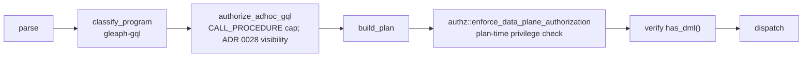

# RBAC and prepared queries

> **Status (2026-08-24):** [ADR 0074](../adr/0074-data-plane-authorization-core.md) Phase 1
> slices 1–3 are **implemented**: administrative capabilities plus per-graph data-plane
> grants with a virtual `PUBLIC` subject and default deny; **plan-time enforcement**
> (slice 2b): every vertex label, edge label × direction, projected property, and mutation
> in a built plan must be covered by the caller's effective privileges; and **caller-bounded
> prepared publication with record-level static extraction** (slice 3): registered queries
> store their statically extracted requirement set, publication is an explicit invariant-7-
> gated `GRANT EXECUTE ON PREPARED QUERY` statement, and ownership is the documented
> implicit root of data-plane authority (amended §3 invariant 3).

## Purpose

Document Gleaph’s **in-canister access model** and how Prepared Queries fit the threat model.

## Non-goals

- IC canister controller privileges (platform-level; separate from RBAC).
- Frontend auth UX.

## Authorization model

**Source:** `crates/auth`, `crates/router/src/rbac.rs`, `crates/router/src/authz.rs`,
`crates/router/src/facade/auth.rs`,
[ADR 0074](../adr/0074-data-plane-authorization-core.md)

Two orthogonal dimensions replace the former five-role ladder:

### Administrative capabilities (`AdminCaps`)

A global bitset stored per principal (`crates/auth::AuthState`, MemoryId 0). Principals with
**no stored row hold an empty set** (**default deny**). Bootstrap init seeds
`issuing_principal` and every `initial_admins` entry with the **full set**; grant
administration writes rows under `MANAGE_AUTHORIZATION` (`admin_grant_caps`, replacing the
former `grant_role`; `my_caps` reports the caller's set).

| Capability             | Governs                                                                                        |
| ---------------------- | ---------------------------------------------------------------------------------------------- |
| `PREPARE_REGISTER`     | Prepared-query registration / drop (`prepare`, `drop_prepared`)                                 |
| `INDEX_CREATE`         | `CREATE INDEX`, vector-index DDL creation                                                       |
| `INDEX_DROP`           | `DROP INDEX`, vector-index DDL drops                                                            |
| `MANAGE_CATALOG`       | Graph-type catalog DDL, schema migrations, catalog interning                                    |
| `CALL_PROCEDURE`       | Named `CALL` procedures (until procedures become catalog objects)                               |
| `MANAGE_FEDERATION`    | Graph/shard topology, backfill, maintenance sweeps, diagnostics, vector activation/maintenance  |
| `MANAGE_AUTHORIZATION` | Writing other principals' capability rows                                                       |

Router gates name the narrowest governing capability (`facade::auth::require_cap`, store-level
surfaces surface `NotAuthorized`; the GQL-path gates in `rbac.rs` surface `Forbidden`). There
is no implicit elevation between capabilities, and administrative authority never implies
data-plane access (ADR 0074 invariant 1). The former global Admin survives only as "holds the
full set" (`is_admin`) for the ADR 0028 metadata bypass arm below.

### Data-plane grants

`(principal | PUBLIC) × privilege` rows (`crates/auth::GrantState`, MemoryId 55) with a
dormant `expires_at` field (expired rows read as absent). `PUBLIC` is a virtual pseudo-subject
resolved at evaluation time — it is never persisted as a principal, and the anonymous
principal can never hold a stored row. Effective data-plane privilege is
`caller-grants ∪ PUBLIC-grants ∪ ownership-root`, where ownership derives from
`GraphRegistryEntry.owner`/`admins` at evaluation time (ADR 0074 §3 invariant 3, amended:
ownership is the implicit root of data-plane authority and is **never materialized as grant
rows**). Plan-time evaluation checks the full requirement set against these rows
(`EXECUTE PreparedQuery`, `MATCH`, `TRAVERSE` (± direction), `READ`, `READ_PROPERTY`,
`CREATE`, `UPDATE`, `DELETE`).

### Plan-time data-plane enforcement (slice 2b)

**Source:** `crates/router/src/authz.rs`

After `build_plan`, the Router walks the built `PhysicalPlan` and extracts an exact
requirement set — every `PlanOp` variant is matched exhaustively with no wildcard op arm, so
a future planner variant fails compilation instead of silently bypassing enforcement. Names
resolve to graph-scoped catalog ids at extraction time; evaluation then demands coverage by
the caller's effective privileges. Any uncovered demand fails the whole query with the uniform
non-disclosing `Forbidden` that never names the missing privilege or resource (ADR 0074 §4).

Attribution contract (fail closed where the plan cannot name a resource):

| Plan fact | Requirement |
| --- | --- |
| Labeled vertex scan | `MATCH` on the label; full property map adds `READ`; explicit projections add `READ_PROPERTY` per key; empty hydration list adds nothing beyond `MATCH` |
| Traversal hop | `TRAVERSE` rows from pattern direction × schema directedness: declared directed labels probe one directional row per orientation (undirected patterns need both); undirected or undeclared labels take the unoriented row — mirroring GRANT lowering |
| Edge-inline property bytes | covered by the edge label's traversal row (no edge-property resource exists in Phase 1) |
| Filter / projection / aggregation expressions | property reads attributed through variable→label facts; ambiguous or unresolvable attribution degrades to tenancy-only |
| Unlabeled scans, `NOT`/wildcard label expressions, `DETACH DELETE`, unresolvable open-schema names | tenancy-only: owners/admins proceed; Phase 1 grants enumerate labels, so wildcard reads are not expressible as grants |
| Mutations | `CREATE` for inserted elements; `UPDATE` for `SET`/`REMOVE`; `DELETE` for deletes, attributed via bound-variable labels |
| Vector `SEARCH` | filter expressions attribute like other reads; the vector-index lookup itself stays ungated until authorization-aware vector search (Phase 2) |
| `USE GRAPH` segments | each child segment resolves names against its target graph's catalogs |

Prepared execution evaluates the **static requirement set stored on the record** (slice 3)
as the primary checked artifact, with the live plan walk retained as the fail-closed
fallback for catalog drift and for derived sorted plans whose shape the stored set does not
describe. Both evaluations run under SECURITY INVOKER (`caller ∪ PUBLIC` plus ownership
root); a stored demand can never re-bind to different vocabulary because catalog ids are
monotonic (ADR 0074 invariant 4). Registration proves equivalence: the stored set must equal
a fresh dynamic walk of the same program (regression-tested).

## Anonymous-principal invariant

**Status: Implemented**

`Principal::anonymous()` holds **no capabilities** and can **never hold a stored privileged
row** — its only reachable authorization path is the `PUBLIC` grant baseline. It can also
never be configured as a trusted Router or Index canister identity, nor as graph
`owner`/`admins` (`validate_registration_principals`). Enforcement lives at the
invariant-owning write/configuration boundaries (not only at Candid entrypoints):

| Owner                | Boundary (source of truth)                                        | Behavior                                                                                                                                                                                                                                                                                                                             |
| -------------------- | ----------------------------------------------------------------- | ------------------------------------------------------------------------------------------------------------------------------------------------------------------------------------------------------------------------------------------------------------------------------------------------------------------------------------ |
| `crates/auth`        | `AuthState::upsert_caps`, `AuthState::bootstrap_principals`, `GrantState::grant` | Reject anonymous before any mutation; bootstrap is **all-or-nothing** (anonymous issuer or any anonymous initial admin inserts no rows). Returns `AuthWriteError::AnonymousPrincipal`. Grant keys reject anonymous subjects; publication to unauthenticated callers uses the `PUBLIC` subject. |
| `crates/auth` (read) | `AuthState::caps_of`                                              | Defense in depth: anonymous always resolves to the empty set even if a corrupt anonymous row exists, so effective authorization is never elevated.                                                                                                                                                                                  |
| Router               | `canister::init` (traps), `admin_grant_caps` → `admin_upsert_caps` | Route bootstrap/grant through the checked auth API; an anonymous target surfaces `RouterError::InvalidArgument`.                                                                                                                                                                                                                     |
| Router (grants)      | `rbac::authorize_prepared_execute`, `authz::enforce_prepared_data_plane_authorization` | Anonymous evaluation resolves to the `PUBLIC` subject only, in both the EXECUTE gate and static/live requirement coverage; explicit caller grants are unreachable.                                                                                                                                                                 |
| Graph metadata       | `GraphMetadata::validate_for_store`                               | Reject `FederationRouting` whose `router_canister` or `index_canister` is anonymous (`GraphMetadataError::AnonymousFederationPrincipal`). Shared by install-time `GraphInitArgs` and `set_federation_routing`; there is no post-install graph wiring endpoint (PocketIC fixtures wire routing through install-time `GraphInitArgs`). |
| Graph router guard   | `guard_router_canister` (graph)                                   | Defense in depth: reject anonymous caller.                                                                                                                                                                                                                                                                                           |
| Graph Index          | `IndexStore::init_from_args`                                      | Reject anonymous `router_canister` **before** clearing/writing any stable state (`IndexError::AnonymousRouter`); a failed init leaves catalog/postings/router untouched.                                                                                                                                                             |
| Graph Index guards   | `guard_router_canister` (index), `assert_router_caller`           | Defense in depth: reject anonymous caller even if the configured router record named it.                                                                                                                                                                                                                                             |

Prepared-query execution for anonymous callers exists **only** through an explicit bounded
publication: `GRANT EXECUTE ON PREPARED QUERY <name> TO PUBLIC`, issued by a granter whose
effective privileges cover the record's stored requirement set (ADR 0074 invariant 7). There
is no registration-time auto-seed; replacing or dropping a record cascades its stale
publication rows so a re-registered name never inherits grants issued against superseded
requirements.

## Classification pipeline

```mermaid
flowchart LR
    A[parse] --> B["classify_program<br/>gleaph-gql"]
    B --> C["authorize_adhoc_gql<br/>CALL_PROCEDURE cap; ADR 0028 visibility"]
    C --> D[build_plan]
    D --> E["authz::enforce_data_plane_authorization<br/>plan-time privilege check"]
    E --> F["verify has_dml()"]
    F --> G[dispatch]
```

Write detection must agree between static classification and planner DML detection (`router/src/gql.rs`).

Two admission stages precede dispatch (slice 2b):

1. **Pre-plan gate** (`rbac::authorize_adhoc_gql`): the caps-governed `CALL_PROCEDURE`
   surface, plus ADR 0028 graph **visibility** — resolution succeeds for tenants,
   grant-covered callers (`caller ∪ PUBLIC`), and the superuser/shard arms, and fails as
   indistinguishable `NotFound` otherwise. The former interim tenancy-or-caps shortcut that
   admitted any capability holder is deleted: administrative capabilities confer no
   data-plane or visibility-by-caps-alone admission.
2. **Plan-time enforcement** (`authz::enforce_data_plane_authorization`, above): runs on
   every path that reaches dispatch — fresh builds and cached plans alike — so a cached plan
   never widens what a caller may run.

**Grant-derived visibility (slice 2b):** `caller_may_access_graph`,
`list_visible_graph_ids`, and `resolve_home_graph_id` accept callers holding at least one
unexpired grant row on the graph. Visibility is admission only — none of these arms
authorize data-plane access, which remains plan-time against grant rows. Metadata surfaces
therefore answer visible grantees with the ordinary authority errors (`Forbidden` on
owner-only surfaces) instead of existence-hiding `NotFound`; callers without rows keep the
indistinguishable `NotFound`.

## Catalog DDL authorization

GQL catalog statements set `has_catalog_modification` in [`ProgramModificationFlags`](../../crates/gql/src/program_modification.rs) (`CREATE`/`DROP` graph, graph type, schema). Router enforcement:

| DDL surface                                                                                  | Entry                                              | Gate                                              |
| -------------------------------------------------------------------------------------------- | -------------------------------------------------- | ------------------------------------------------ |
| **Graph type catalog** (`CREATE`/`DROP GRAPH TYPE`, `CREATE`/`DROP GRAPH` in `gql_execute*`) | `authorize_adhoc_gql` after `classify_program`     | ADR 0028 visibility (tenancy ∪ grant-derived ∪ superuser/shard arms; no caps-alone admission); catalog DDL is additionally governed by `MANAGE_CATALOG` on its dedicated store surfaces |
| **Index DDL** (`CREATE INDEX` / `DROP INDEX` standalone parse path)                          | `authorize_index_ddl`                              | `INDEX_CREATE` or `INDEX_DROP`                    |
| **Prepared plan registry**                                                                   | `authorize_prepared_catalog_change`                | `PREPARE_REGISTER`                                 |
| **Federation graph registration**                                                            | `register_graph`                                   | `MANAGE_FEDERATION`                                |
| **Shard registry / backfill / maintenance sweeps**                                           | `register_shard` / `advance_backfill` / sweeps     | `MANAGE_FEDERATION`                                |

Graph type catalog DDL runs on the main GQL path **before** ingress dispatch when the transaction block contains catalog statements ([ADR 0013](../adr/0013-gql-graph-type-catalog-on-router.md)). Catalog-only blocks return zero rows without dispatching DML/query ops.

**Note:** Index DDL requires an index-specific capability — unrelated capabilities (e.g. `PREPARE_REGISTER`) do not admit it.

## Per-graph tenancy (graph-scoped read authorization)

**Status: Implemented** ([ADR 0028](../adr/0028-per-graph-tenancy-metadata-reads.md))

RBAC capabilities above are **canister-global**. Graph-scoped _visibility_ is a separate, orthogonal ACL carried on `GraphRegistryEntry.{owner, admins}` plus grant-derived visibility (slice 2b). A caller may resolve/read a graph's metadata and routing data when `caller_may_access_graph` holds (`crates/router/src/facade/store/registry.rs`):

| Allow path       | Who                                                                                         | Why                                                                                                                                                                                                               |
| ---------------- | ------------------------------------------------------------------------------------------- | ----------------------------------------------------------------------------------------------------------------------------------------------------------------------------------------------------------------- |
| Tenant           | `caller == owner` or `caller ∈ admins`                                                      | The graph's tenant(s). Also the ownership-derived arm of plan-time data-plane coverage (ADR 0074 §4).                                                                                                             |
| Grantee          | caller holding ≥1 unexpired data-plane grant row on the graph, `caller ∪ PUBLIC` (slice 2b) | Grantees of a shared graph may resolve it by name; visibility is admission only — data access stays plan-time against the grant rows.                                                                              |
| Superuser bypass | principal holding the **full capability set** (bootstrap analogue of the former global Admin) | Operations/migration/tooling (DB-superuser analogue). Phase 1 keeps this arm scoped to control/metadata reads only — never the data plane; Phase 2 replaces it with time-boxed grants (ADR 0074 §1b). |
| Own shard        | the graph's registered `graph_canister` (keyed in `ROUTER_SHARD_BY_GRAPH`, same `graph_id`) | Keeps federation/index-routing inter-canister calls working (`verify_shard_attachment`, `list_shards_for_graph`, `indexed_property_catalog`), which reach the router with the shard's `graph_canister` principal. |

Enforcement:

- **Name→id metadata endpoints** (`resolve_shard`, `lookup_graph_id`, `list_shards_for_graph`, `indexed_property_catalog`, `lookup_{vertex,edge}_label_id`, `lookup_property_id`, `reverse_{vertex,edge}_label_name`, `reverse_property_name`) resolve via `resolve_graph_id_authorized`. Previously these used a bare name lookup with no ACL (cross-tenant disclosure).
- **Non-disclosure:** a caller without visibility gets `NotFound`, not `Forbidden`, so it cannot confirm a graph exists. `resolve_graph` follows the same rule and gains the Admin bypass. A **visible** non-owner (tenant admin or grantee) receives ordinary authority errors (`Forbidden`) on owner-only surfaces — existence is already implied by the grant relationship.
- **Default/HOME selection:** `list_visible_graph_ids` / `resolve_home_graph_id` follow tenancy ∪ grant-derived visibility (no caps-alone bypass), so an Admin's HOME does not become ambiguous. The intentionally-public prepared prepared-query endpoints path already scopes through `list_visible_graph_ids` and is unchanged.
- **Registration validation:** `validate_registration_principals` rejects the anonymous principal as `owner` or in `admins` (before any state mutation); an anonymous owner/admin would make the ACL match every unauthenticated caller. This complements the [anonymous-principal invariant](#anonymous-principal-invariant).

## Graph shard exposure

Graph canisters **do not** serve arbitrary GQL to end users. They execute:

- `ExecutePlanArgs` from router (trusted)
- Cross-shard graph endpoints (`federated_expand`, peer ACL) are **removed** until a follow-up ADR (router `peer_sync` is a no-op).
- Migration APIs (controlled)

This shrinks the attack surface: compromise of a user principal does not bypass router policy without also forging router calls.

## Prepared queries

**Product goal (README):** Admins register queries; frontends invoke them with parameters only.

Benefits:

- No arbitrary parse/plan on hot path for untrusted callers
- Stable plans for auditing and caching
- Combined with `IC.MSG_CALLER()` for row-level patterns

**Registration:** a principal holding `PREPARE_REGISTER` (the bootstrap full-set holders
included). Registration extracts the query's **static requirement set** through the same
plan-time walker enforcement uses and stores it on the record; it publishes nothing.

**Publication (slice 3):** `GRANT EXECUTE ON PREPARED QUERY <name> TO <subject>` is the only
way an EXECUTE row comes into existence. Two gates, both evaluated before any write:
(a) authority — the resolved graph's registry owner (implicit root) or a
`PREPARE_REGISTER` caps holder — and (b) invariant 7: the granter's effective privileges
must cover every row of the stored requirement set. Revocation is symmetric and removes
exactly the targeted row. Replacing or dropping a record cascades its stale EXECUTE rows.

**Execution:** default deny. A caller executes when it holds an explicit
`EXECUTE PreparedQuery` grant, a bounded PUBLIC row exists for that name, or the caller is
owner/admin of the query's bound graph (`rbac::authorize_prepared_execute`; SECURITY INVOKER,
caller ∪ PUBLIC ∪ ownership-root). The stored static set then governs data-plane coverage
with the live walk as fallback (see *Plan-time data-plane enforcement* above).

**Operator workflow:** [ADR 0061](../adr/0061-prepared-cli-registration-and-batch-catalog-api.md)
defines the file-based `gleaph prepared` workflow: `prepared/<name>.gql` sources (optional
`<name>.toml` sidecar), local `plan`, `status` drift checks via `get_prepared`, and batch
`apply` through the multi-operation `prepare` API. The Router remains the final validator and
completes parameter and result metadata (ADR 0053/0061).

**Implementation touchpoints:**

- `crates/router/src/prepared.rs`
- `crates/prepared-runtime`: heap-only prepared-source parsing, comment
  retention, and runtime records; it does not own prepared-query persistence
  or persist an AST
- Plan blob storage on router stable memory (`ROUTER_PREPARED_PLANS`, MemoryId 8); records
  are versioned (`PreparedPlanRecord::V1`, destructively redefined in slice 3 to carry
  `required_privileges` — fresh state required, no decode fallback)
- Data-plane grant rows on router stable memory (`ROUTER_AUTH_GRANTS`, MemoryId 55; ADR 0074)

## IC caller identity

GQL extensions:

- `IC.MSG_CALLER()` evaluated at execution time on graph
- Used in filters and prepared-query access patterns

Document query patterns that enforce “users see only their rows” in application guides (future).

## Federation and security

- Cross-shard expand requires peer graph principals in ACL.
- Router remains the entry for user GQL; shards trust router + peers, not arbitrary users.

## Related documents

- [architecture/overview.md](../architecture/overview.md)
- [gql/layers.md](../gql/layers.md)
