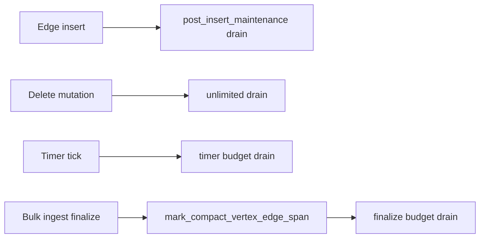

# Bulk ingest finalize (maintenance reclaim)

**Status:** Implemented — P0–P4 (2026-06-15).

## Purpose

Define an **explicit commit hook** for tombstone-free bulk ingest: after a batch of edge inserts, optionally enqueue `CompactVertexEdgeSpan` on known hot vertices and drain the LARA deferred maintenance queue so overflow buckets become **dense-eligible** before read-heavy queries run.

This closes the gap between:

- **Incremental reclaim** (implemented): every `GraphStore` edge insert calls `run_post_edge_insert_maintenance()` — drain only, no extra `mark_compact_vertex_edge_span`.
- **Aggressive reclaim** (this document): caller-declared batch boundary where vertex-edge-span compaction is safe and desirable.

## Non-goals

- Replacing per-insert maintenance or timer maintenance.
- Automatic tombstone detection or “compact all vertices” heuristics.
- Visit-time fold during query execution (rejected — materialize cost wins on single-shot queries).
- Implementing GQL `CALL` procedure execution in this milestone (syntax is specified here for later work).

## Background

### Dense eligibility

A labeled bucket is dense-eligible for bulk payload read when:

```text
payload_log_head < 0
&& overflow_log_head < 0
&& stored_slots == degree
```

See [payload-first-traversal.md](./payload-first-traversal.md).

### What is implemented today

| Path | `mark_compact_vertex_edge_span` | Drain budget |
|------|--------------------------------|--------------|
| Edge insert (all `GraphStore` insert APIs) | No (LARA may queue `mark_compact_dense` only) | `post_edge_insert_maintenance_budget` — timer cap on wasm, unlimited on native |
| Edge / vertex delete | Via LARA queue | `delete_maintenance_budget` — timer cap on wasm, unlimited on native (ADR 0020) |
| Timer tick | No | `timer_lara_maintenance_budget` |

On canisters the delete/insert/finalize inline drains are **bounded** (timer budget) and **arm the deferred-maintenance timer** so any leftover reclamation is finished between messages without trapping; see [ADR 0020](../adr/0020-deferred-maintenance-timer-drain.md). Native builds drain fully (timer arm is a no-op) so tests observe reclaimed state.

**Source:** `crates/graph/src/facade/store/maintenance.rs`, `crates/graph/src/facade/ic_budget.rs`, `crates/graph/src/facade/maintenance_timer.rs`.

Forcing `mark_compact_vertex_edge_span` on **every** insert breaks buckets with live tombstones (`valued_insert_after_delete_*` tests). Therefore aggressive span compaction is **not** on the insert hot path.

### Why a separate finalize hook

Benchmark evidence (converging-hub WSP setup): explicit `mark_compact_vertex_edge_span(src)` + unlimited drain moved overflow hubs to dense bulk read (~8.21M → ~7.33M instructions before further executor optimizations). Production bulk ingest in one update message may not drain the full queue under the insert budget; queries immediately after ingest can still hit hybrid / per-slot IO on hot vertices.

## Problem statement

```text
Bulk ingest (tombstone-free) → query on hot hub
```

Without finalize:

1. Inserts enqueue some maintenance (`mark_compact_dense`, etc.).
2. Post-insert drain runs under a **bounded** budget on canisters.
3. Overflow buckets may remain non-dense at first query.

With finalize (this design):

1. Caller declares ingest complete for a known vertex set.
2. System enqueues `CompactVertexEdgeSpan` for those vertices (per orientation).
3. Maintenance drains with a finalize budget; client or timer retries until `remaining_queue_len == 0`.

## Caller contract (required)

The finalize caller **must** guarantee for every listed vertex and orientation:

1. **No unprocessed edge tombstones** in the target span (no delete-then-insert hole pattern on that bucket).
2. **Batch boundary:** finalize is not interleaved with concurrent mutations on the same vertices (single-writer ingest partition or equivalent).
3. **Violation** is undefined at the storage layer (payload / slot inconsistency); treated as a caller bug, not validated at runtime (full tombstone scan is too expensive).

Vertices with delete/reinsert history must rely on **incremental drain only** until a future safe compaction story exists.

## API layers (planned)

### Layer 1 — `GraphStore` (graph crate)

```rust
pub struct BulkIngestFinalizeSpec {
    pub forward_vertices: Vec<VertexId>,
    pub reverse_vertices: Vec<VertexId>,
}

pub struct BulkIngestFinalizeReport {
    pub maintenance: LabeledBidirectionalMaintenanceReport,
    pub queued_forward: u32,
    pub queued_reverse: u32,
}
```

| Method | Behavior |
|--------|----------|
| `enqueue_bulk_ingest_finalize(spec)` | **Implemented** — `mark_compact_vertex_edge_span(Forward\|Reverse, vid, 0)` for each listed vertex; dedupe via LARA `vertex_edge_span_maintenance_pending`; arms the maintenance timer (enqueue-only, no inline drain — ADR 0020) |
| `run_bulk_ingest_finalize_drain()` | **Implemented** — `run_maintenance_best_effort(bulk_ingest_finalize_maintenance_budget())` |
| `finalize_bulk_ingest(spec)` | **Implemented** — enqueue + one drain pass |

**Budget:** `bulk_ingest_finalize_maintenance_budget()` — same as timer on wasm (~32B instructions), unlimited on native. Multi-call retry when `instruction_budget_exhausted && remaining_queue_len > 0`.

**Placement:** `crates/graph/src/facade/store/maintenance.rs`.

### Layer 2 — Graph canister (control plane)

Router-only update endpoint (same guard as `execute_plan_update`):

```candid
type BulkIngestFinalizeArgs = record {
  target_shard_id : nat32;
  forward_vertices : vec nat32;
  reverse_vertices : vec nat32;
  enqueue : bool; // true: enqueue + drain; false: drain-only retry
};

type BulkIngestFinalizeResult = record {
  queued_forward : nat32;
  queued_reverse : nat32;
  processed_work_items : nat32;
  remaining_queue_len : nat64;
  instruction_budget_exhausted : bool;
  instructions_used : nat64;
};
```

**Limits:** `forward_vertices.len() + reverse_vertices.len() <= 256` per call (argument size and queue growth).

**Not implemented:** explicit application metadata hub lists.

**Implemented (P3):** graph DML execution reports `ExecutePlanResult.hot_forward_vertices` (sources with `>= HOT_FORWARD_EDGE_INSERT_THRESHOLD` forward edge inserts in the batch). Graph persists the same hint in the mutation journal so router retry/recovery can still run post-DML finalize after a lost reply. Router `bulk_ingest_finalize` calls `finalize_bulk_ingest` per shard after successful DML when the plan has no explicit `GLEAPH.FINALIZE_*` `CALL`.

**Implemented (P1):** `finalize_bulk_ingest` update endpoint with `BulkIngestFinalizeArgs` / `BulkIngestFinalizeResult` in `gleaph-graph-kernel`; handler in `crates/graph/src/canister/handlers.rs`; router client in `crates/router/src/graph_client.rs`.

### Layer 3 — Router (optional)

After DML commit on a shard, router may call graph finalize with a **hot-vertex set** collected during mutation execution (sources with high out-degree in the batch, explicit hub list from application metadata, etc.). Router orchestration is optional; Layer 1–2 suffice for ETL tools calling the graph canister directly.

## GQL surface (mutation executor)

Parser and planner support generic `CALL name(args) YIELD ...` → `PlanOp::CallProcedure`. **Gleaph finalize procedures execute in the mutation executor** (`crates/graph/src/plan/mutation/gleaph_finalize.rs`). Query executor still returns `UnsupportedOp` for `CallProcedure` (including `db.labels`). Gleaph-specific procedure names are not added to portable `gleaph-gql` / `gleaph-gql-planner` (see [gql/layers.md](../gql/layers.md)).

### Recommended procedures

| Procedure | Use |
|-----------|-----|
| `GLEAPH.FINALIZE_BULK_INGEST(forward_list, reverse_list)` | Multi-vertex batch complete |
| `GLEAPH.FINALIZE_FORWARD_EDGE_SPAN(vertex)` | Single hub, forward out-span |
| `GLEAPH.DRAIN_DEFERRED_MAINTENANCE()` | Retry drain without re-enqueue |

### Example (transaction tail)

```gql
START TRANSACTION READ WRITE

INSERT (src:IngestHub)
INSERT (src)-[:Road {w: 1}]->(p:Prefix)
-- ... bulk INSERT ...

CALL GLEAPH.FINALIZE_BULK_INGEST(
  GLEAPH.VERTEX_LIST(src),
  GLEAPH.VERTEX_LIST()
)
YIELD
  processed_work_items,
  remaining_queue_len,
  instruction_budget_exhausted

COMMIT
```

`GLEAPH.VERTEX_LIST(...)` is evaluated in the graph mutation executor: resolves bound node variables from [`PlanMutationBindings`] to internal `VertexId`s. Supports `GLEAPH.VERTEX_LIST()` (empty) and `GLEAPH.VERTEX_LIST(var, ...)`. A bare node variable is also accepted where a single-vertex list is required.

`CALL ... YIELD` columns are scalar mutation outputs. The graph mutation executor projects them through `Project` / `Materialize`, so a transaction tail can `RETURN` finalize report columns without adding Gleaph-specific behavior to `gleaph-gql` or `gleaph-gql-planner`.

### YIELD columns

| Column | Meaning |
|--------|---------|
| `queued_forward` / `queued_reverse` | Vertices enqueued this call |
| `processed_work_items` | Maintenance items processed |
| `remaining_queue_len` | Deferred queue length after drain |
| `instruction_budget_exhausted` | Wasm budget stopped early |
| `instructions_used` | Instruction counter delta (wasm) |

### Authorization

Named `CALL` sets `has_call_procedure` in `classify_program` → requires write path (`execute_plan_update`). Same RBAC as DML.

## Relationship to other maintenance paths



Finalize **complements** post-insert drain; it does not remove it.

## Observed canbench impact (post-insert maintenance, `c16a247f`)

Commit `perf(graph): drain LARA maintenance after edge inserts` added
`run_post_edge_insert_maintenance()` on every `GraphStore` edge insert and
**removed** bench-only setup hooks from `setup_repeated_edge_cost_cache_graph`:

- `drain_lara_maintenance()` (unlimited budget, once mid-setup)
- `mark_compact_vertex_edge_span(Forward, src, 0)` + final unlimited drain

Re-running canbench after that change showed regressions in `canbench_results.yml`.
**Do not attribute all of them to insert-time drain.** Split by what each bench
measures.

### By benchmark

| Bench | Approx. change | Cause |
|-------|----------------|-------|
| `bench_graph_profile_setup_50kscan` | +0.23% (~1.17K ix/edge on 50k edges) | **Yes — insert-time drain.** Setup is measured inside `bench_fn`; each edge insert pays post-insert maintenance. Matches prior ~1.2K/insert estimate. |
| `bench_graph_weighted_shortest_repeated_edge_cost_cache_48prefix_24hub_out` | **+10%** (3.12M → 3.44M total) | **No — not drain during query.** `bench_fn` measures only `execute_shortest_plan`. Regression is **setup graph shape**: removed `mark_compact_vertex_edge_span` on `src`. |
| `bench_graph_hop_count_shortest_converging_hub_48prefix_24hub_out` | +0.9% | Same shared setup as WSP; smaller effect (hop-count path, not weighted payload-batch hot path). |
| `bench_graph_expand_vector_l2_24scan_8match` | +0.25% | **Noise / negligible.** Query measured after tiny setup (24 edges). |
| `ic-stable-lara` benches | Mixed up/down | **Unrelated** to GraphStore insert drain (direct LARA, no facade hook). |

### WSP query regression detail

Scopes under `bench_graph_weighted_shortest_repeated_*` (query phase only):

| Scope | Before | After | Notes |
|-------|--------|-------|-------|
| `shortest_fixed_expand_forward_slices` (calls) | 28 | 32 | More expand iterations |
| `shortest_fixed_expand_forward_slices` (ix) | ~899K | ~1.19M | Higher ix per call as well |
| `weighted_shortest_relax` (calls) | 98 | 102 | Follows expand count |

`repeated_edge_cost_cache_payload_batch_path_on_hot_vertices` still reports
`batch.dense == true` for `src` after current setup-only post-insert drain.
**Dense-eligible is necessary but not equivalent** to the old bench path that
ran `mark_compact_vertex_edge_span` after all 48 parallel edges were present.
Incremental per-insert drain can fold overflow to dense while leaving a bucket
that is slower on the weighted shortest payload-batch expand path than after
explicit vertex-edge-span compaction.

This is the same production gap finalize is meant to close: post-insert drain
alone does not reproduce the aggressive reclaim that the WSP baseline assumed.

### Bench baseline policy (option C — implemented)

Option **C** is active: `setup_repeated_edge_cost_cache_graph` calls
`finalize_bulk_ingest(forward_vertices: [src])` after ingest, matching the
production post-ingest finalize API (replaces the temporary bench-only
`mark_compact_vertex_edge_span` hook from option A).

**P4 canbench comparison (2026-06-15, wasm32 PocketIC):**

| Setup | WSP total instructions | `shortest_fixed_expand_forward_slices` calls | Notes |
|-------|------------------------|----------------------------------------------|-------|
| Post-insert drain only (finalize commented out) | ~3.27 M | 32 | Within noise of pre-P4 `canbench_results.yml` row (~3.28 M) |
| `finalize_bulk_ingest(src)` in setup | **2.97 M** (−9.5%) | **28** | Persisted baseline in `canbench_results.yml` |

Hop-count converging-hub bench (`bench_graph_hop_count_shortest_converging_hub_*`)
shares the same setup; total instructions moved −0.9% (within noise) — expected
because that path is not weighted payload-batch hot.

`repeated_edge_cost_cache_payload_batch_path_on_hot_vertices` confirms
`batch.dense == true` for `src` after finalize setup.

## Implementation phases (when resumed)

| Phase | Deliverable | Verification |
|-------|-------------|--------------|
| P0 | `GraphStore::finalize_bulk_ingest` + unit tests | **Implemented** — `facade/store/maintenance.rs`; WSP bench setup calls finalize on `src` |
| P1 | Canister wire + handler | **Implemented** — `finalize_bulk_ingest` update; PocketIC router call |
| P2 | Mutation executor: `CallProcedure` for `GLEAPH.FINALIZE_*` + `GLEAPH.VERTEX_LIST` | **Implemented** — `plan/mutation/gleaph_finalize.rs`; executor + gql_run tests |
| P3 | Router hot-vertex tracking after DML | **Implemented** — `hot_forward_vertices` wire hint + router `bulk_ingest_finalize` |
| P4 | canbench WSP | **Implemented** — `finalize_bulk_ingest(src)` in setup; baseline **2.97 M** ix (−9.5% vs drain-only ~3.27 M); expand calls 28 vs 32 |

## Risks and open questions

1. **Hot vertex discovery:** ETL must supply vertices, or router must track endpoints during DML — no automatic full-graph scan.
2. **Multi-update drain:** Large hubs may need several finalize/drain calls or timer assistance on wasm.
3. **Federation:** Finalize is **shard-local**; each shard compacts its own hot vertices after local ingest.
4. **GQL `CallProcedure` in read path:** Finalize procedures are mutation-only; query executor should reject `GLEAPH.FINALIZE_*` if ever planned on read plans.

## Related documents

- [payload-first-traversal.md](./payload-first-traversal.md) — dense eligibility, M6 sparse path
- [lara-and-facade.md](./lara-and-facade.md) — `GraphStore` vs LARA maintenance
- [gql/layers.md](../gql/layers.md) — Gleaph extensions stay out of portable GQL crates
- [execution/operators.md](../execution/operators.md) — `CallProcedure` planner vs executor status

## Source of truth (current code)

| Source-of-truth item | Location |
|----------------------|----------|
| Post-insert drain | `crates/graph/src/facade/store/maintenance.rs` |
| Insert hook | `crates/graph/src/facade/store/edge_insert.rs`, `edge_logical.rs` |
| Budgets | `crates/graph/src/facade/ic_budget.rs` |
| `mark_compact_vertex_edge_span` | `crates/ic-stable-lara/src/labeled/bidirectional/deferred.rs` |
| `CallProcedure` (Gleaph finalize) | `crates/graph/src/plan/mutation/gleaph_finalize.rs` |
| `CallProcedure` (other) unsupported on query path | `crates/graph/src/plan/query/executor/ops.rs` |
