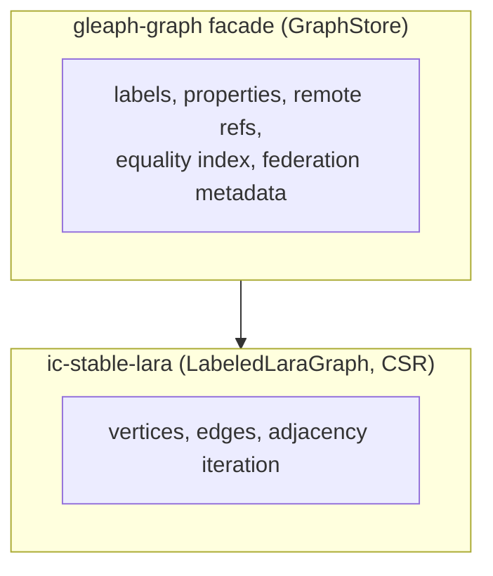

# Storage: LARA and graph facade

## Purpose

Clarify what **ic-stable-lara** provides vs what **gleaph-graph** stable structures add for GQL, federation, and indexes.

## Non-goals

- PMA / tombstone algorithm proofs (see `crates/ic-stable-lara/README.md`).
- Full stable memory layout bytes.

## Layering

## LARA responsibilities

**Crate:** `ic-stable-lara`

- CSR vertex/edge storage, tombstones, adjacency iterators
- Labeled graphs, bidirectional deferred views
- **Remote/external edge** insertion at storage level (no logical shard semantics)

LARA does not know `LogicalVertexId`, router placement, or GQL.

## Graph facade responsibilities

**Crate:** `gleaph-graph` — `facade/store.rs`, `facade/stable/*`

| Store | Role |
|-------|------|
| Vertex/edge properties | Property catalogs and maps |
| Label catalogs | Vertex/edge labels |
| `metadata` | `FederationRouting`, graph name |
| `remote_vertex_refs` | Remote endpoint handles |
| `remote_forward_in` | Incoming-to-remote index |
| `edge_equality_postings` | Local edge property equality |
| Auth / peers | Shard peer principals |

**GraphStore** is the single entry for plan executor and federation expand.

## Identity on shard

| Mode | Logical id |
|------|------------|
| Federated | From router; stored per local vertex |
| Standalone | `standalone_logical_vertex_id(local)` |

Placement client calls router for resolve/commit/release (`index/placement.rs`).

## Indexes (local vs global)

| Index | Location | Scope |
|-------|----------|-------|
| Property equality (vertex) | graph-index canister | All shards, `shard_id` in hit |
| Edge equality | graph stable | Per shard |
| Forward-to-remote | graph stable | Per shard |

## Writes and placement

- Normal writes go through `GraphStore` mutation paths.
- In federated mode, router placement is active-only and identifies the authoritative shard.
- Vertex migration is future work and has no runtime stable-memory state today ([federation/operations.md](../federation/operations.md)).

## Related documents

- [federation/model.md](../federation/model.md)
- [index/property-index.md](../index/property-index.md)
- [execution/pipeline.md](../execution/pipeline.md)
