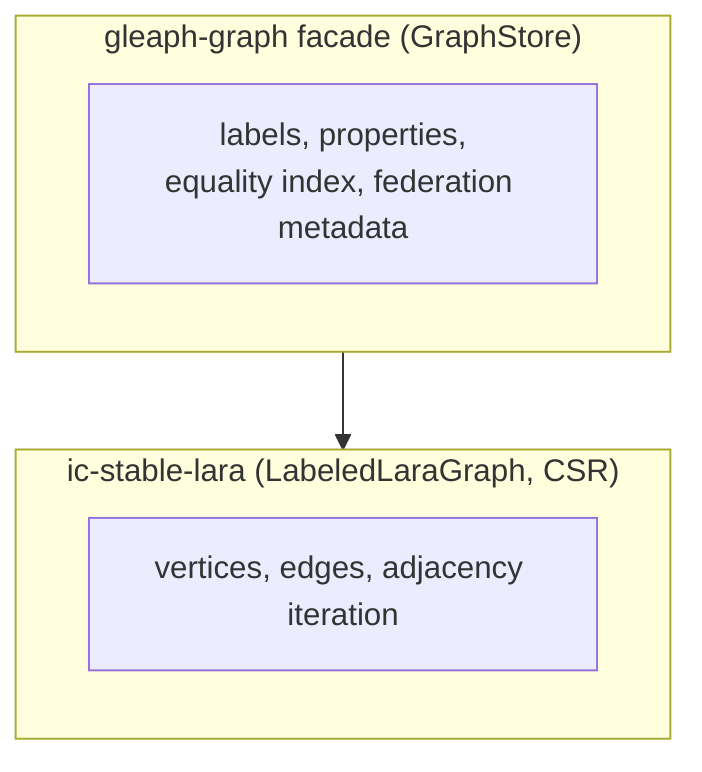

# Storage: LARA and graph facade

**Status:** Implemented (facade); Partially Implemented (LARA labeled physical layer — see [lara-dgap-contract.md](./lara-dgap-contract.md))

Last updated: 2026-06-11

## Purpose

Clarify what **ic-stable-lara** provides vs what **gleaph-graph** stable structures add for GQL, federation, and indexes.

## Non-goals

- PMA / tombstone algorithm proofs (see `crates/ic-stable-lara/README.md`).
- Per-byte stable memory layout (see [stable-memory-inventory.md](./stable-memory-inventory.md) for region inventory).
- DGAP / PMA contract detail (see [lara-dgap-contract.md](./lara-dgap-contract.md)).

## Layering

## LARA storage boundary

**Crate:** `ic-stable-lara`

- CSR vertex/edge storage, tombstones, adjacency iterators
- PMA segment density, weighted rebalance, segment relocation (DGAP-aligned core)
- `FreeSpanStore` for retired segment physical blocks (core LARA — see [lara.md](./lara.md))
- Labeled graphs, bidirectional deferred views
- **Remote/external edge** insertion at storage level (no shard routing semantics)

LARA does not know `GlobalVertexId` or GQL.

**Design contract:** [lara.md](./lara.md) (accepted) · [lara-dgap-contract.md](./lara-dgap-contract.md) (DGAP mapping detail).

## Graph facade state boundary

**Crate:** `gleaph-graph` — `facade/store.rs`, `facade/stable/*`

| Store | Role |
|-------|------|
| Vertex/edge properties | Property values by `PropertyId` (names on router) |
| Label catalogs | Vertex/edge labels by id |
| `metadata` | `FederationRouting`, graph name |
| `edge_pending` (ephemeral) | Federated edge property index ops → graph-index |

**Removed:** `remote_vertex_refs`, `remote_forward_in`, `peer_graph_canisters` stable regions.

**GraphStore** is the single entry for plan executor and index sidecars.

## Identity on shard

| Mode | Global key |
|------|------------|
| Federated | `GlobalVertexId { shard_id, local_vertex_id }` derived from routing + local dense id |
| Standalone | `GlobalVertexId { shard_id: 0, local_vertex_id }` |

Vertex liveness is checked on the graph shard (`GraphStore::is_vertex_live`, CSR tombstone). Router
`resolve_shard` maps `ShardId` → canister for federation routing only.

## Indexes (local vs global)

| Index | Location | Scope |
|-------|----------|-------|
| Property equality (vertex) | graph-index canister | All shards, `shard_id` in hit |
| Edge equality | graph stable | Per shard |

## Writes and vertex existence

- Normal writes go through `GraphStore` mutation paths.
- In federated mode, vertex existence is authoritative on the owning graph shard (tombstone + index sync); router registry routes by `ShardId` only.
- Vertex migration is future work and has no runtime stable-memory state today ([federation/operations.md](../federation/operations.md)).

## Related documents

- [lara-dgap-contract.md](./lara-dgap-contract.md)
- [labeled-edge-inline-values.md](./labeled-edge-inline-values.md)
- [inline-value-first-traversal.md](./inline-value-first-traversal.md)
- [federation/model.md](../federation/model.md)
- [index/property-index.md](../index/property-index.md)
- [execution/pipeline.md](../execution/pipeline.md)
