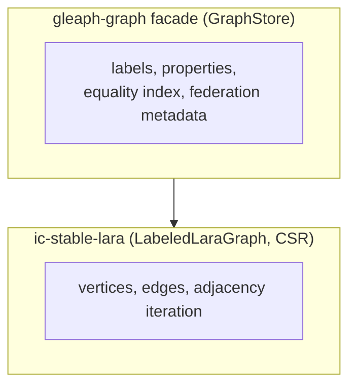

# Storage: LARA and graph facade

**Status:** Implemented (facade); Partially Implemented (LARA labeled physical layer — see [lara-dgap-contract.md](./lara-dgap-contract.md)). Failure-atomic stable mutations for `EdgeStore::grow_segment_tree_to` and `LabeledLaraGraph::promote_bypass_to_bucket_mode` are implemented.

Last updated: 2026-07-25
Anchor timestamp: 2026-07-25 13:11:03 UTC +0000

## Purpose

Clarify what **ic-stable-lara** provides vs what **gleaph-graph** stable structures add for GQL, federation, and indexes.

## Non-goals

- PMA / tombstone algorithm proofs (see `crates/ic-stable-lara/README.md`).
- Per-byte stable memory layout (see [stable-memory-inventory.md](./stable-memory-inventory.md) for region inventory).
- DGAP / PMA contract detail (see [lara-dgap-contract.md](./lara-dgap-contract.md)).

## Layering

```mermaid
flowchart TB
    subgraph Facade["gleaph-graph facade (GraphStore)"]
        F["labels, properties,<br/>equality index, federation metadata"]
    end
    subgraph Lara["ic-stable-lara (LabeledLaraGraph, CSR)"]
        L["vertices, edges, adjacency iteration"]
    end
    Facade --> Lara
```

## LARA storage boundary

**Crate:** `ic-stable-lara`

- CSR vertex/edge storage, tombstones, adjacency iterators
- PMA segment density, weighted rebalance, segment relocation (DGAP-aligned core)
- `FreeSpanStore` for retired segment physical blocks (core LARA — see [lara.md](./lara.md))
- Labeled graphs, bidirectional deferred views
- **Partially implemented (ADR 0048):** `CounterpartScan` is now live on the ADR 0050 logical-slot
  surface (`read_edge_state`, `visit_edges`, typed `BucketEntryPosition`) for edge-property
  sidecars, live inline-edge-property mutation, and vertex-deletion observer cleanup. The latter
  receives exact removed locations before LARA emits slot-move notifications; returned insert
  locations and the remaining mutation/alias-removal work are still pending
- **Partially implemented (ADR 0050):** canonical logical-slot traversal (`visit_edges`) and
  selected-slot reads are active and used by CounterpartScan; the broader forward/reverse facade
  migration and legacy removal remain pending
- **Remote/external edge** insertion at storage level (no shard routing semantics)

LARA does not know `GlobalVertexId` or GQL.

**Design contract:** [lara.md](./lara.md) (accepted) · [lara-dgap-contract.md](./lara-dgap-contract.md) (DGAP mapping detail).

## Graph facade state boundary

**Crate:** `gleaph-graph` — `facade/store.rs`, `facade/stable/*`

| Store                      | Role                                                        |
| -------------------------- | ----------------------------------------------------------- |
| Vertex/edge properties     | Property values by `PropertyId` (names on router)           |
| `EDGE_ALIASES`             | Current derived implementation; planned removal by ADR 0048 |
| Label catalogs             | Vertex/edge labels by id                                    |
| `metadata`                 | `FederationRouting`, graph name                             |
| `edge_pending` (ephemeral) | Federated edge property index ops → graph-index             |

**Removed:** `remote_vertex_refs`, `remote_forward_in`, `peer_graph_canisters` stable regions.

**GraphStore** is the single entry for plan executor and index sidecars.

## Identity on shard

| Mode       | Global key                                                                           |
| ---------- | ------------------------------------------------------------------------------------ |
| Federated  | `GlobalVertexId { shard_id, local_vertex_id }` derived from routing + local dense id |
| Standalone | `GlobalVertexId { shard_id: 0, local_vertex_id }`                                    |

Vertex liveness is checked on the graph shard (`GraphStore::is_vertex_live`, CSR tombstone). Router
`resolve_shard` maps `ShardId` → canister for federation routing only.

## Edge identity and counterpart ownership

**Current transitional implementation:** Graph-side `EdgeHandle` and related wire/index records
carry an owner, label, and logical `BucketEntryPosition` slot. `EDGE_ALIASES` and the existing
`mate`-named paths remain active for local-index movement, reverse-repair alias maintenance,
ordinary alias-row counterpart removal, and other pending callers. Reverse repair now performs
differential row reconciliation and applies exact reverse slot moves; alias-row ownership
migration is still pending. The scan-only canonical-edge-handle helper, edge-property
sidecar group, live inline-edge-property mutation, and vertex-deletion observer cleanup use LARA
CounterpartScan or exact deletion locations on the ADR 0050 read surface. Reverse-store
inline-property callers use explicit orientation because a logical slot alone cannot identify the
physical store.

**Target contract:** ADR 0048 makes `BucketEntryPosition` the only slot accepted by LARA
`EdgeHandle`/`CanonicalEdgeOccurrence`; raw slab/log locations remain inside LARA. Counterpart resolution is
owned by bidirectional LARA through `counterpart_of` and `canonical_handle`, using live
`PairOrdinal`. ADR 0050 consolidates labeled traversal around the same logical slot and provides
the `visit_edges`/selected-slot APIs. Graph, Router, and graph-index encode logical slots into
existing wire `u32` fields only at explicit adapters.

GraphStore continues to own canonical sidecars during the replacement. `EDGE_ALIASES` is removed
only after all callers adopt ADR 0048. The target architecture has no packed derived mate index;
exact rank/select scanning remains the source of truth.

## Indexes (local vs global)

| Index                      | Location             | Scope                         |
| -------------------------- | -------------------- | ----------------------------- |
| Property equality (vertex) | graph-index canister | All shards, `shard_id` in hit |
| Edge equality              | graph stable         | Per shard                     |

## Writes and vertex existence

- Normal writes go through `GraphStore` mutation paths.
- In federated mode, vertex existence is authoritative on the owning graph shard (tombstone + index sync); router registry routes by `ShardId` only.
- Vertex migration is future work and has no runtime stable-memory state today ([federation/operations.md](../federation/operations.md)).

## Related documents

- [lara-dgap-contract.md](./lara-dgap-contract.md)
- [labeled-edge-inline-properties.md](./labeled-edge-inline-properties.md)
- [inline-property-bytes-first-traversal.md](./inline-property-bytes-first-traversal.md)
- [ADR 0048](../adr/0048-lara-counterpart-resolution.md)
- [ADR 0050](../adr/0050-lara-traverse-read-api.md)
- [federation/model.md](../federation/model.md)
- [index/property-index.md](../index/property-index.md)
- [execution/pipeline.md](../execution/pipeline.md)
