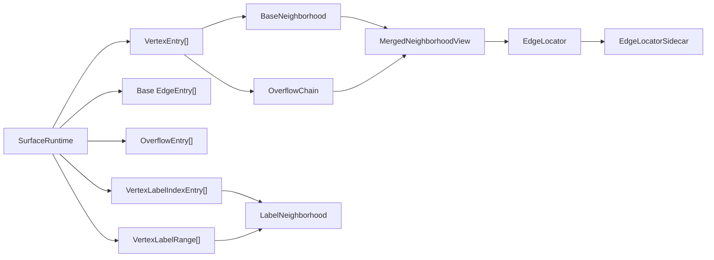
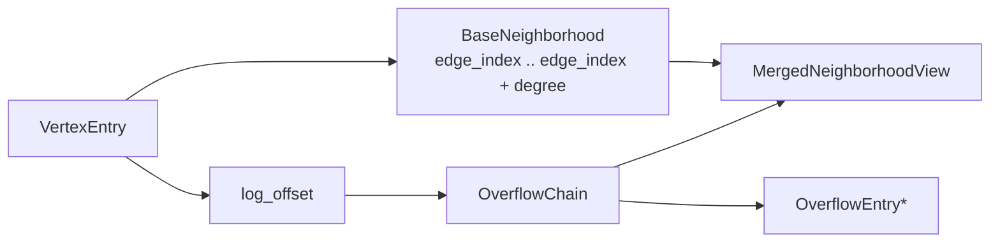

# graph-store Low-level Spec

## Purpose

This document is the implementation-facing companion to
[`graph-store-target-design.md`](/Users/yota/dev/gleaph-project/docs/graph-store-target-design.md).
It exists to drive the rewrite of `crates/graph-store` from low-level storage
rules rather than from API convenience.

Property persistence and indexing are specified separately in
[`graph-store-property-store-spec.md`](/Users/yota/dev/gleaph-project/docs/graph-store-property-store-spec.md).

Current implementation progress and next-step guidance are tracked in
[`graph-store-rewrite-status.md`](/Users/yota/dev/gleaph-project/docs/graph-store-rewrite-status.md).

## Rewrite Rule

The rewrite should proceed in this order:

1. fixed physical layouts
2. local mutation rules
3. compaction / merge rules
4. only then higher-level Rust APIs

Anything that violates the physical rules for the sake of short-term API
convenience should be treated as out of scope for the rewrite.

## Phase 1 Target

The first rewritten `graph-store` milestone should provide:

- forward and reverse `VertexEntry` arrays
- 8-byte `AdjacencyEntry` slabs
- `EdgeId -> EdgeLocator` sidecar
- per-vertex local overflow buffer via `log_offset`
- read iterator that merges base + overflow

It should explicitly avoid:

- global adjacency rebuild after mutation
- global label-range rebuild after mutation
- edge-id-centric traversal

## Required Low-level Decisions

The rewrite must pin down, in code and docs:

- region layout for forward/reverse vertex entries
- region layout for forward/reverse adjacency slabs
- overflow entry format
- merge trigger policy
- per-vertex capacity/gap policy
- locator sidecar format

## Storage Authority

The authoritative storage is stable memory.

- the primary adjacency surfaces live in stable memory
- any in-process RAM copy is temporary working state only
- rewrite decisions should optimize for stable-memory mutation and recovery
- "heap" should not be used as the primary architectural term for adjacency
  storage unless it explicitly means a stable-memory managed arena

This document therefore uses:

- `region`: a named stable-memory slice recorded in the layout directory
- `arena`: a stable-memory managed variable-size space inside one region
- `buffer`: temporary in-process scratch memory

## Stable Memory Region Manager

`graph-store` should not treat adjacency as the only growable structure in stable
memory.

The stable-memory design should begin with a region manager that can host
multiple independently growable regions.

At minimum, the manager must support distinct regions for:

- forward adjacency surface
- reverse adjacency surface
- overflow / mutation log
- `EdgeId -> EdgeLocator` sidecar
- node property store
- edge property store
- property index
- label catalog
- future statistics or auxiliary indexes

### Required property

Growth in one region must not require copying unrelated regions as the normal
case.

In particular, the design must avoid:

- growing forward adjacency by shifting reverse adjacency wholesale
- growing PMA-backed adjacency by rewriting property-store payloads
- growing property indexes by relocating adjacency regions wholesale

### Design implication

This means the stable-memory foundation must be a regioned allocator or memory
manager, not a naive fixed contiguous partition.

The implementation may be inspired by `ic-stable-structures::MemoryManager`
(bucketized virtual memories over one stable memory), but the graph kernel still
needs its own adjacency-local invariants on top of that allocator.

### Wasm page model

`ic-stable-structures` is explicitly page-based underneath.

- `WASM_PAGE_SIZE` is `65536` bytes
- a `MemoryManager` grows memory in fixed-size buckets measured in pages
- the default bucket size is `128` pages
- each `VirtualMemory` is a logical contiguous space built from those buckets
- the manager maps virtual offsets to real bucket addresses when reading or
  writing

The important lesson for Gleaph is not that adjacency should be page-shaped.
The lesson is that a stable-memory allocator can manage several independent
logical regions on top of page-sized physical growth units.

So for Gleaph:

- `WASM_PAGE_SIZE` matters only at the stable-memory allocator layer
- adjacency base ranges remain logically `EdgeEntry`-contiguous
- property/index regions can use page/bucket growth without changing adjacency
  semantics
- steady-state adjacency growth should preserve vertex-local contiguity, not
  page boundaries

### Minimum shape

The region manager should have:

1. a small fixed header
2. a region directory
3. allocation metadata for variable-size stable-memory blocks
4. the section payload space itself

Conceptually:

```rust
struct StableAddr(u64);

const WASM_PAGE_SIZE: u64 = 65_536;

struct WasmPages(u64);

struct BucketSizeInPages(u16);

struct EdgeIndex(u64);

struct ExtentRef {
    addr: StableAddr,
    len_bytes: u64,
}

struct BucketRef {
    bucket_id: u32,
}

enum RegionStorageKind {
    Extent,
    BucketChain,
}

struct RegionRef {
    storage: RegionStorageKind,
    kind: RegionKind,
    root: u32,
    logical_len_bytes: u64,
}

struct RegionDirectoryEntry {
    region: RegionRef,
}

struct RegionManagerLayout {
    directory: [Option<RegionDirectoryEntry>; MAX_REGION_KINDS],
    bucket_size_in_pages: BucketSizeInPages,
}

struct ExtentHeader {
    id: ExtentId,
    extent: ExtentRef,
    next: ExtentId,
}

struct ExtentChain {
    head: ExtentId,
    tail: ExtentId,
    logical_len_bytes: u64,
    allocated_pages: WasmPages,
    slack_pages: WasmPages,
}

enum ExtentGrowthKind {
    InPlace,
    RelocateTrailingSmallRegions,
    RelocateSelf,
}

struct ExtentGrowthPolicy {
    min_append_pages: WasmPages,
    small_region_relocation_max_pages: WasmPages,
}

struct ExtentGrowthRequest {
    additional_pages: WasmPages,
}

struct ExtentGrowthDecision {
    kind: ExtentGrowthKind,
    pages: WasmPages,
}

struct BucketChain {
    head: u32,
    tail: u32,
    logical_len_bytes: u64,
}

struct FreeExtentList {
    head: ExtentId,
}

struct ExtentTable {
    headers: Vec<ExtentHeader>,
}
```

Where `kind` identifies the tenant:

- forward vertex entries
- forward edge entries
- forward label sidecar
- reverse vertex entries
- reverse edge entries
- reverse label sidecar
- overflow log
- locator sidecar
- property store
- property index
- label catalog

The important point is that a region is identified through the directory and
resolved through allocator metadata, not through one fixed contiguous offset.

`root` means:

- first extent / extent-table entry for `Extent`
- first bucket id for `BucketChain`

So one stable-memory address space can mix:

- extent-backed adjacency and segment-log regions
- bucket-backed property and index regions

`RegionManagerLayout` is only the metadata layer.

It does not itself enforce PMA or DGAP rules; it only records which region kind
exists, how it is stored, and where its root allocator object lives.

For `RegionStorageKind`, the root object is expected to be:

- `Extent`: an `ExtentChain`, whose nodes are `ExtentHeader`s
- `BucketChain`: a `BucketChain`

This means:

- adjacency and segment-log regions can be extent-backed and still relocate or
  grow by chaining extents
- property and index regions can be bucket-backed without adopting PMA
  invariants

The extent-backed side should therefore maintain at least:

- an `ExtentTable` keyed by `ExtentId`
- a `FreeExtentList` for allocator reuse
- `ExtentChain` roots from regions into that table
- a page-based growth policy that can choose among:
  - `InPlace`
  - `RelocateTrailingSmallRegions`
  - `RelocateSelf`

### Allocation unit

The default planning assumption should be block/bucket allocation, not arbitrary
byte-range growth.

Reasons:

- it matches the stable-memory virtualization style used by
  `ic-stable-structures::MemoryManager`
- it avoids whole-section relocation when a section grows
- it gives the rewrite a concrete physical unit for compaction and migration

This does **not** mean adjacency itself should be modeled as unordered buckets.
It means the stable-memory allocator underneath adjacency should hand out
stable-memory blocks, while the adjacency kernel imposes its own ordered PMA
structure on top.

`WASM_PAGE_SIZE` and `BucketSizeInPages` belong to this allocator layer. They
do not change the logical meaning of:

- `VertexEntry.edge_index`
- `EdgeEntry`
- vertex-local contiguous base ranges

Those remain adjacency-kernel concepts. Pages and buckets are only the physical
growth and mapping units underneath them.

For extent-backed regions, growth decisions should be described in pages, not in
raw bytes. That keeps the allocator aligned with stable-memory growth units and
makes relocation policy comparable across regions.

The first implementation should keep growth planning as a pure decision step,
separate from the allocator side effects. Conceptually:

```rust
impl ExtentChain {
    fn plan_growth(
        self,
        request: ExtentGrowthRequest,
        policy: ExtentGrowthPolicy,
        trailing_region_pages: Option<WasmPages>,
    ) -> ExtentGrowthDecision
}
```

This planning step should choose among:

- `InPlace`
- `RelocateTrailingSmallRegions`
- `RelocateSelf`

without mutating stable memory yet.

At the metadata-update stage, `RelocateTrailingSmallRegions` may update the
physical `ExtentRef.addr` of one or more colliding trailing extent-backed
regions, while `RelocateSelf` may reassign the current region's own address.

After that, a second pure step may update only allocator metadata, for example:

```rust
impl ExtentChain {
    fn apply_growth_decision(
        self,
        request: ExtentGrowthRequest,
        policy: ExtentGrowthPolicy,
        decision: ExtentGrowthDecision,
    ) -> ExtentChain
}
```

This step may update values such as:

- `allocated_pages`
- `slack_pages`

while still avoiding real stable-memory writes.

On top of `RegionManagerLayout`, the first rewrite may introduce a thin
`RegionManager` that:

- defines extent-backed regions
- defines bucket-backed regions
- resolves `RegionRef.root` into `ExtentChain` / `BucketChain`
- applies `plan_growth` / `apply_growth_decision` at region scope
- owns allocator metadata such as:
  - `ExtentTable`
  - `FreeExtentList`
  - `BucketTable`
  - `FreeBucketList`

This manager is still metadata-only. It should not be the stable-memory IO
layer yet.

The first allocator metadata implementation may keep free lists intentionally
simple, but region definition should already prefer:

- reuse from `FreeExtentList` / `FreeBucketList`
- append-only allocation only when no reusable id exists

For physical extent placement, the first implementation may use a simple
bump-pointer extent arena:

- `ExtentRef.addr` is assigned from a monotonic `StableAddr`
- `ExtentRef.len_bytes` is derived from allocated pages
- later revisions may replace this with a relocating extent allocator

`VertexEntry.edge_index` should be interpreted as an `EdgeIndex`, meaning an
index in units of `EdgeEntry`, not a raw byte offset. Byte offsets remain an
allocator concern; edge-entry indexing remains an adjacency-kernel concern.

### Region manager responsibilities

The region manager is responsible for:

- allocate a new block chain or extent for a region
- append capacity to an existing region
- read and write logical region bytes
- persist region length and root metadata
- ensure one region's growth does not force unrelated regions to move

The region manager is **not** responsible for:

- PMA density invariants
- vertex-local gap policy
- DGAP overflow semantics
- label-aware exact traversal

Those belong to the adjacency kernel built on top of it.

### First implementation bias

For the rewrite, prefer the following order:

1. directory-managed block chains
2. region-local sequential read/write API
3. only later, optional reclamation / compaction of freed blocks

This matches the practical lesson from `ic-stable-structures`:
growth without whole-memory relocation is the first win; reclamation can come
later.

## Forward / Reverse Growth Model

Forward and reverse adjacency are logically distinct surfaces, but they grow in
lockstep at the edge-count level.

For every inserted edge:

- one forward edge entry is added
- one reverse edge entry is added

Therefore:

- total forward edge-entry count and total reverse edge-entry count remain
  synchronized
- the design must not rely on workloads where only one direction grows in total
  size

However, local pressure is not synchronized.

The same edge insert may stress:

- a high out-degree source neighborhood in forward storage
- a different high in-degree destination neighborhood in reverse storage

So while counts grow 1:1, local rebalance and overflow pressure do not.

## Surface Strategy

The target design keeps:

- one forward adjacency surface
- one reverse adjacency surface

These are logically separate because they preserve different traversal orders:

- forward: source-major
- reverse: destination-major

They should not be collapsed into one mixed physical ordering.

Conceptually:

```rust
enum SurfaceKind {
    Forward,
    Reverse,
}

struct EdgeLocator {
    surface: SurfaceKind,
    vertex: NodeId,
    ordinal: u32,
}

struct SurfaceRegions {
    vertex_table: RegionRef,
    edge_entries: RegionRef,
    label_index: RegionRef,
    segment_log: RegionRef,
}
```

Here, `label_index` should be read narrowly:

- it is the surface-local label-range sidecar for exact-label access
- it is not a general-purpose global label tree
- it is attached to adjacency ordering and therefore belongs next to the
  surface, not in a separate external index by default

`EdgeLocator` is a physical position descriptor.

Its meaning is:

- `surface`: which directional surface owns the physical slot
- `vertex`: which vertex-local base/log neighborhood owns the slot
- `ordinal`: slot position within that vertex-local view

This keeps semantic identity (`EdgeId`) separate from physical location.

`VertexEntry.edge_index` should therefore be interpreted as an offset within the
surface's `edge_entries` region, not as a raw global stable-memory address.

## Surface-internal PMA Layout

The internal adjacency model must follow the original VCSR / DGAP principle:

- one surface owns one logical edge-entry region
- that region stores edge entries for many vertices
- each individual vertex owns one contiguous base neighborhood within that
  region

This means:

- multiple vertices share the same `ForwardEdgeEntries` region
- multiple vertices share the same `ReverseEdgeEntries` region
- contiguity is required per vertex-local base neighborhood, not per region
  tenant
- the rewrite must not interpret "contiguous neighborhood" as "one dedicated
  region per vertex"

Conceptually:

```rust
struct VertexEntry {
    edge_index: EdgeIndex,
    degree: u32,
    log_offset: i32,
}
```

For a given vertex `v`:

- `edge_index` points into the surface-local `edge_entries` region
- `degree` counts visible base entries for `v`
- `log_offset` points to overflow / DGAP log state outside the base range

So the base view for a vertex is:

```text
edge_entries[edge_index .. edge_index + degree)
```

where `edge_entries` belongs to either the forward or reverse surface.

Conceptually, the read-side types look like:

```rust
struct BaseNeighborhood {
    surface: SurfaceKind,
    start: EdgeIndex,
    degree: u32,
}

struct LabelNeighborhood {
    surface: SurfaceKind,
    label_id: LabelId,
    start: EdgeIndex,
    degree: u32,
}

struct VertexLabelIndexEntry {
    start: u32,
    len: u32,
}

struct VertexLabelRange {
    label_id: LabelId,
    start: u32,
    len: u32,
}

struct LogOffset(i32);

struct OverflowEntry {
    edge_id: EdgeId,
    entry: EdgeEntry,
    next: LogOffset,
}

struct OverflowChain {
    surface: SurfaceKind,
    vertex: NodeId,
    head: LogOffset,
}

struct MergedNeighborhoodView {
    base: BaseNeighborhood,
    overflow: OverflowChain,
}
```

In this model:

- `BaseNeighborhood` is the canonical contiguous interval
- `LabelNeighborhood` is an exact-label contiguous subrange within that base
  interval
- `OverflowChain` is additive mutation state outside the base interval
- `MergedNeighborhoodView` is a read-side composition, not a third storage
  layout

The first read-side runtime may bundle these concepts like this:

```rust
struct SurfaceRuntime {
    layout: SurfaceLayout,
    vertices: Vec<VertexEntry>,
    base_entries: Vec<EdgeEntry>,
    overflow_entries: Vec<OverflowEntry>,
    label_index_entries: Vec<VertexLabelIndexEntry>,
    label_ranges: Vec<VertexLabelRange>,
}

struct EdgeLocatorSidecar {
    locators: Vec<Option<EdgeLocator>>,
}
```

With read-only responsibilities such as:

- build `BaseNeighborhood` from `VertexEntry`
- resolve per-vertex exact-label subranges from the surface-local label sidecar
- expose those exact-label subranges as `LabelNeighborhood`
- follow `OverflowChain` through `overflow_entries`
- materialize merged read order as `base entries + overflow entries`
- derive `EdgeLocator` for both base and overflow positions
- populate an `EdgeId -> EdgeLocator` sidecar once semantic edge ids are known

That means the read-side layering becomes:

- `SurfaceLayout`: which regions make up one surface
- `SurfaceRuntime`: in-memory read model for that surface
- `HydratedSurfaceRuntimes`: layout-driven pair of forward/reverse read-side runtimes
- `EdgeLocatorSidecar`: semantic-to-physical bridge

On top of that, a thin graph-level runtime may coordinate:

- one forward-surface mutation
- one reverse-surface mutation
- one `EdgeId -> EdgeLocator` update

so that a logical edge insert/delete is still applied as a pair even though
the two directional surfaces remain physically separate.





### Required invariant

For every vertex in a given surface:

- the base neighborhood is one logical contiguous interval of `EdgeEntry`
- that interval is interpreted in `EdgeEntry` units, not in bytes
- stable-memory allocator details must not split one base neighborhood into
  multiple logical runs

If the underlying extent-backed region is relocated, the region may move as a
whole, but the vertex-local interval semantics must remain unchanged.

### What is allowed

- many vertices packed into the same edge-entry region
- slack / gaps between neighborhoods, as required by VCSR density policy
- local rebalance windows that shift nearby vertex neighborhoods
- overflow/log entries outside the base interval

### What is not allowed

- treating one vertex as one dedicated region
- representing a single base neighborhood as several disconnected base ranges
- making the stable-memory bucketization visible as discontinuity at the
  adjacency-kernel level

### Relationship to DGAP logs

DGAP-style logs are separate from the base interval.

The intended model is:

1. each vertex first uses its contiguous base interval
2. if local base slack is insufficient, insertion falls into a fixed-size
   segment / local log
3. once that log crosses a threshold, the surface performs a local rebalance
   and restores a contiguous base interval

So the "merged neighborhood view" is:

- one contiguous base interval in `edge_entries`
- plus zero or more overflow entries reachable through `log_offset`

but the canonical base layout remains contiguous.

### Label-sidecar vs external tree

The rewrite should distinguish two different concepts that are easy to blur
together:

1. surface-local exact-label sidecar
2. external label-oriented index structures

The current `label_index` region means only the first one.

That surface-local sidecar stores:

- `VertexLabelIndexEntry`
- `VertexLabelRange`

and is intended to answer:

- for this vertex-local base neighborhood,
- where is the contiguous base subrange for label `L`?

This is adjacency-local metadata and should stay coupled to the surface.

As an initial implementation strategy, this sidecar may be materialized
directly from the canonical base interval by scanning `EdgeEntry` runs in
surface order and emitting one `VertexLabelRange` per contiguous live
same-label run. Tombstones break runs and are excluded from the sidecar.

Once the sidecar already exists, an implementation may rebuild only the
affected vertex-local ranges and shift later `VertexLabelIndexEntry.start`
offsets, instead of requiring a full-surface rebuild for every small change.
In particular, base-interval mutations should mark the affected vertex as dirty
for sidecar refresh, while pure overflow-log appends do not require relabeling
the canonical base interval.
At the surface-runtime layer, this should feed region-level dirty flags so that
stable-memory writeback can flush only the mutated regions instead of blindly
rewriting the full surface every time.

If Gleaph later adds a more global label-oriented structure backed by an
`(a,b)`-tree or similar storage, that should be treated as a different
structure entirely:

- not the surface-local `label_index` region
- not the canonical source of vertex-local exact-label subranges
- instead an auxiliary external index or catalog

This is also the intended division of responsibility:

- base interval:
  - VCSR-style canonical neighborhood layout
  - source of `edge_index` and `degree`
- overflow chain:
  - DGAP-style write absorption
  - source of local post-base mutations
- merged neighborhood:
  - read-only composition used by iterators / expand logic

### Relationship to region management

`ForwardEdgeEntries` and `ReverseEdgeEntries` are region-manager tenants.

The region manager decides:

- where the surface edge-entry region lives in stable memory
- how that region grows or relocates

The adjacency kernel decides:

- how multiple vertex neighborhoods are packed into that region
- where local slack and rebalance windows exist
- when a mutation stays in base versus when it goes to DGAP log

So:

- region manager: region-level physical placement
- adjacency kernel: surface-internal PMA ordering and local mutation rules

That separation is essential. Without it, allocator decisions leak into
vertex-local adjacency semantics.

### Current graph-level mutation policy

The current low-level rewrite exposes a `GraphRuntime` that coordinates:

- forward surface mutation
- reverse surface mutation
- canonical `EdgeId -> EdgeLocator` sidecar updates

Its mutation policy is intentionally conservative.

#### Insert

Insertion first asks whether both directional surfaces can append at the tail
of their canonical base interval without shifting later base entries, or
whether both can reuse a tombstoned tail slot.

- if both can tail-append:
  - insert into base on both surfaces
  - store the canonical forward locator in the sidecar
- else if both can reuse a tombstoned tail slot:
  - reuse that slot in base on both surfaces
  - store the canonical forward locator in the sidecar
- else if the local rebalance window on both surfaces contains reclaimable
  tombstoned base slots:
  - compare reclaimed tombstoned slots against
    `existing overflow entries in the window + 1 incoming entry`
  - prefer `RebalanceRequired(plan)` only when both surfaces can absorb that
    live payload back into base through local compaction
  - keep the decision pure; do not mutate either surface yet
- else if both local overflow chains are still below the insert-policy limit:
  - append to overflow on both surfaces
  - store the canonical forward overflow locator in the sidecar
- otherwise:
  - return `RebalanceRequired(plan)`
  - do not mutate either surface yet

That plan is still pure metadata. At minimum it identifies:

- forward rebalance target vertex / ordinal
- reverse rebalance target vertex / ordinal
- current base degree on each surface
- current overflow-chain length on each surface
- incoming live entries that the rebalance is expected to absorb

The local rebalance window can also be summarized for reclaimable slack before
mutation. In the current implementation that summary counts tombstoned base
slots and live overflow entries inside the selected window, then asks whether
local compaction can absorb the current overflow payload plus the incoming
insert without growing base capacity for that window.

`incoming_live_entries` is carried explicitly in the rebalance plan so the same
planner shape can be reused for future batched insertions or merged mutation
steps, not only for single-edge inserts.

Graph-level convenience APIs keep the single-edge wrappers, but also expose
batch-aware variants that accept `planned_incoming_live_entries` and reuse the
same local-rebalance flow.

The same graph-level layer also exposes "prepare capacity" helpers that may
run one local rebalance cycle and write back dirty regions before any concrete
edge insert is attempted. This is intended for future batched mutation paths.

For convenience, a thin batch-mutation session can wrap that flow as
`prepare -> repeated inserts -> flush`.

The next pure planning step refines this into a local rebalance window on each
surface:

- `anchor_ordinal`
- `start_ordinal`
- `end_ordinal_exclusive`
- `current_window_span_len`
- `target_base_len`
- `reserved_base_len`
- `gap_budget`
- `total_weight`
- `weighted_layout`

This refined plan still does not move bytes. It only says which nearby vertex
window should participate in the next local PMA/DGAP reflow and how much
capacity budget exists inside that window.

The current rewrite now treats that window more like VCSR's weighted
positioning step:

- `target_base_len` is the minimum number of live entries that must fit back
  into canonical base
- `reserved_base_len` is the number of base slots kept after rebalance,
  including reserved future slack
- `gap_budget = reserved_base_len - target_base_len`
- `total_weight` is the sum of `degree + 1` for the vertices in the window

This means the planner no longer thinks only in terms of "compact current live
entries". It also carries an explicit gap budget that can be redistributed
across the window.

The current rewrite also carries the expected weighted placement directly in
the window plan as `weighted_layout`, so planner state and runtime placement
state stay aligned:

- planner:
  - chooses the window
  - records the current base-capacity span already occupied by that window
  - computes gap budget and total weight
  - stores the expected weighted positions and reserved spans
  - can expose the expected rewritten capacity span directly from the plan
  - can expose the expected displacement against the current window span
  - can summarize forward/reverse displacement at the graph-plan level
- runtime:
  - uses that same weighted shape to derive the concrete local rebalance delta

The current rewrite also exposes the same shape from the delta side:

- delta:
  - exposes the rewritten capacity span for each surface
  - exposes the actual displacement against the planned current span
  - can summarize forward/reverse displacement at the graph-delta level

This makes it possible to compare:

- what the planner predicted for the rebalance window
- what the concrete rewritten delta actually represents

The current rewrite also exposes one more stage after mutation:

- apply:
  - returns the old and new rewritten span lengths for each surface
  - returns the actual displacement applied to following vertex base indices
  - can summarize forward/reverse displacement at the graph-apply level

So the current low-level flow can compare three views of the same local
rebalance:

- planner prediction
- delta shape
- applied result

The next pure transform step derives a local rebalance delta from that window.
For each directional surface, the runtime first builds a pure weighted layout
for the selected window. Conceptually:

```rust
struct SurfaceWeightedWindowLayout {
    anchor_ordinal: usize,
    start_ordinal: usize,
    end_ordinal_exclusive: usize,
    base_start: EdgeIndex,
    live_degrees: Vec<u32>,
    reserved_lengths: Vec<u32>,
    positions: Vec<EdgeIndex>,
    reserved_base_len: u32,
}
```

This helper is the current rewrite's closest analogue to VCSR's
`calculate_positions_V1`:

- it starts from the current window `base_start`
- it computes `gaps = reserved_base_len - total_live_entries`
- it uses `degree + 1` as the per-vertex weight
- it derives one weighted step from `gaps / total_weight`
- it places each rewritten vertex neighborhood at a weighted start position
- it derives each vertex's reserved base span from the next weighted start

The current implementation still keeps the placement pure and local to the
window. It does not mutate bytes during this phase.

After that layout exists, the rebalance delta is derived from it. For each
directional surface, the runtime:

- reads every vertex neighborhood inside the selected window
- filters out tombstoned base and overflow entries
- appends live overflow entries after the surviving base entries for that vertex
- rewrites the window into one weighted contiguous base slice
- resets each rewritten vertex to `log_offset = EMPTY_LOG_OFFSET`
- leaves reserved tombstoned placeholders inside the rewritten window according
  to the weighted layout

This produces metadata like:

- `base_start`
- weighted `positions`
- per-vertex `reserved_lengths`
- `compacted_base_entries`
- rewritten `VertexEntry[]` for the window

This is still a pure result. Applying the rebalance delta to runtime state or
stable memory is a later step.

The important consequence is that the current rewrite is no longer doing a
strictly minimal "pack live entries tightly" compaction. It is already carrying
the DGAP/VCSR idea that rebalance should preserve or redistribute window-local
capacity so that higher-degree vertices keep more usable base slack after the
rewrite.

The current rewrite now also supports an in-memory apply step:

- rewrite the affected base slice on each surface
- replace rewritten `VertexEntry` values
- shift later `edge_index` values if the compacted slice changes length
- mark all affected-and-later vertices dirty for label-sidecar refresh

At the graph level, applying that delta currently clears the semantic
`EdgeId -> EdgeLocator` sidecar conservatively. Rebuilding the sidecar after
rebalance requires semantic edge ids for the rewritten base slice, which is
still a separate step.

The current runtime now supports that next step explicitly:

- apply the local rebalance delta
- rebuild the canonical forward sidecar from caller-supplied forward-surface
  vertex ids and base edge ids in ordinal order

This keeps semantic `EdgeId` ownership outside `EdgeEntry`, while still making
rebalance followed by sidecar restoration possible in one graph-level step.

For smaller updates, the graph runtime can also refresh only the affected
forward-side window:

- apply the local rebalance delta
- drop existing forward locators for the rewritten source vertices
- repopulate only that window from caller-supplied forward vertex ids and base
  edge ids

This keeps unaffected forward locator mappings intact.

The current graph-level runtime can now carry that sequence through writeback:

- apply local rebalance delta
- refresh the affected forward locator window
- rebuild dirty label sidecars
- flush dirty forward/reverse regions back to stable memory

The current rewrite now exposes summaries for that writeback-bearing path too:

- rebalance+write:
  - returns the applied rebalance summary
  - returns which forward/reverse vertices had label sidecars refreshed
- prepare-capacity+write:
  - returns whether rebalance actually ran
  - returns rebalance+write summary when it did
- insert-with-rebalance+write:
  - returns the final insert result
  - returns rebalance+write summary when rebalance was needed first
  - returns the final refreshed forward/reverse vertex sets

There is also now a single-step insert helper for the conservative current
policy:

- if insert can proceed immediately, perform it
- otherwise perform one local rebalance cycle
- refresh the affected forward locator window
- retry the insert once
- refresh dirty label sidecars and flush dirty regions

This means the current rewrite does **not** yet perform local PMA rebalance as
part of insert. It only chooses between:

- safe base tail append
- DGAP-style overflow absorption
- explicit rebalance request once local overflow pressure crosses policy

#### Replace

Replacement resolves the canonical forward locator from the sidecar and then
classifies it as either:

- base slot
- overflow slot

Replacement then updates the matching slot on both directional surfaces.
The current graph-level runtime also reports whether that replacement used the
base path or the overflow path.

#### Tombstone / delete

Delete follows the same path classification as replace:

- base slot -> tombstone both base entries
- overflow slot -> tombstone both overflow entries

In both cases, the semantic `EdgeId -> EdgeLocator` mapping is removed once the
paired mutation succeeds.
The current graph-level runtime also reports whether tombstone/delete used the
base path or the overflow path.

This preserves a simple invariant:

- the sidecar exists only for live logical edges
- the canonical sidecar locator always points at the forward surface

## Stable Arena Strategy

Although forward and reverse are logically separate, the physical space manager
should be designed as a stable-memory arena, not as two naive fixed contiguous
regions laid out "front then back".

### Not acceptable

- a single forward region followed directly by a single reverse region, where
  forward growth shifts the entire reverse region
- any design that requires whole-surface copying as the normal consequence of
  local edge insertion

### Acceptable direction

- a stable-memory adjacency arena with directory-managed allocation
- forward and reverse surfaces owning disjoint segment/block sets inside that
  arena
- local rebalance staying within the affected surface and nearby segments

In other words:

- logical model: two surfaces
- physical allocator: one stable arena

This avoids whole-region copying while still preserving direction-specific
physical order.

## PMA and Non-PMA Coexistence

PMA-backed adjacency is only one tenant of the stable-memory region manager.

The other major tenants are property and indexing subsystems. These should not
be embedded inside the adjacency growth path.

The intended layering is:

1. stable-memory region manager
2. adjacency arena(s) for PMA/VCSR/DGAP structures
3. property store regions
4. property index regions

This separation is important because it allows:

- adjacency to grow without shifting property payloads
- property store compaction without rewriting adjacency slabs
- property index growth without touching PMA layout

So the rewrite should treat "PMA vs non-PMA" as a first-class regional
boundary in stable memory.

## Segment-local Rebalancing

PMA/VCSR benefits should be preserved by keeping rebalance local.

Normal insertion should proceed like this:

1. append to forward local space or overflow
2. append to reverse local space or overflow
3. update locator sidecar
4. defer base merge until a local threshold is exceeded

What must not happen in the steady state:

- rebuilding all forward entries
- rebuilding all reverse entries
- rewriting a huge neighborhood just because one adjacent edge was inserted

## Terminology Baseline

Until a better name is chosen in code, the spec assumes:

- `EdgeEntry`: 8-byte hot adjacency entry
- `VertexEntry`: per-vertex base locator
- `EdgeLocator`: physical position descriptor
- `ForwardSurface`: source-major adjacency
- `ReverseSurface`: destination-major adjacency
- `AdjacencyArena`: stable-memory allocator backing both surfaces

## Current implementation

`graph-store` ships a single adjacency and persistence stack (`GraphStore` facade
over the low-level `GraphRuntime` and region manager). Earlier prototype
bridges and alternate on-disk formats are not supported.

## Incremental surface and property-index persistence

This section records the **contracts** for narrowing foreground flush work from
full-region rewrites. Implementations may apply these optimizations only when
all preconditions hold; otherwise they must fall back to whole-region encoding.

### Vertex table (forward / reverse)

- Each surface keeps a **suffix start ordinal** `s` when every in-memory row with
  index `< s` is already bit-identical to the same prefix in stable memory for
  that vertex table region.
- A flush encodes `vertices[s..]` and, for **extent-backed** regions with a
  matching stable logical length (`s * SERIALIZED_VERTEX_ENTRY_LEN`), may issue a
  **tail write** at byte offset `s * SERIALIZED_VERTEX_ENTRY_LEN` instead of
  rewriting the full extent payload in one write.
- **Bucket-chain** vertex tables cannot patch a middle offset cheaply; flushes
  fall back to the existing whole-region write path after a full encode.
- Any mutation that can change a row before `s` **widens** the dirty suffix
  (lowers `s`) or forces a full rewrite (drops the suffix hint).

### Label sidecar

- Layout is `header || index_entries[] || label_ranges[]`. Pure **tail append**
  of `VertexLabelIndexEntry` rows (no change to `label_ranges.len()` and no
  in-place edits earlier in the sidecar) allows a flush to rewrite the header,
  append new index-entry bytes starting at the old index count, then write the
  full ranges blob at its new offset after expanded index entries.
- If the label region was marked **fully** dirty (no append hint), or if stable
  header counts do not match the append-only preconditions, flushes fall back to
  full sidecar encoding.

### Property index (PIDX) paged node stores

- When the property-index region’s **total logical length is unchanged** after
  a compact re-encode, an **extent-backed** region may **diff** old and new
  bytes and issue smaller `memory.write` spans for changed intervals only. This
  avoids relying on explicit per-page dirty lists while still shrinking stable
  writes when most pages are identical.
- When the logical length **grows** but the new image is a **byte extension** of
  the previous payload (`new[..old_len] == old`), implementations may write
  **only the tail** starting at `old_len` instead of rewriting the full extent
  capacity.
- When the logical length **shrinks**, implementations must clear stable bytes
  from the new logical end through the old logical end (zero-fill or equivalent)
  so no stale indexed data remains after truncation.
- In-memory [`PropertyIndexNodeStore`](../crates/graph-store/src/property_index/node_store.rs)
  tracks `pidx_side_must_flush`: compact PIDX flushes **reuse the on-disk bytes**
  for a side that was not mutated since the last flush, avoiding a full
  `encode_paged_area` for that side. **Full rewrite fallback** is required when
  the on-disk header or section lengths are missing, inconsistent, or do not
  match the read-back slice for a “clean” side.
- Structural changes that alter paged-area length (new primary slots, different
  overflow footprint, allocator header changes) still rely on encoding the
  affected store and may use tail or diff paths only when the **combined region
  image** still satisfies the prefix/tail rules above.

### Node and edge property store regions (extent)

- For **extent-backed** `NodePropertyStore` / `EdgePropertyStore`, flushes write
  only the serialized append-log bytes required by `logical_len_bytes`, not the
  entire extent allocation.
- When logical length decreases, clear the stable range `(new_logical,
  old_logical)` so clients scanning by `logical_len` never observe stale record
  bytes beyond the new end.

### Failure and recovery

- Incremental paths rely on **prefix stability**: if stable memory does not match
  the in-memory prefix assumed by the optimizer (e.g. torn write, manual
  corruption, or a crash between metadata update and payload), the process must
  **detect mismatch** (length/header checks) and fall back to a full encode or
  treat the instance as damaged according to higher-layer policy.
- Higher layers that split **logical graph bootstrap** into ordered steps (for
  example properties before adjacency) must provide **explicit rollback** on
  intermediate failure so kernel-visible state does not leak a committed
  `NodeId` without its graph vertex slots.

### Observability

- Bench builds may set `GLEAPH_BENCH_PROFILE=1` to compare flush phases before
  and after incremental persistence work; instruction counts on repeated
  `INSERT` workloads are the primary regression signal.
