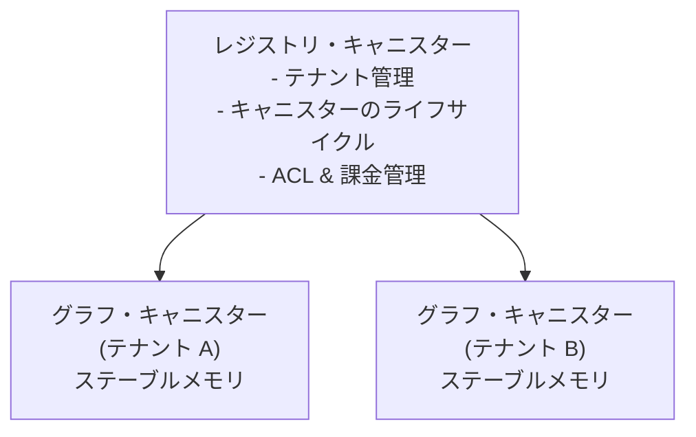

# Gleaph: Internet Computer上のグラフデータベース・サービス

## 概要

Gleaphは、Internet Computer（IC）上で動作するマルチテナント型の汎用グラフデータベース・サービスです。各ユーザーやプロジェクトに対して、独立したグラフインスタンスを提供します。主なユースケースはEコマースのレコメンデーション（購入履歴、コメント）ですが、ソーシャルグラフやその他の領域にも対応可能な汎用アーキテクチャを採用しています。本システムは、クエリおよびデータ更新のためのGQL（Graph Query Language）をサポートします。

`reference/`ディレクトリには、動的グラフデータ構造の3つのC++実装（VCSR、DGAP、Cluster-wise SpGEMM）が含まれています。また、`research/`ディレクトリには6本の学術論文があり、これらがコアデータ構造設計の指針となっています。具体的には、ICのステーブルメモリ（Stable Memory）に最適化された、Packed Memory Array（PMA）ベースのCSR（Compressed Sparse Row）を採用。VCSRの頂点中心型PMAと、DGAPの永続メモリ向けログ構造化アップデート手法を統合した設計となっています。

---

## 開発言語: Rust

以下の理由から、Rustが唯一の現実的な選択肢です。

- `wasm32-unknown-unknown` ターゲットへの第一級の対応、および成熟した `ic-cdk` と `ic-stable-structures` クレートの存在。
- `#[repr(C)]` による正確なステーブルメモリ・レイアウトの制御が可能。PMAのリバランス中にGC（ガベージコレクション）による一時停止が発生しない。
- C++に匹敵するパフォーマンスとメモリ安全性の両立。これはマルチテナント型のブロックチェーンサービスにおいて極めて重要。
- Motokoは低レベルのメモリ制御が不足しており、C++はICツールチェーンのサポートが限定的である。

---

## システムアーキテクチャ



- **レジストリ・キャニスター**（単一）: テナント管理、グラフ・キャニスターのプロビジョニング、ACL（アクセス制御）およびサイクル消費の追跡を行います。
- **グラフ・キャニスター**（テナントごとに1つ）: ステーブルメモリ内にPMAベースのグラフを保持し、GQLおよびプログラム用APIを提供します。
- **将来計画**: 単一キャニスターの容量を超えるグラフのためのシャード・コントローラーを導入予定。

---

## コアデータ構造: ステーブルメモリ向けPMA-CSR

VCSR (`reference/VCSR/vcsr/src/graph.h`) と DGAP (`reference/DGAP/dgap/src/graph.h`) を統合した構造です。

### 構造体定義

```rust
#[repr(C)]
struct VertexEntry {       // 16バイト
    edge_index: u64,       // エッジ配列へのバイトオフセット
    degree: u32,           // エッジ数（次数）
    log_offset: i32,       // オーバーフロー・ログへのポインタ（なければ -1）
}

#[repr(C)]
struct EdgeEntry {         // 16バイト
    target: u32,           // 遷移先頂点ID
    weight: f32,           // 関連度ウェイト
    timestamp: u64,        // 作成日時 (ナノ秒)
}

#[repr(C)]
struct LogEntry {          // 12バイト（DGAPスタイルのセグメント単位オーバーフロー用）
    src: u32,
    dst: u32,
    prev_offset: i32,      // セグメントログ内のリンクリスト
}
```

### 主要な操作（リファレンス実装からの移植）

| 操作                                        | ソース元                 | リファレンス行      |
| :------------------------------------------ | :----------------------- | :------------------ |
| 挿入（インライン + ログへのフォールバック） | DGAP `do_insertion`      | `graph.h:1039-1096` |
| リバランス（次数加重ギャップ）              | VCSR `rebalance_wrapper` | `graph.h:719-795`   |
| 容量計算                                    | VCSR `compute_capacity`  | `graph.h:612-628`   |
| リバランス時のログマージ                    | DGAP `rebalance_data`    | `graph.h:1389-1407` |
| 近傍イテレータ                              | VCSR `Neighborhood`      | `graph.h:114-128`   |

### ステーブルメモリ・レイアウト

```
オフセット         領域                       最大サイズ
─────────────────────────────────────────────────────
0x0000_0000      ヘッダー + PMAメタデータ    4 KB
0x0000_1000      頂点配列                   ~4 GB (2億5600万頂点 × 16B)
                 エッジ配列 (PMA)           動的に拡張、最大約 64 GB
                 セグメント・ログ領域       ~100 MB
                 セグメント・ツリー         ~数 MB
                 プロパティストア ((a,b)+ tree) 可変 (CBORエンコード)
                 ラベル/型インデックス       BTreeMap<label, vertex_ids>
```

- **ヒープ領域 (4GB)**: クエリの計算用スペース、頻繁にアクセスされる頂点のLRUキャッシュ、書き込みバッチバッファ、GQLパーサーの状態保持に使用。
- 計算負荷の高いアルゴリズム（PageRank/SSSPなど）の結果を保持する内部ヒープキャッシュには、パフォーマンス向上のためにRust特有のバイナリシリアライゼーション（`rkyv`など）を使用する場合があります。ただし、外部に返される認定済みの証明（certified proofs/witnesses）は、IC互換のエンコーディング（CBOR/hash-tree形式）である必要があります。

### `(a,b)+ tree` について（プロパティ/インデックス・ストレージ）

- 本ドキュメントにおける **`(a,b)+ tree`** とは、[LMUのノート](https://cs.lmu.edu/~ray/notes/abtrees/)にある`(a,b) tree`の定義に基づいたリバランス不変条件を持ちつつ、データ配置とスキャン動作は **B+ tree** スタイルに従うものを指します。
- 具体的な仕様:
  - 内部ノードはセパレータキーと子ポインタのみを保持する。
  - リーフノードに実際のキー/値レコードを保持する。
  - リーフノード間は連結（あるいは順次トラバーサル可能）されており、効率的なプレフィックススキャンや範囲スキャンをサポートする。
- 頂点/エッジのプロパティのプレフィックススキャンやセカンダリインデックスの走査が主要な操作となるため、通常のB-treeよりもGleaphのプロパティストレージに適しています。
- 実装上の注意: キーや値が可変長であるため、固定の要素数ではなく、ページの占有率/充填率に基づいて`(a,b)`スタイルのバランスを維持します。
- 補足: これはヒープ上の小さなメタデータ等に使用するRust標準ライブラリの`BTreeMap`/`BTreeSet`を置き換えるものではありません。`(a,b)+ tree`は、ページレイアウトとスキャン動作を明示的に制御する必要がある、ステーブルメモリ上の永続化ストア/インデックスに使用されます。

#### フェーズ2 実装に関する注記（一時的措置）

- フェーズ2の期間中、一部のGQLオーバーレイ状態（ラベル、プロパティ、削除フラグ、関連メタデータ）は、キャニスターが管理するスナップショットとしてステーブルメモリに永続化される場合があります。これはグラフヘッダーの予約領域（`_reserved`）からオフセット/長さのメタデータを介して参照されます。
- これは、GQLエンジンが進化過程にある中でコアとなるPMAレイアウトを不安定にさせないための、デリバリー優先の一時的なレイアウト選択です。
- `design/architecture.md` の計画が完全に完了する（プロダクション硬化フェーズ）までには、このスナップショット方式を廃止し、PMAとGQLのメタデータ永続化が統合されたスキーマとして管理されるようにPMA内のレイアウトに組み込む必要があります。
- プロダクションレベルの要件として、PMAが管理するエッジストレージは、単なる頂点ペア `(src, dst)` だけでなく、各エッジレコードごとにエッジのアイデンティティとラベル/型情報を保持しなければなりません。これにより、同じ頂点間の並列エッジ（Parallel edges）を MATCH/DELETE セマンティクスで区別できるようになります。
- これには、`EdgeEntry` を拡張するか、あるいは `EdgeEntry` に保存されたエッジIDをキーとするPMA管理のエッジメタデータテーブルを隣接させる必要があります。

---

## GQLエンジン

### パイプライン

```
GQL文字列 → パーサー (nom) → AST → バリデーター → プランナー → エグゼキューター → Candidレスポンス
```

### サポートされるサブセット（フェーズ2）

- `MATCH (a:Label)-[:EDGE]->(b)` — パターンマッチング（1〜3ホップ）
- `WHERE a.prop = value` — 一致/比較フィルタリング
- `CREATE`, `DELETE` — データ更新
- `RETURN`, `ORDER BY`, `LIMIT` — プロジェクション
- 可変長パスおよび集計処理はフェーズ3へ延期

---

## APIサーフェス

### グラフ・キャニスター・エンドポイント

```
// 読み取り（クエリコール — 高速、コンセンサスなし）
query(gql: text) → QueryResult
get_neighbors(vertex_id: u32) → Vec<EdgeEntry>
recommend(user: u32, edge_label: text, max_hops: u8, limit: u32) → Vec<Recommendation>
bfs(start: u32, target: u32) → Option<Vec<u32>>
get_stats() → GraphStats

// 書き込み（アップデートコール — 約2秒のコンセンサスが必要）
mutate(gql: text) → MutationResult
batch_mutate(gqls: Vec<text>) → Vec<MutationResult>
bulk_insert_vertices(data: Vec<VertexData>) → Result<u64, Error>
bulk_insert_edges(data: Vec<EdgeData>) → Result<u64, Error>
```

---

## 段階的実装プラン

### フェーズ1: 基盤構築（最初の目標）

1.  **ステーブルメモリ・アロケーター**: `ic0::stable64_read/write` 上のリージョンベースのアロケーター。
2.  **PMAコア**: VCSRの挿入、リバランス、リサイズ、近傍イテレータのRustへの移植。
3.  **セグメント・ログ**: 書き込みバッファリングのためのDGAPスタイルのログ構造化オーバーフローの移植。
4.  **プログラム用API**: Candidエンドポイント（頂点追加、エッジ追加、近傍取得、一括挿入）。
5.  **レジストリ・キャニスター**: テナント管理とキャニスター配布機能。

### フェーズ2: GQLエンジン

1. 上述のサブセットに対応するGQLパーサー (nom)。
2. ヒューリスティック・クエリプランナー（アンカーノードに基づくトラバーサル順序の最適化）。
3. PMA上で動作するVolcanoモデル・エグゼキューター。
4. 頂点/エッジプロパティ用のステーブルメモリ型 `(a,b)+ tree` プロパティストア。

### フェーズ3: レコメンデーションと分析

1. マルチホップの協調フィルタリング。
2. 組み込みのBFS、PageRank、SSSP（VCSRのアルゴリズム実装を移植）。
3. 時間窓クエリのための時間的エッジフィルタリング。
4. トラストレスな読み取りのためのIC認定クエリ（Certified Queries）。

### フェーズ4: プロダクション硬化

1. エッジの安定したアイデンティティ（`EdgeEntry` 内の `edge_id`）とPMA管理の `EdgeMetaTable` の導入。
2. オーバーレイからPMAへの統合（フェーズ2の一時的なスナップショットをPMA構造へ移行）。
3. キャニスター・アップグレードの安全性確保（レイアウトのバージョン管理、大規模グラフの遅延移行）。
4. サイクル管理、使用量クォータ、およびレート制限の実装。
5. きめ細かなACL（Principalベースの権限管理）。

---

## 主要なリスクと対策

| リスク                                   | 対策                                                                                       |
| :--------------------------------------- | :----------------------------------------------------------------------------------------- |
| PMAのリバランスがICの命令制限を超える    | 継続（Continuation）パターンを用いた段階的なリバランス。`performance_counter` による監視。 |
| クエリ実行中の4GBヒープ枯渇              | イテレータベースの実行、LIMIT句の強制適用、アリーナ・アロケーターの活用。                  |
| ステーブルメモリのランダムアクセスの遅延 | 頻繁に参照されるフィールドを構造体内にインライン化。プロパティ用のLRUキャッシュ。          |
| 書き込みレイテンシ（2秒のコンセンサス）  | バッチ更新の利用、DGAPスタイルのログバッファリング、一括インポート用エンドポイント。       |
| GQL仕様の複雑さ                          | 実用的なサブセットから実装し、サポート機能を明示。完全準拠は目指さない。                   |

---

## 検証手順

1. `icp network start && icp deploy` を実行し、ローカル・レプリカにレジストリとグラフ・キャニスターをデプロイ。
2. `icp canister call` を使用してテナントグラフを作成し、頂点/エッジの挿入、近傍クエリを実行。
3. `bulk_insert_*` を用いて小規模なEコマース・データセット（ユーザー、商品、購入履歴）をロード。
4. レコメンデーション・クエリを実行し、マルチホップのトラバーサルが正しい結果を返すことを確認。
5. `icp canister install --mode upgrade` を実行し、アップグレード後もデータが保持されていることを確認。
