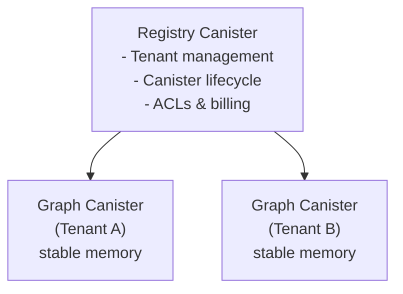

# Gleaph: Graph Database Service on the Internet Computer

## Context

Gleaph is a multi-tenant, general-purpose graph database service on the Internet Computer (IC) that enables each user/project to provision isolated graph instances. The primary use case is e-commerce recommendation (purchase history, comments), but the architecture must generalize to social graphs and other domains. The system will support GQL (Graph Query Language) for querying and mutations.

The `reference/` directory contains three C++ implementations (VCSR, DGAP, Cluster-wise SpGEMM) of dynamic graph data structures. The `research/` directory contains six academic papers. These inform the core data structure design: a Packed Memory Array (PMA)-based CSR adapted for IC's stable memory, synthesizing VCSR's vertex-centric PMA with DGAP's persistent-memory log-structured updates.

---

## Language: Rust

Rust is the only viable choice:

- First-class `wasm32-unknown-unknown` target; mature `ic-cdk` and `ic-stable-structures` crates
- `#[repr(C)]` for precise stable memory layout; no GC pauses during PMA rebalance
- Matches C++ performance with memory safety — critical for multi-tenant blockchain service
- Motoko lacks low-level memory control; C++ has minimal IC toolchain support

---

## System Architecture



- **Registry Canister** (single): Manages tenants, provisions graph canisters, tracks ACLs/cycles
- **Graph Canister** (one per tenant): Contains PMA-based graph in stable memory, exposes GQL & programmatic API
- **Future**: Shard controller for graphs exceeding single-canister capacity

---

## Core Data Structure: PMA-CSR for Stable Memory

Synthesized from VCSR (`reference/VCSR/vcsr/src/graph.h`) and DGAP (`reference/DGAP/dgap/src/graph.h`).

### Structures

```rust
#[repr(C)]
struct VertexEntry {       // 16 bytes
    edge_index: u64,       // byte offset into edge array
    degree: u32,           // edge count
    log_offset: i32,       // overflow log pointer (-1 if none)
}

#[repr(C)]
struct EdgeEntry {         // 16 bytes
    target: u32,           // destination vertex ID
    weight: f32,           // relevance weight
    timestamp: u64,        // creation time (ns)
}

#[repr(C)]
struct LogEntry {          // 12 bytes (DGAP-style per-segment overflow)
    src: u32,
    dst: u32,
    prev_offset: i32,      // linked list within segment log
}
```

### Key Operations (ported from references)

| Operation                        | Source                   | Reference Lines     |
| -------------------------------- | ------------------------ | ------------------- |
| Insert (inline + log fallback)   | DGAP `do_insertion`      | `graph.h:1039-1096` |
| Rebalance (degree-weighted gaps) | VCSR `rebalance_wrapper` | `graph.h:719-795`   |
| Compute capacity                 | VCSR `compute_capacity`  | `graph.h:612-628`   |
| Log merge during rebalance       | DGAP `rebalance_data`    | `graph.h:1389-1407` |
| Neighborhood iterator            | VCSR `Neighborhood`      | `graph.h:114-128`   |

### Stable Memory Layout

```
Offset           Region                    Max Size
─────────────────────────────────────────────────────
0x0000_0000      Header + PMA Metadata     4 KB
0x0000_1000      Vertex Array              ~4 GB (256M vertices × 16B)
                 Edge Array (PMA)          grows dynamically, up to ~64 GB
                 Segment Log Area          ~100 MB
                 Segment Tree              ~few MB
                 Property Store ((a,b)+ tree / B+ style)   variable (CBOR-encoded)
                 Label/Type Index          BTreeMap<label, vertex_ids>
```

- **Heap (4GB)**: Query scratch space, LRU cache for hot vertices, write batch buffer, GQL parser state
- Internal heap caches for compute-heavy algorithm results (e.g. PageRank/SSSP) may use Rust-specific binary serialization (such as `rkyv`) for performance, but externally returned certified proofs/witnesses must remain IC-compatible encodings (CBOR/hash-tree witness formats).

### `(a,b)+ tree` Terminology (Property/Index Storage)

- This document uses **`(a,b)+ tree`** to mean: the balancing invariants come from the `(a,b) tree` definition (as described in [LMU's notes](https://cs.lmu.edu/~ray/notes/abtrees/)), while data placement and scan behavior follow a **B+ tree** style.
- Concretely:
  - Internal nodes store separator keys and child pointers only
  - Leaf nodes store actual key/value records
  - Leaf nodes are linked (or otherwise sequentially traversable) to support efficient prefix/range scans
- This is a better fit than a plain B-tree for Gleaph property storage because `scan_prefix(...)` is a first-class operation (vertex/edge property prefix scans and secondary-index postings scans).
- Practical note: because keys/values are variable-length, the implementation may enforce `(a,b)`-style balance using page occupancy/fill ratios rather than a strict fixed entry count per node.
- This terminology does **not** imply replacing Rust stdlib `BTreeMap`/`BTreeSet` used for small in-heap metadata/planner state. The `(a,b)+ tree` is for **stable-memory-backed persisted stores/indexes** where page layout and scan behavior must be controlled explicitly.

#### Phase 2 Implementation Note (Temporary)

- During Phase 2, some GQL overlay state (labels/properties/tombstones and related metadata) may be persisted as a canister-managed snapshot stored in stable memory and referenced from the graph header reserved bytes (`_reserved`) via offset/length metadata.
- This is a delivery-oriented temporary layout choice to avoid destabilizing the core PMA stable layout while the GQL engine is still evolving.
- Before/when the `design/architecture.md` plan is fully completed (production hardening phase), this snapshot indirection should be folded into the PMA-owned stable layout so PMA and GQL metadata persistence are managed in one integrated schema.
- Production hardening requirement: PMA-owned edge storage must preserve edge identity and label/type information per edge record (or a stable per-edge indirection to such metadata), not only per `(src, dst)` endpoint pair, so parallel edges between the same vertices remain distinguishable for MATCH/DELETE semantics.
- This likely requires extending `EdgeEntry` (or adding an adjacent PMA-managed edge metadata table keyed by an edge ID stored in `EdgeEntry`) before lifting the current Phase 2 restriction on parallel edges.

##### Candidate Designs for Parallel-Edge Support

| Option | PMA edge payload | Pros | Cons | Fit |
| --- | --- | --- | --- | --- |
| **A. Extend `EdgeEntry` directly** | `target, weight, timestamp, edge_id/label_ref` | Simple query path (single read path), no extra metadata lookup for label/type, easiest semantics for MATCH/DELETE on parallel edges | Increases PMA edge record size, lowers effective PMA density/capacity, larger rebalance/resize copy cost, stable layout migration is more invasive | Best when label/type filtering is hot and PMA layout changes are acceptable |
| **B. Keep `EdgeEntry` compact + edge ID indirection** | `target, weight, timestamp, edge_id` + PMA-owned edge metadata table | Keeps PMA edge array relatively compact, isolates evolving GQL metadata schema, easier to add future per-edge fields without reshaping PMA record again | Extra lookup on edge label/property access, more moving parts (ID allocator, metadata table, consistency on delete/rebalance), more complex persistence invariants | Best when PMA locality/throughput is prioritized and metadata schema is expected to evolve |

Decision criteria (production hardening phase):
- If neighborhood scans are dominated by label/type predicates, prefer **A** unless memory expansion cost is prohibitive.
- If edge properties/types are expected to expand rapidly (versioned schema, ACLs, provenance, etc.), prefer **B** for schema flexibility.
- In both options, DELETE/MATCH semantics must operate on per-edge identity, not endpoint pairs.

##### Phase 3 Migration Steps (Recommended for Option B)

1. **Introduce stable edge identity in PMA records**
   - Extend `EdgeEntry` to include `edge_id` (or introduce an equivalent PMA-adjacent identity slot written/rebalanced together with each edge record).
   - `edge_id` must be monotonically allocated and never derived from PMA physical position.

2. **Add a PMA-owned `EdgeMetaTable` keyed by `edge_id`**
   - Initial fields: `label_id` (or label ref), `tombstone`, and minimal metadata required for MATCH/DELETE correctness.
   - Keep schema compact first; edge properties can remain partially on the temporary overlay during transition if needed.

3. **Switch query/mutation semantics to `edge_id`**
   - GQL executor bindings for edges should carry `edge_id`.
   - `MATCH`, `DELETE`, tombstone checks, and edge property lookups must resolve through `edge_id`, not `(src, dst)` endpoint pairs.

4. **Refactor label indexing away from `(src, dst) -> label`**
   - Remove endpoint-pair edge label ownership.
   - Optional optimization path: add `label -> edge_id postings` if label-filtered traversals become hot.

5. **Migrate persistence from canister overlay to PMA-owned schema**
   - Fold edge labels/properties/tombstones currently stored in temporary overlay snapshots into PMA-owned stable layout structures.
   - Keep migration code capable of reading Phase 2 overlay snapshots and backfilling `EdgeMetaTable` during upgrade.

6. **Lift the Phase 2 parallel-edge restriction**
   - Only after steps 1-5 are complete and MATCH/DELETE tests cover duplicate `(src, dst)` edges with different labels/properties.

Migration safety invariants:
- Rebalance/resize may move edge records physically, but `edge_id` must remain stable.
- `edge_id` tombstones are the source of truth for edge deletion semantics.
- Upgrade paths must be idempotent for partially migrated canisters (retry-safe post-upgrade logic).

### IC-Specific Adaptations

1. **Bounded rebalancing**: Track instruction count via `ic0::performance_counter(0)`; save/resume rebalance state across calls if approaching the ~20B instruction limit
2. **Query/Update call split**: All reads via query calls (fast, free); mutations via update calls (2s consensus)
3. **Batch mutations**: Accept thousands of edges per update call to amortize consensus cost
4. **DGAP-style logs**: Buffer writes in per-segment logs; merge during rebalance — minimizes stable memory writes per insert

---

## GQL Engine

### Pipeline

```
GQL String → Parser (nom) → AST → Validator → Planner → Executor → Candid Response
```

### Supported Subset (Phase 2)

- `MATCH (a:Label)-[:EDGE]->(b)` — pattern matching (1-3 hops)
- `WHERE a.prop = value` — equality/comparison filtering
- `CREATE`, `DELETE` — mutations
- `RETURN`, `ORDER BY`, `LIMIT` — projections
- Variable-length paths and aggregations deferred to Phase 3

### Execution Strategy

- Identify anchor nodes (those with equality predicates), start traversal from smallest estimated cardinality
- Iterator-based volcano model to avoid materializing large intermediates
- PMA's sequential edge layout enables efficient neighborhood scans in stable memory

---

## API Surface

### Graph Canister Endpoints

```
// Reads (query calls — fast, no consensus)
query(gql: text) → QueryResult
get_neighbors(vertex_id: u32) → Vec<EdgeEntry>
recommend(user: u32, edge_label: text, max_hops: u8, limit: u32) → Vec<Recommendation>
bfs(start: u32, target: u32) → Option<Vec<u32>>
get_stats() → GraphStats

// Writes (update calls — 2s consensus)
mutate(gql: text) → MutationResult
batch_mutate(gqls: Vec<text>) → Vec<MutationResult>
bulk_insert_vertices(data: Vec<VertexData>) → Result<u64, Error>
bulk_insert_edges(data: Vec<EdgeData>) → Result<u64, Error>
```

### Registry Canister Endpoints

```
create_graph(config) → GraphId
delete_graph(id) → ()
list_graphs() → Vec<GraphInfo>
grant_access(graph, principal, level) → ()
```

---

## Phased Implementation

### Phase 1: Foundation (target first)

1. **Stable memory allocator** — region-based allocator over `ic0::stable64_read/write`
2. **PMA core** — port VCSR insert, rebalance, resize, neighborhood iterator to Rust
3. **Per-segment logs** — port DGAP log-structured overflow for write buffering
4. **Programmatic API** — Candid endpoints: add_vertex, add_edge, get_neighbors, bulk_insert
5. **Registry canister** — tenant management, canister provisioning
6. **Integration testing** — deploy to local replica with e-commerce test data

### Phase 2: GQL Engine

1. GQL parser (nom) for the subset above
2. Heuristic query planner (anchor-based traversal ordering)
3. Volcano-model executor operating on PMA
4. Stable-memory `(a,b)+ tree` property store for vertex/edge properties

### Phase 3: Recommendations & Analytics

1. Multi-hop collaborative filtering (users who bought X also bought Y)
2. Built-in BFS, PageRank, SSSP (adapted from VCSR's algorithm implementations)
3. Temporal edge filtering for time-windowed queries
4. IC certified queries for trustless reads

### Phase 3.5: GQL Engine Maturation

1. Recursive expression AST (arithmetic, boolean, string, null operators)
2. GQL language expansion: SET, REMOVE, OPTIONAL MATCH, DETACH DELETE, incoming edges, DISTINCT, OFFSET
3. Aggregation engine (COUNT, SUM, AVG, MIN, MAX, COLLECT) with GROUP BY / HAVING / WITH
4. Scalar functions (string, numeric, element, list)
5. UNION / set operations
6. Path variables and SHORTEST path integration
7. Cost-based query optimizer with table statistics and plan enumeration
8. Property store upgrade: `(a,b)+ tree` backend with compaction and secondary indexes

#### `(a,b)+ tree` Planned Usage in Gleaph

- **Primary property store** (`crates/pma/src/property_store.rs`)
  - Stores vertex/edge properties keyed by encoded property keys
  - Must support `get`, `set`, `delete`, and efficient `scan_prefix(...)`
- **Secondary equality indexes** (Phase 3.5 / Step 9c)
  - Reuses the same `(a,b)+ tree` approach to store equality postings (e.g. encoded property value to entity IDs)
  - Powers planner/executor `IndexScan` for selective equality predicates
- **Migration from Phase 2 temporary store**
  - Phase 2 append-only log-backed property persistence remains a temporary implementation
  - Later migration moves persisted property/index data into stable-memory `(a,b)+ tree` pages while preserving public API semantics
- **Stable-memory region allocation (collision avoidance requirement)**
  - PMA graph regions and `(a,b)+ tree` property/index regions must be assigned disjoint stable-memory ranges via explicit offset/length metadata in the graph/canister header.
  - Do not instantiate `(a,b)+ tree` stores at ad-hoc offsets in production paths; region placement must be centrally managed to avoid PMA/overlay/property-index collisions during upgrades and migrations.

### Phase 4: Production Hardening

1. Stable edge identity (`edge_id` in EdgeEntry) and PMA-owned EdgeMetaTable
2. Overlay → PMA consolidation (migrate Phase 2 temporary snapshot into PMA-owned structures)
3. Canister upgrade safety (versioned layout V2→V3, deferred migration for large graphs)
4. Cycle management, usage quotas, and rate limiting
5. Fine-grained ACLs (principal-based read/write/admin permissions)
6. Monitoring/metrics endpoint
7. Continuation-based execution for budget-exceeding algorithms and queries

### Phase 5 (Future): Multi-Canister Sharding

- Shard controller canister with vertex-range partitioning
- Cross-shard traversal via inter-canister calls
- Dynamic rebalancing across shards

---

## Key Risks & Mitigations

| Risk                                       | Mitigation                                                                        |
| ------------------------------------------ | --------------------------------------------------------------------------------- |
| PMA rebalance exceeds IC instruction limit | Bounded rebalancing with continuation pattern; track via `performance_counter`    |
| 4GB heap exhaustion during queries         | Iterator-based execution; enforce LIMIT; arena allocators                         |
| Slow stable memory random access           | Keep hot fields inline in structs; LRU heap cache for properties                  |
| Write latency (2s consensus)               | Batch mutations; DGAP-style log buffering; bulk import endpoints                  |
| GQL spec complexity                        | Implement practical subset; document supported features; no full compliance claim |
| Stable memory layout versioning            | Version header in first 8 bytes; migration code in `post_upgrade`                 |

---

## Key Reference Files

- `reference/VCSR/vcsr/src/graph.h` — PMA insert/rebalance/iterator logic (primary port target)
- `reference/DGAP/dgap/src/graph.h` — Log-structured overflow and persistent-memory layout patterns
- `reference/clusterwise-spgemm/CSR_FlengthCluster.h` — Clustering for multi-hop traversal optimization
- `research/VCSR*.pdf` — Vertex-centric PMA theory and density threshold analysis
- `research/DGAP*.pdf` — Persistent memory adaptation and amortized complexity bounds

## Verification

1. `icp network start && icp deploy` — deploy registry + graph canisters to local replica
2. Use `icp canister call` to create a tenant graph, insert vertices/edges, query neighbors
3. Load a small e-commerce dataset (users, products, purchases) via `bulk_insert_*`
4. Run recommendation query and verify multi-hop traversal returns correct results
5. Verify canister upgrade preserves data: `icp canister install --mode upgrade`
